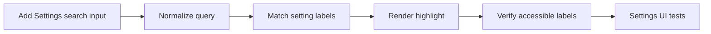

## task_113_settings_search_and_label_highlighting - Settings search and label highlighting
> From version: 1.11.0
> Schema version: 1.0
> Status: Ready
> Understanding: 90%
> Confidence: 85%
> Progress: 0%
> Complexity: Medium
> Theme: UI
> Reminder: Update status/understanding/confidence/progress and linked request/backlog references when you edit this doc.

# Definition of Done (DoD)
- [ ] Settings search input is implemented above the existing Settings content.
- [ ] Label matching and highlighting work case-insensitively without changing persisted settings.
- [ ] Accessible label/control relationships are preserved.
- [ ] Empty and no-match states are covered.
- [ ] Focused UI tests pass.
- [ ] Validation passes.

# Backlog
- `item_605_settings_search_and_label_highlighting`

# Acceptance criteria
- AC1: A Settings search input is visible above the Settings content.
- AC2: Typing a query highlights matching text in setting labels case-insensitively.
- AC3: Highlighting preserves accessible names and does not break label/control association.
- AC4: Empty search restores the normal Settings display.
- AC5: A no-match search shows a clear empty-results signal without changing persisted settings.
- AC6: Existing Settings cards and controls remain visible and usable while search is active.
- AC7: Tests cover search matching, highlight rendering, no-match behavior, clear-search restoration, and at least one accessibility assertion for label/control wiring.

# Implementation Plan
- Identify the Settings label rendering surfaces in `SettingsWorkspaceContent.tsx` and related Settings components.
- Add local Settings search state and a stable search input above the Settings content.
- Add a small label-highlighting helper/component that keeps accessible text intact.
- Wire matches across representative Settings labels without changing setting values or persistence.
- Add a no-match state and a clear/empty-search path.
- Extend `app.ui.settings*.spec.tsx` coverage for search, highlight, no-match, and label association.

# Validation
- Run `python3 -m logics_manager lint --require-status`.
- Run `npm run -s lint`.
- Run `npm run -s typecheck`.
- Run focused Settings UI tests covering search/highlight.
- Run `python3 -m logics_manager flow finish task task_113_settings_search_and_label_highlighting.md` after implementation.

# Report
- Not started.

# AI Context
- Summary: Implement settings search and label highlighting.
- Keywords: task, settings, search, highlight, label accessibility, settings UI
- Use when: You need a bounded implementation task for a backlog item.
- Skip when: The work is still at the request or backlog shaping stage.

# Links
- Request: `req_131_settings_search_and_sectioned_navigation`
- Product brief(s): (none yet)
- Architecture decision(s): (none yet)
