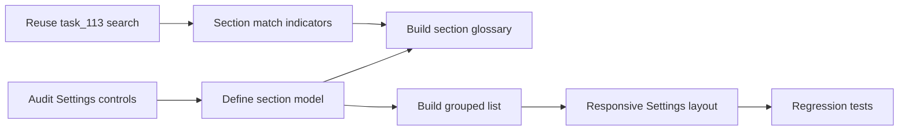

## task_114_settings_section_glossary_and_grouped_preferences_layout - Settings section glossary and grouped preferences layout
> From version: 1.11.0
> Schema version: 1.0
> Status: Ready
> Understanding: 90%
> Confidence: 85%
> Progress: 0%
> Complexity: Medium
> Theme: UI
> Reminder: Update status/understanding/confidence/progress and linked request/backlog references when you edit this doc.

# Definition of Done (DoD)
- [ ] Settings are grouped into stable named sections.
- [ ] Desktop/tablet Settings layout provides a left section glossary and right grouped settings list.
- [ ] Mobile/narrow layout keeps all settings reachable without overlap.
- [ ] Search results from `task_113` are reflected in the section glossary.
- [ ] Existing Settings workflows still pass after layout migration.
- [ ] Validation passes.

# Backlog
- `item_606_settings_section_glossary_and_grouped_preferences_layout`

# Acceptance criteria
- AC1: Settings are organized into named sections that can be navigated from a left-side glossary on desktop layouts.
- AC2: Selecting a glossary section scrolls or jumps to the corresponding settings group.
- AC3: The right-side settings area presents grouped settings in a scannable list without nested decorative cards.
- AC4: In search mode, the glossary indicates which sections contain matches.
- AC5: Matching labels remain highlighted after jumping to a section.
- AC6: The layout remains usable on narrow/mobile viewports without overlapping controls or hiding required settings.
- AC7: Existing Settings controls preserve their behavior and persisted values after the layout migration.
- AC8: Tests cover section navigation, grouped rendering, search-section match indicators, responsive/narrow behavior, and at least one existing Settings workflow after migration.

# Implementation Plan
- Audit current Settings panels and define stable section groups for existing controls.
- Introduce a Settings section model that can drive both glossary entries and grouped right-side rendering.
- Build desktop/tablet layout with left glossary and right settings list.
- Add responsive fallback for narrow widths, such as a compact section selector or top glossary.
- Integrate the search state from `task_113` so sections with matches are indicated.
- Preserve existing labels, controls, persistence handlers, and test selectors where possible.
- Extend Settings UI tests for navigation, search-section interaction, mobile/narrow layout, and representative settings persistence.

# Dependencies
- Should follow or reuse `task_113_settings_search_and_label_highlighting` so search semantics and highlight rendering are not reimplemented.

# Validation
- Run `python3 -m logics_manager lint --require-status`.
- Run `npm run -s lint`.
- Run `npm run -s typecheck`.
- Run focused Settings UI tests covering section navigation and migrated workflows.
- Run `python3 -m logics_manager flow finish task task_114_settings_section_glossary_and_grouped_preferences_layout.md` after implementation.

# Report
- Not started.

# AI Context
- Summary: Implement settings section glossary and grouped preferences layout.
- Keywords: task, settings, glossary, section navigation, grouped settings, responsive settings layout
- Use when: You need a bounded implementation task for a backlog item.
- Skip when: The work is still at the request or backlog shaping stage.

# Links
- Request: `req_131_settings_search_and_sectioned_navigation`
- Product brief(s): (none yet)
- Architecture decision(s): (none yet)
