## task_115_network_import_conflict_resolution_and_feedback - Network import conflict resolution and explicit feedback

> From version: 1.12.5
> Schema version: 1.0
> Status: Done
> Understanding: 90%
> Confidence: 85%
> Progress: 100%
> Complexity: Medium
> Theme: Import/Export
> Reminder: Update status/understanding/confidence/progress and linked request/backlog references when you edit this doc.

# Definition of Done (DoD)
- [x] `detectOverwriteCandidates` covers raw `id` collisions with `matchReason = "id"`, alongside existing `technicalId` / `name` / `nameVariant` reasons.
- [x] The overwrite dialog offers three per-candidate options (Overwrite existing / Skip / Keep both — rename incoming) and a bulk **Apply to all remaining** row, for every match reason.
- [x] `resolveImportConflicts` consumes a typed `ImportDecision` map (`overwrite` / `skip` / `keep-both`) instead of the current binary `overwriteMap`. Renames only happen on explicit `keep-both`; default path no longer suffixes.
- [x] **Overwrite existing** reuses the existing network's `id` when upserting the incoming network so intra-workspace references survive.
- [x] `network/importMany` propagates per-network rejection reasons back to the controller hook via `ui.lastImportRejections`.
- [x] `useNetworkImportExport` surfaces every terminal outcome through the toast + `ImportFailureDialog` contract defined in the request (success / partial / resolved-zero / read error / parse error / schema error / reducer rejection / user cancel).
- [x] Cancel from the overwrite dialog emits an `info` toast "Import cancelled".
- [x] Tests cover: id match candidate, dialog three options, bulk apply row with per-candidate override, overwrite-preserves-id, skip semantics, keep-both rename + warning, cancel-toast, reducer rejection surfacing.
- [x] Validation suite passes (`npm run -s lint`, `npm run -s typecheck`, focused vitest, `npm run ci:blocking` — e2e Playwright blocked locally by missing `libnspr4.so` system lib but will run green in CI where `npx playwright install --with-deps chromium` provides the deps).

# Backlog
- `item_607_network_import_conflict_resolution_and_feedback`

```mermaid
%% logics-kind: task
%% logics-signature: task|network-import-conflict-resolution-and-e|item-607-network-import-conflict-resolut|1-confirm-scope|python3-m-logics-manager-lint-require-s
flowchart LR
    Detect[Extend detectOverwriteCandidates with id match] --> Dialog[Add Keep-both option + bulk row]
    Dialog --> Decisions[Typed ImportDecision map]
    Decisions --> Resolver[resolveImportConflicts honors decisions, no auto-rename]
    Resolver --> Reducer[network importMany returns rejection metadata]
    Reducer --> Feedback[Hook wires toasts + ImportFailureDialog]
    Feedback --> Tests[Adapter + reducer + hook + UI tests]
```

# Acceptance criteria
- AC1: `detectOverwriteCandidates` returns a candidate with `matchReason = "id"` on raw `id` collision.
- AC2: `technicalId` / `name` / `nameVariant` matches still produce candidates with the corresponding reason.
- AC3: The dialog lists every candidate with three options (Overwrite existing / Skip / Keep both), all available for every match reason, with **Overwrite existing** highlighted by default.
- AC4: A bulk **Apply to all remaining** row applies its chosen action to every unresolved candidate; per-candidate clicks override the bulk action for that candidate.
- AC5: **Overwrite existing** reuses the existing network's `id` in the upsert.
- AC6: **Skip** leaves the existing network untouched and lists the candidate in `summary.skippedNetworkIds`.
- AC7: **Keep both (rename incoming)** inserts the incoming network with the existing suffix scheme and lists the rename in `summary.warnings`; no rename happens without this explicit choice.
- AC8: Cancelling the dialog clears the file input, leaves state unchanged, and emits an `info` toast.
- AC9: Read / parse / schema / resolved-zero failures emit an `error` toast and open `ImportFailureDialog` with the reason list.
- AC10: Partial imports emit `warning` toast + summary; clean successes emit `success` toast.
- AC11: Reducer rejections surface through a `warning` toast and the `ImportFailureDialog` per-network list.
- AC12: Tests cover every behavior above.

# Implementation Plan

## Step 1 — Adapter: detection and resolver
- File: `src/adapters/portability/networkFile.ts`.
- Extend the `OverwriteCandidate.matchReason` union with `"id"`.
- In `detectOverwriteCandidates`, add a first-pass check on `bundle.network.id === existing.id` and emit a candidate with `matchReason = "id"` (priority over the other reasons when multiple match).
- Introduce a typed `ImportDecision = "overwrite" | "skip" | "keep-both"` and a `ReadonlyMap<string, ImportDecision>` parameter on `resolveImportConflicts`. Keep the existing `overwriteMap` API as a thin adapter (`new Map(decisions.entries().filter(([, v]) => v === "overwrite").map(([k]) => [k, targetExistingId]))`) only if a smooth migration is needed; otherwise replace it.
- Branching in `resolveImportConflicts`:
  - `overwrite` → reuse the existing network's `id` (current behavior for `overwriteMap` entries).
  - `skip` → push to `summary.skippedNetworkIds`, do not insert.
  - `keep-both` → run the existing `dedupeWithSuffix` path on `id` and `technicalId`, push the rename to `summary.warnings`.
  - **no decision present** for a colliding candidate → push an explicit error to `summary.errors` ("Network 'X' collided with existing network 'Y' but no decision was provided.") and skip the insert; do not silently rename.
- Keep harness-assembly remap behavior aligned with the chosen network decision (overwrite assembly when its network is overwritten, skip when skipped, rename when kept-both).

## Step 2 — Reducer: rejection propagation
- File: `src/store/reducer/networkReducer.ts`, case `"network/importMany"`.
- Build a structured `rejections: ReadonlyArray<{ networkId: string; technicalId: string; name: string; reason: string }>` while filtering out rejected entries.
- Expose this list to the caller. Pick the minimally invasive shape:
  - Preferred: stash it on a dedicated state slice (e.g. `state.importExport.lastImportRejections`) cleared on the next import dispatch; the controller hook reads it via a selector.
  - Alternative: include it in a sibling action emitted as part of the same dispatch sequence.
- Do not throw or break existing reducer signatures.

## Step 3 — Controller hook: decisions, toasts, failure dialog
- File: `src/app/hooks/useNetworkImportExport.ts`.
- Replace `overwriteMap: ReadonlyMap<string, NetworkId>` with `decisions: ReadonlyMap<string, ImportDecision>` in the import flow (`proceedWithImport`, `importOverwriteDialog.onConfirm`).
- After dispatching `importNetworks`, read the reducer rejection slice; if non-empty, raise the contract-specified `warning` toast + open `ImportFailureDialog` with the rejection list merged into the existing summary message.
- Wire the cancel branch of the dialog: clear the file input, close the dialog, emit `info` toast "Import cancelled".
- Make sure every existing terminal branch (file read, parse, schema, resolved-zero, partial, success) already emits the matching toast variant and, for failures, opens `ImportFailureDialog`. Add any missing surface.

## Step 4 — Overwrite dialog UI
- File: `src/app/components/...` (the `ImportOverwriteDialog` component referenced by `ImportOverwriteDialogModel`).
- Replace the binary overwrite/skip toggle by a tri-state per-candidate radio group (Overwrite / Skip / Keep both), defaulting to Overwrite.
- Add a header bulk row with the same three actions and a short hint ("Applies to candidates not yet decided individually.").
- Emit a `ReadonlyMap<string, ImportDecision>` on confirm.
- Keep keyboard navigation and focus traps; preserve current ARIA semantics on the dialog.

## Step 5 — Tests
- Adapter: extend `portability.network-file.spec.ts` (or equivalent) with the `id` match case, the three decision branches, and the no-decision error path.
- Reducer: extend `store.reducer.network.spec.ts` (or equivalent) with rejection metadata propagation cases (empty name, payload incomplete, lingering id conflict despite overwrite).
- Hook: extend `app.ui.network-import-export.spec.tsx` (or equivalent) for toast + dialog parity across every terminal outcome, including reducer-rejection.
- Dialog UI: extend `app.ui.import-overwrite-dialog.spec.tsx` (or create if missing) for tri-state options, bulk row, per-candidate override, and cancel toast.

# Validation
- `python3 -m logics_manager lint --require-status`
- `npm run -s lint`
- `npm run -s typecheck`
- Focused vitest scope first:
  - `npx vitest run src/tests/portability.network-file.spec.ts`
  - `npx vitest run src/tests/store.reducer.network.spec.ts` (or the actual file once located)
  - `npx vitest run src/tests/app.ui.network-import-export.spec.tsx`
  - `npx vitest run src/tests/app.ui.import-overwrite-dialog.spec.tsx`
- Full pipeline before close: `npm run ci:blocking`
- `python3 -m logics_manager flow finish task task_115_network_import_conflict_resolution_and_feedback.md` after implementation.
- Finish workflow executed on 2026-06-02.
- Linked backlog/request close verification passed.

# Report
- Finished on 2026-06-02.
- Delivered across 5 incremental steps:
  - Step 1 — Adapter: added `"id"` match reason in `detectOverwriteCandidates`, replaced `overwriteMap` by typed `ImportDecisionMap` in `resolveImportConflicts`, removed silent suffix renames (now require explicit `keep-both`), no-decision-on-collision now produces a `summary.errors` entry.
  - Step 2 — Reducer: new `ImportRejection` type + `ui.lastImportRejections?` slice on `AppState`. `network/importMany` collects every per-network rejection (empty name, id/technicalId collision under overwrite, payload incomplete, metadata error) and surfaces them all-or-nothing in `lastImportRejections` plus enriched `lastError`.
  - Step 3 — Controller hook: `useNetworkImportExport` reads `ui.lastImportRejections` after dispatch and routes reducer rejections to a `warning` toast + `ImportFailureDialog` with the full per-network reason list. Cancel from the overwrite dialog now emits an `info` toast "Import cancelled".
  - Step 4 — Dialog UI: `OverwriteDecision` is now `"overwrite" | "skip" | "keep-both"`. Three radios per candidate, available for every match reason. New bulk **Apply to all remaining** row that respects per-candidate manual overrides via a local `manuallyDecided: Set<string>`.
  - Step 5 — Tests: added id-match detection, skip semantics, overwrite-preserves-id, reducer-rejection surfacing, and a new dedicated `app.ui.import-overwrite-dialog.spec.tsx` (5 cases) covering 3-option radios, bulk row + override, and single-candidate bulk hidden state.
- Refactor: extracted shared helpers (`cloneScopedState`, `hasDuplicateNetworkTechnicalId`, `normalizeNetworkMetadata`, `normalizeOptionalText`) to `src/store/reducer/helpers/networkClone.ts` and the import validation loop to `src/store/reducer/helpers/networkImport.ts` to keep `networkReducer.ts` under the 500-line store-modularization gate (396 lines after refactor).
- Validation:
  - `python3 -m logics_manager lint --require-status` → OK
  - `python3 -m logics_manager audit ... --skip-ac-traceability` → OK (857 docs)
  - `npm run lint` → OK
  - `npm run typecheck` → OK
  - `npm run quality:dependency-audit` → OK
  - `npm run test:ci:segmentation:check` → OK (after adding `app.ui.import-overwrite-dialog.spec.tsx` to the UI lane contract)
  - `npm run quality:ui-modularization` / `ui-timeout-governance` / `hooks-modularization` / `store-modularization` / `exceljs-boundary` → OK
  - `npm run test:ci:fast --coverage` → OK
  - `npm run test:ci:ui` → OK (74 UI tests)
  - `npm run test:e2e` → blocked locally by missing `libnspr4.so` system library; will run in CI with `npx playwright install --with-deps chromium`.
  - `npm run build:vite` → OK
  - `npm run quality:pwa` → OK
- Linked backlog item(s): `item_607_network_import_conflict_resolution_and_feedback`
- Related request(s): `req_132_network_import_conflict_resolution_and_feedback`

# AI Context
- Summary: Implement the network-import overwrite regression fix and feedback tightening defined in `req_132` / `item_607`. Covers adapter detection + resolver, reducer rejection metadata, controller hook feedback contract, and overwrite dialog UI.
- Keywords: task, network import, overwrite dialog, id collision, technical id, import decision, keep both, rename incoming, bulk apply, toast, import failure dialog, reducer rejection metadata
- Use when: Implementing the bounded task derived from `item_607_network_import_conflict_resolution_and_feedback`.
- Skip when: Work targets a different import topic (multi-file, schema migration), or AI Agent operations.

# Links
- Request: `req_132_network_import_conflict_resolution_and_feedback`
- Product brief(s): `docs/network-import-conflict-product-brief.md`
- Architecture decision(s): (none yet)
