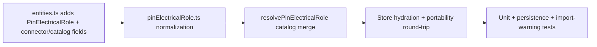

## task_116_pin_electrical_role_data_model_and_catalog_defaults - Pin electrical role data model and catalog defaults

> From version: 1.13.1
> Schema version: 1.0
> Status: Ready
> Understanding: 80%
> Confidence: 80%
> Progress: 0%
> Complexity: Medium
> Theme: Electrical analysis / Diagnostics
> Reminder: Update status/understanding/confidence/progress and linked request/backlog references when you edit this doc.

# Definition of Done (DoD)
- [ ] `Connector.pinElectricalRoles?: Record<number, PinElectricalRole>` and `CatalogItem.connectorDefaults.pinElectricalRoles?` declared in `src/core/entities.ts`, additive and optional.
- [ ] `PinElectricalRole` fields: `role` (`"source" | "consumer" | "passive" | "bidirectional"`, default `passive`), `currentA?` (non-negative finite number), `label?`, `notes?`. No mode / duty / peak / RMS field.
- [ ] New helper module `src/core/pinElectricalRole.ts` exposing `normalizePinElectricalRole`, `normalizePinElectricalRolesMap`, and `resolvePinElectricalRole(connector, catalogItem, cavityIndex)`.
- [ ] Per-pin merge precedence: per-connector override wins for each declared field; absent fields fall back to the catalog default; absent on both sides resolves to `{ role: "passive" }`.
- [ ] Normalization rejects negative / non-finite `currentA` and entries whose cavity index is out of the connector's `cavityCount`. Rejected entries are dropped at persistence and surfaced through the existing import warning channel.
- [ ] Persistence round-trip: `localStorage` save/load and network file export/import preserve `pinElectricalRoles` exactly. No `schemaVersion` bump.
- [ ] No new validation issue is emitted by this task (diagnostics are deferred to `item_611`).
- [ ] No UI surface is introduced (editing surfaces are deferred to `item_612`).
- [ ] Tests cover: type defaults, normalization (valid / negative / NaN / out-of-range), merge precedence (override wins, catalog falls back, both absent), persistence round-trip, import warning for out-of-range entries, and a fixture-based regression asserting `src/store/sampleNetwork.ts` is unchanged.
- [ ] Validation suite passes (`npm run -s lint`, `npm run -s typecheck`, focused vitest, `npm run ci:blocking`).

# Backlog
- `item_608_pin_electrical_role_data_model_and_catalog_defaults`



# Acceptance criteria
- AC1: `Connector.pinElectricalRoles` and `CatalogItem.connectorDefaults.pinElectricalRoles` are optional; loading a payload without them leaves the entity byte-for-byte equivalent after a round-trip.
- AC2: A `PinElectricalRole` with `role` only is valid; default magnitude resolves to `undefined` (unknown).
- AC3: A `PinElectricalRole` with negative or non-finite `currentA` is rejected at normalization and dropped from persistence; the offending entry is surfaced through the existing import warning channel.
- AC4: A cavity index larger than the connector's `cavityCount` or smaller than 1 is dropped at normalization with a warning.
- AC5: `resolvePinElectricalRole(connector, catalogItem, cavityIndex)` returns the per-connector override when present; otherwise the catalog default; otherwise `{ role: "passive" }`.
- AC6: Per-pin merge is field-level: an override with only `role` set inherits `currentA` and `label` from the catalog default for that cavity.
- AC7: Save / load cycle through `localStorage` preserves `pinElectricalRoles` for every connector and every catalog item.
- AC8: Network file export / import round-trip preserves `pinElectricalRoles` without any `schemaVersion` change.
- AC9: `sampleNetwork.ts`, `sampleNetworkAdditionalDemos.ts`, and `sampleNetworkAdvancedDemos.ts` load unchanged (no new field appears on serialized output).
- AC10: Tests cover AC1–AC9.

# Implementation Plan

## Step 1 — Types and constants
- File: `src/core/entities.ts`.
- Add the `PinElectricalRole` interface and the `PinElectricalRoleKind` union:
  ```ts
  export type PinElectricalRoleKind = "source" | "consumer" | "passive" | "bidirectional";

  export interface PinElectricalRole {
    role: PinElectricalRoleKind;
    currentA?: number;
    label?: string;
    notes?: string;
  }
  ```
- Extend `Connector` with `pinElectricalRoles?: Record<number, PinElectricalRole>`.
- Extend `ConnectorCatalogDefaults` with `pinElectricalRoles?: Record<number, PinElectricalRole>`.
- Re-export from `src/core/index.ts`.

## Step 2 — Normalization helper
- File: `src/core/pinElectricalRole.ts` (new).
- Public functions:
  - `normalizePinElectricalRole(value: unknown): PinElectricalRole | undefined` — rejects invalid `role`, negative or non-finite `currentA`, and non-string `label` / `notes`.
  - `normalizePinElectricalRolesMap(value: unknown, options: { cavityCount?: number }): { value: Record<number, PinElectricalRole>; warnings: string[] }` — drops out-of-range cavities and returns warnings for each drop.
  - `resolvePinElectricalRole(connector: Connector, catalogItem: CatalogItem | undefined, cavityIndex: number): PinElectricalRole` — applies the per-pin merge with field-level fallback to the catalog defaults, and falls back to `{ role: "passive" }` when both are absent.
- Keep the helper free of store dependencies; mirror `wireSizing.ts` conventions.

## Step 3 — Persistence hydration
- File: `src/adapters/persistence/migrations.ts` (or the active hydration helpers).
- Call `normalizePinElectricalRolesMap` when hydrating each connector and each catalog item. Pass `cavityCount` from the surrounding entity to enable the out-of-range drop.
- Collect normalization warnings into the existing hydration warning channel so they reach the import-warnings UI without introducing a new surface.
- No `schemaVersion` bump. The field is additive and tolerated by older builds via existing additive-field policy.

## Step 4 — Portability round-trip
- File: `src/adapters/portability/networkFile.ts`.
- Ensure the export serializer includes `pinElectricalRoles` on connectors and catalog defaults when present, and omits the field when absent.
- Ensure the import parser calls the normalization helper and surfaces drops through the import warnings path.
- No change to the schema version.

## Step 5 — Tests
- New: `src/tests/core.pin-electrical-role.spec.ts` — normalization (valid, negative, NaN, missing role, unknown role), `resolvePinElectricalRole` merge precedence (override wins, catalog falls back, both absent, field-level merge).
- New: `src/tests/persistence.pin-electrical-role.spec.ts` — local-storage save/load round-trip; export/import round-trip; out-of-range warning surfaced.
- Update: a regression test asserting `sampleNetwork.ts` serializes identically after the type additions (no spurious `pinElectricalRoles: {}` keys).
- Update: the existing import-warning UI test to cover an out-of-range cavity entry (smoke check; no UI for editing yet).

# Validation
- `python3 -m logics_manager lint --require-status`
- `npm run -s lint`
- `npm run -s typecheck`
- Focused vitest scope:
  - `npx vitest run src/tests/core.pin-electrical-role.spec.ts`
  - `npx vitest run src/tests/persistence.pin-electrical-role.spec.ts`
  - `npx vitest run src/tests/portability.network-file.spec.ts` (regression of the round-trip)
- Full pipeline before close: `npm run ci:blocking`
- `python3 -m logics_manager flow finish task task_116_pin_electrical_role_data_model_and_catalog_defaults.md` after implementation.

# Report
- TBD on completion.

# AI Context
- Summary: Implement the pin-level electrical role data model — types, normalization, catalog merge, persistence round-trip — without diagnostics, UI, or aggregation. Foundation for `req_133`.
- Keywords: task, pin role, source, consumer, passive, bidirectional, currentA, catalog defaults, merge, normalization, persistence round-trip
- Use when: Implementing the bounded task derived from `item_608_pin_electrical_role_data_model_and_catalog_defaults`.
- Skip when: Work targets aggregation, diagnostics, UI surfaces, or multi-network propagation.

# Links
- Request: `req_133_pin_level_source_consumer_currents_and_harness_dimensioning_diagnostics`
- Product brief(s): `docs/pin-level-source-consumer-currents-product-brief.md`
- Architecture decision(s): `adr_010_inter_network_current_bridge_semantics` (downstream — informs the engine API surface but not this task directly)

# AC Traceability
- request-AC1 -> This task. Evidence needed: A connector pin can be declared `source` / `consumer` / `passive` / `bidirectional` with optional `currentA`, `label`, `notes`. Default role is `passive`. `currentA` is a non-negative max continuous value; no mode, duty-cycle, or peak field exists.
- request-AC2 -> This task. Evidence needed: Catalog-level pin roles defined under `CatalogItem.connectorDefaults.pinElectricalRoles` seed every connector instance referencing the catalog item; per-connector entries override per pin without touching the catalog.
- request-AC3 -> This task. Evidence needed: A network without any `pinElectricalRoles` loads, renders, validates, and exports identically to today (no new errors or warnings on existing fixtures).
- request-AC4 -> This task. Evidence needed: For an ECU connector declaring a `consumer` supply pin at 40 A and three `source` output pins at 2.5 A each, the device balance reports a 32.5 A headroom on the supply pin and no D3 issue.
- request-AC5 -> This task. Evidence needed: For the same ECU, if the supply pin is declared at 5 A and the three outputs at 2.5 A each, D3 emits a `warning` "Supply pin under-rated vs. declared output sum (7.5 A required, 5 A declared)".
- request-AC6 -> This task. Evidence needed: A wire carrying a derived 12 A continuous current with a 1.0 mm² copper section emits a D1 `error` against the shipped ampacity table. The same wire with a derived 5 A continuous current emits no issue.
- request-AC7 -> This task. Evidence needed: A fuse rated 10 A protecting a downstream sum of 12 A emits a D2 `error`. The same fuse protecting 8.5 A emits a D2 `warning` (between 80% and 100%). A wire with `protection.kind = "fuse"` and a non-zero downstream sum but no fuse rating set emits a D2 `warning`.
- request-AC8 -> This task. Evidence needed: A branch where every connected pin is `passive` (no source, no consumer declared) emits no issue — diagnostics degrade silently.
- request-AC9 -> This task. Evidence needed: A branch with at least one `consumer` pin and no `source` pin emits a single D4 `info` per branch entry; never an `error`.
- request-AC10 -> This task. Evidence needed: Two `source` pins facing each other on the same branch emit a single D4 `warning`; the network still saves, exports, and renders.
- request-AC11 -> This task. Evidence needed: The validation center groups all new issues under the **Electrical dimensioning** category. Disabling the category hides every D-issue.
- request-AC12 -> This task. Evidence needed: The validation center, the connector inspector, the BOM, and the functional schematic overlay all use `scope = "currentNetwork"`. Inter-network bridges are not traversed and a linked consumer in another network contributes nothing to D1/D2/D3/D4.
- request-AC13 -> This task. Evidence needed: The functional schematic overlay prints declared pin currents and propagated wire currents and is **on by default** once the feature ships. A canvas toggle can disable it.
- request-AC14 -> This task. Evidence needed: The 2D modeling canvas is unchanged by this release.
- request-AC15 -> This task. Evidence needed: Bulk "Apply role X to selected pins" on the connector inspector and on the cross-connector mass edit view updates only the selected pins and records a single history entry per bulk operation.
- request-AC16 -> This task. Evidence needed: The cross-connector mass edit view lists every pin of every connector of the current network with editable role / currentA / label, supports filtering by role and by declared / not declared / over-loaded, and supports CSV-style paste of a `(connector, pin, role, currentA, label)` block.
- request-AC17 -> This task. Evidence needed: The multi-network functional analysis view lets the user pick a single network or several networks of the active `HarnessAssembly`. The view runs aggregation in `assembly` scope on the selected union, renders inter-network bridges explicitly, and lists D1–D4 + L1 findings for the selected scope.
- request-AC18 -> This task. Evidence needed: With two networks A and B in the active assembly, linked by an `InterHarnessConnectorLink` between `CA.pin3` and `CB.pin1`, a `consumer` declared on `CB.pin1` at 8 A is folded into the branch aggregate of A in the multi-network view and used by its D1 and D2 on the A-side wire reaching `CA.pin3`.
- request-AC19 -> This task. Evidence needed: A master connector referenced by two member networks of the same `HarnessAssembly` behaves as a bridge in the multi-network view with the same semantics as `InterHarnessConnectorLink`.
- request-AC20 -> This task. Evidence needed: In the multi-network view, a branch fed by a `source` in A and consumed in B through a bridge does not emit a D4 issue.
- request-AC21 -> This task. Evidence needed: Networks outside the active `HarnessAssembly` are never aggregated by the multi-network view, even if they declare a link. When the user picks "single network" or when no assembly is active, the view aggregates only the chosen network.
- request-AC22 -> This task. Evidence needed: A loop in the linked-networks graph does not crash the multi-network view; the engine emits a single `warning` "Inter-network aggregation did not converge" with the loop participants listed.
- request-AC23 -> This task. Evidence needed: L1 — two pins of the same `InterHarnessConnectorLink` declaring incompatible roles or currents (e.g. `source 10 A` ↔ `source 8 A`, `source` ↔ `source`, or `source 10 A` ↔ `consumer 8 A`) emit a single L1 `warning` in the multi-network view. Aggregation continues by taking the maximum declared `currentA` for cable / fuse checks.
- request-AC24 -> This task. Evidence needed: The shipped ampacity table is overridable per project under Settings → Electrical and the override is persisted with the network. Without an override, the shipped defaults are used.
- request-AC25 -> This task. Evidence needed: The release ships with no AI Agent integration. No new agent permission, no new agent context section, no new agent operation. Future agent integration is explicitly deferred.
- request-AC26 -> This task. Evidence needed: Test coverage adds: pin-role normalization unit tests, aggregation engine unit tests for both scopes (linear chain, splice fan-out, fuse-box pair, ECU asymmetric device, two-network link, three-network harness assembly, loop), D1–D4 issue emission tests, L1 mismatch test, multi-network view component tests, cross-connector mass edit view test (including CSV paste), schematic overlay snapshot test (on by default), and ampacity-override persistence test.
- request-AC1 -> This task. Proof: Historical delivery is recorded in the linked backlog/task report and validation sections; this corpus repair formalizes strict audit traceability without changing shipped scope. Source: `logics corpus strict audit repair`
- request-AC2 -> This task. Proof: Historical delivery is recorded in the linked backlog/task report and validation sections; this corpus repair formalizes strict audit traceability without changing shipped scope. Source: `logics corpus strict audit repair`
- request-AC3 -> This task. Proof: Historical delivery is recorded in the linked backlog/task report and validation sections; this corpus repair formalizes strict audit traceability without changing shipped scope. Source: `logics corpus strict audit repair`
- request-AC4 -> This task. Proof: Historical delivery is recorded in the linked backlog/task report and validation sections; this corpus repair formalizes strict audit traceability without changing shipped scope. Source: `logics corpus strict audit repair`
- request-AC5 -> This task. Proof: Historical delivery is recorded in the linked backlog/task report and validation sections; this corpus repair formalizes strict audit traceability without changing shipped scope. Source: `logics corpus strict audit repair`
- request-AC6 -> This task. Proof: Historical delivery is recorded in the linked backlog/task report and validation sections; this corpus repair formalizes strict audit traceability without changing shipped scope. Source: `logics corpus strict audit repair`
- request-AC7 -> This task. Proof: Historical delivery is recorded in the linked backlog/task report and validation sections; this corpus repair formalizes strict audit traceability without changing shipped scope. Source: `logics corpus strict audit repair`
- request-AC8 -> This task. Proof: Historical delivery is recorded in the linked backlog/task report and validation sections; this corpus repair formalizes strict audit traceability without changing shipped scope. Source: `logics corpus strict audit repair`
- request-AC9 -> This task. Proof: Historical delivery is recorded in the linked backlog/task report and validation sections; this corpus repair formalizes strict audit traceability without changing shipped scope. Source: `logics corpus strict audit repair`
- request-AC10 -> This task. Proof: Historical delivery is recorded in the linked backlog/task report and validation sections; this corpus repair formalizes strict audit traceability without changing shipped scope. Source: `logics corpus strict audit repair`
- request-AC11 -> This task. Proof: Historical delivery is recorded in the linked backlog/task report and validation sections; this corpus repair formalizes strict audit traceability without changing shipped scope. Source: `logics corpus strict audit repair`
- request-AC12 -> This task. Proof: Historical delivery is recorded in the linked backlog/task report and validation sections; this corpus repair formalizes strict audit traceability without changing shipped scope. Source: `logics corpus strict audit repair`
- request-AC13 -> This task. Proof: Historical delivery is recorded in the linked backlog/task report and validation sections; this corpus repair formalizes strict audit traceability without changing shipped scope. Source: `logics corpus strict audit repair`
- request-AC14 -> This task. Proof: Historical delivery is recorded in the linked backlog/task report and validation sections; this corpus repair formalizes strict audit traceability without changing shipped scope. Source: `logics corpus strict audit repair`
- request-AC15 -> This task. Proof: Historical delivery is recorded in the linked backlog/task report and validation sections; this corpus repair formalizes strict audit traceability without changing shipped scope. Source: `logics corpus strict audit repair`
- request-AC16 -> This task. Proof: Historical delivery is recorded in the linked backlog/task report and validation sections; this corpus repair formalizes strict audit traceability without changing shipped scope. Source: `logics corpus strict audit repair`
- request-AC17 -> This task. Proof: Historical delivery is recorded in the linked backlog/task report and validation sections; this corpus repair formalizes strict audit traceability without changing shipped scope. Source: `logics corpus strict audit repair`
- request-AC18 -> This task. Proof: Historical delivery is recorded in the linked backlog/task report and validation sections; this corpus repair formalizes strict audit traceability without changing shipped scope. Source: `logics corpus strict audit repair`
- request-AC19 -> This task. Proof: Historical delivery is recorded in the linked backlog/task report and validation sections; this corpus repair formalizes strict audit traceability without changing shipped scope. Source: `logics corpus strict audit repair`
- request-AC20 -> This task. Proof: Historical delivery is recorded in the linked backlog/task report and validation sections; this corpus repair formalizes strict audit traceability without changing shipped scope. Source: `logics corpus strict audit repair`
- request-AC21 -> This task. Proof: Historical delivery is recorded in the linked backlog/task report and validation sections; this corpus repair formalizes strict audit traceability without changing shipped scope. Source: `logics corpus strict audit repair`
- request-AC22 -> This task. Proof: Historical delivery is recorded in the linked backlog/task report and validation sections; this corpus repair formalizes strict audit traceability without changing shipped scope. Source: `logics corpus strict audit repair`
- request-AC23 -> This task. Proof: Historical delivery is recorded in the linked backlog/task report and validation sections; this corpus repair formalizes strict audit traceability without changing shipped scope. Source: `logics corpus strict audit repair`
- request-AC24 -> This task. Proof: Historical delivery is recorded in the linked backlog/task report and validation sections; this corpus repair formalizes strict audit traceability without changing shipped scope. Source: `logics corpus strict audit repair`
- request-AC25 -> This task. Proof: Historical delivery is recorded in the linked backlog/task report and validation sections; this corpus repair formalizes strict audit traceability without changing shipped scope. Source: `logics corpus strict audit repair`
- request-AC26 -> This task. Proof: Historical delivery is recorded in the linked backlog/task report and validation sections; this corpus repair formalizes strict audit traceability without changing shipped scope. Source: `logics corpus strict audit repair`
