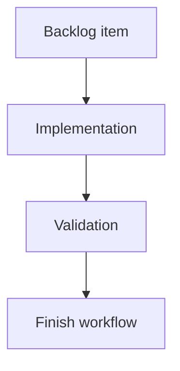

## task_120_pin_role_inspector_and_cross_connector_mass_edit_view - Pin role inspector + mass-edit view

> From version: 1.13.1
> Schema version: 1.0
> Status: Done
> Understanding: 100%
> Confidence: 92%
> Progress: 100%
> Complexity: Medium
> Theme: Electrical analysis / Diagnostics

# Definition of Done (DoD)
- [x] Connector inspector exposes a collapsible "Pin electrical roles" section with per-pin role, currentA, label edits.
- [x] Catalog item editor exposes the same table for `CatalogItem.connectorDefaults.pinElectricalRoles`.
- [x] Bulk "Apply role to selected pins" + "Reset to catalog default"; one history entry per bulk operation.
- [x] Catalog-vs-override badge per row.
- [x] New cross-connector mass-edit view: filters, bulk apply, CSV-style copy/paste.
- [x] Optional BOM column "Computed downstream load (A)" on fuse rows, off by default.
- [x] Component tests cover all DoD items.

# Backlog
- `item_612_pin_role_inspector_and_cross_connector_mass_edit_view`

# Acceptance criteria
Mirror `item_612` AC1–AC10.

# Implementation Plan

## Step 1 — Reducer actions
- Edit `src/store/reducer/...` to add `connector/setPinElectricalRole`, `connector/clearPinElectricalRole`, `connector/setPinElectricalRolesBulk`, and the catalog equivalents.
- Each bulk action records as a single history entry via the existing grouped-history helper.

## Step 2 — Inspector section
- Edit the connector inspector React component to add the collapsible section.
- Per pin row: role dropdown, currentA input (number, ≥ 0, optional), label input.
- Badge: "override" / "catalog" / "default" based on `resolvePinElectricalRole` source.
- Bulk bar with multi-selection.

## Step 3 — Catalog editor
- Mirror the inspector table inside the catalog item editor for `connectorDefaults.pinElectricalRoles`.

## Step 4 — Mass-edit view
- New view under Modeling (sibling of existing wire / connector lists).
- Rows: one per `(connectorId, cavityIndex)` for the active network.
- Columns: connector name, pin index, role, currentA, label, resolved branch load, ampacity ratio chip.
- Filters: by connector (multi-select), role (multi-select), declared/not declared, over-loaded.
- CSV paste: header optional; columns `connector,pin,role,currentA,label`; rows that fail validation surfaced in an inline error panel.
- Bulk select + apply role/currentA/label; one history entry per bulk operation.

## Step 5 — BOM column
- Edit BOM export to optionally include "Computed downstream load (A)" on fuse rows.
- Toggle in BOM export preferences, default off.

## Step 6 — Tests
- `src/tests/app.ui.inspector-pin-roles.spec.tsx`
- `src/tests/app.ui.catalog-pin-roles.spec.tsx`
- `src/tests/app.ui.mass-edit-pin-roles.spec.tsx` (including CSV paste with invalid rows)
- `src/tests/app.export.bom-downstream-load.spec.ts`

# Links
- Request: `req_133`
- Architecture decision(s): `adr_010_inter_network_current_bridge_semantics`

# Progress Report
- Delivered in 1.14.0: connector inspector editing, catalog defaults editing, override/catalog/default badges, bulk inspector apply/reset, and focused inspector/catalog tests.
- Real-status audit on 2026-06-09: no cross-connector mass-edit view, CSV paste, or optional BOM downstream-load export column was found in `src/` or `src/tests/`.
- Delivered on 2026-06-09: optional BOM export setting `Computed downstream load (A)` is off by default and adds fuse rows with computed downstream load when enabled; covered by `npm run -s test -- src/tests/network-summary-bom-csv.spec.ts --run`, `npm run -s test -- src/tests/app.ui.network-summary-bom-export.spec.tsx --run`, and `npm run -s typecheck`.
- Delivered on 2026-06-09: cross-connector `Pin role mass edit` panel in the Modeling/Analysis column. It lists every connector pin, filters by connector, role, declaration status, and overloaded rows, supports bulk apply/reset, and accepts CSV paste with inline validation errors.
- Delivery status: done for `item_612`.

# Validation
- 2026-06-09: `rtk npm run -s test -- src/tests/app.ui.mass-edit-pin-roles.spec.tsx src/tests/app.ui.inspector-pin-roles.spec.tsx src/tests/app.ui.catalog-pin-roles.spec.tsx src/tests/network-summary-bom-csv.spec.ts src/tests/app.ui.network-summary-bom-export.spec.tsx --run` passed (5 files, 32 tests). Covers inspector/catalog pin roles, mass-edit bulk apply, CSV paste error handling, valid CSV apply, and BOM downstream-load export.
- 2026-06-09: `rtk npm run -s typecheck` passed.
