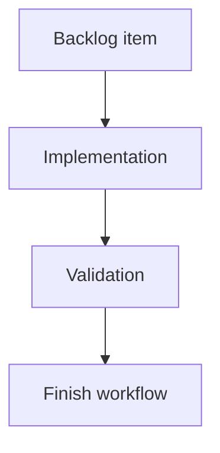

## task_121_functional_schematic_electrical_overlay - Functional schematic electrical overlay

> From version: 1.13.1
> Schema version: 1.0
> Status: Done
> Understanding: 100%
> Confidence: 92%
> Progress: 100%
> Complexity: Small
> Theme: Electrical analysis / Diagnostics

# Definition of Done (DoD)
- [x] Functional schematic renders directional pin markers (`→` source, `←` consumer) + declared `currentA` when set.
- [x] Wire labels include the engine-derived continuous current when non-zero.
- [x] Fuse-box pairs show protected-side downstream sum when non-zero.
- [x] Canvas toggle "Show electrical roles", on by default for new and existing workspaces (preference default `true`).
- [x] Theme tokens only; no inline color literals.
- [x] Snapshot tests for overlay on / off / no-pin-roles network.

# Backlog
- `item_613_functional_schematic_electrical_overlay`

# Acceptance criteria
Mirror `item_613` AC1–AC8.

# Implementation Plan

## Step 1 — Data plumbing
- Engine result threaded into the functional schematic renderer (re-use `computePinElectricalLoad` with `currentNetwork` scope).

## Step 2 — Renderer
- Edit `src/core/functionalSchematic.ts` (data) and the app-layer SVG/Canvas painter.
- For each declared pin, paint the arrow + value next to the pin position.
- For each wire, paint the resolved current.
- For each fuse-box pair, paint the protected sum next to the fuse symbol.

## Step 3 — Toggle + preference
- Add `showElectricalRoles` boolean to canvas preferences.
- Default `true` when absent (covers existing workspaces).
- Wire the canvas toggle button.

## Step 4 — Tests
- Vitest snapshot of three scenarios.
- Toggle persistence test.

# Links
- Request: `req_133`
- Architecture decision(s): `adr_010_inter_network_current_bridge_semantics`

# Progress Report
- Delivered on 2026-06-09 in commit `a66d85df` plus snapshot follow-up. `src/app/components/network-summary/FunctionalSchematicPanel.tsx` now threads `computePinElectricalLoad(..., { kind: "currentNetwork" })` into the SVG renderer.
- Pin overlays render source/consumer arrows with declared current, wire labels render non-zero branch current, and fuse nodes render non-zero protected current. Overlay styling was added in `src/app/styles/canvas/canvas-diagram-and-overlays/functional-schematic.css` using theme tokens.
- The "Electrical roles" functional schematic toggle defaults on, persists an explicit off/on choice, and does not mutate network data.
- Regression coverage: `src/tests/app.ui.functional-schematic-electrical-overlay.spec.tsx` and `src/tests/__snapshots__/app.ui.functional-schematic-electrical-overlay.spec.tsx.snap` cover overlay on, overlay off, and no-pin-role networks. `src/tests/app.ui.network-summary-workflow-polish.spec.tsx` keeps the workflow action row aligned with the new toggle.
- Validation: `npm run -s typecheck`, `npm run -s lint`, and `npm run -s test -- src/tests/app.ui.functional-schematic-electrical-overlay.spec.tsx src/tests/app.ui.network-summary-workflow-polish.spec.tsx`.
