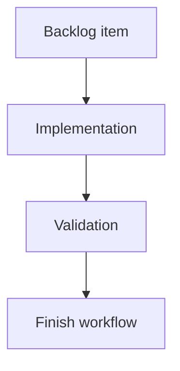

## task_122_multi_network_functional_analysis_view_and_assembly_scope - Multi-network functional analysis view + assembly scope + L1

> From version: 1.13.1
> Schema version: 1.0
> Status: In progress
> Understanding: 100%
> Confidence: 92%
> Progress: 60%
> Complexity: Large
> Theme: Electrical analysis / Diagnostics

# Definition of Done (DoD)
- [x] `computePinElectricalLoad` `assembly` arm implemented per `adr_010`.
- [x] Bridges (`InterHarnessConnectorLink` + shared master connector refs) treated as Kirchhoff pass-through with 1:1 cavity pairing.
- [x] Cycle-safe traversal keyed by `(networkId, connectorId, cavityIndex)`.
- [x] L1 link declaration mismatch emitted as `warning` with `max(currentA)` continuation per ADR.
- [x] Out-of-assembly networks excluded; bridges with far end outside the selected `networkIds` reported in `skippedBridges`.
- [ ] New top-level "Multi-network functional analysis" view, read-only, with scope picker (current network only / active assembly / custom subset).
- [ ] D1–D4 + L1 + loop / skipped-bridge diagnostics listed inside the view.
- [ ] `Go to` switches active network before focusing the entity.
- [ ] Tests cover assembly aggregation, bridge mismatch, loop, scope picker, out-of-assembly exclusion.

# Backlog
- `item_614_multi_network_functional_analysis_view_and_assembly_scope`

# Acceptance criteria
Mirror `item_614` AC1–AC14.

# Implementation Plan

## Step 1 — Engine assembly arm
- Replace the `NotImplemented` throw in `computePinElectricalLoad` with a real implementation.
- Build the cross-network adjacency by walking each selected network's wires + splices + fuse-box pairs, then adding bridge edges from the active `HarnessAssembly.connectorLinks` and from shared master connector references.
- Reuse the BFS traversal from the `currentNetwork` arm with scoped keys.

## Step 2 — L1 emission
- For each bridge edge, compare the two declared roles + currentA.
- Emit a single L1 warning per (bridge, cavityIndex) on incompatibility (rules from `adr_010` §4).
- Continue aggregation with `max(declaredCurrentA, declaredCurrentA)`.

## Step 3 — Skipped-bridge + loop diagnostics
- Output `diagnostics.skippedBridges` for bridges whose far end is outside `networkIds`.
- Loop warnings list participating scoped pins.

## Step 4 — View
- New top-level view (under "Analysis" tab or sibling).
- Scope picker component with three modes.
- Union functional schematic rendering (re-use the existing renderer with assembly input).
- Findings panel listing D1–D4 + L1 + loop / skipped-bridge entries.
- `Go to` action that dispatches the network switch and focus.

## Step 5 — Tests
- `src/tests/core.pin-electrical-load.assembly.spec.ts` — two-network link, three-network assembly, loop, L1 cases.
- `src/tests/app.ui.multi-network-analysis-view.spec.tsx` — scope picker, finding list, navigation.

# Links
- Request: `req_133`
- Architecture decision(s): `adr_010_inter_network_current_bridge_semantics`

# Progress Report
- Delivered in 1.14.0: assembly-scope aggregation core, bridge traversal, shared master connector bridge behavior, loop safety, skipped-bridge diagnostics, L1 mismatch computation, and core assembly tests.
- Real-status audit on 2026-06-09: no read-only multi-network functional analysis view, scope picker, view-level D1-D4/L1 findings panel, or active-network-switching `Go to` UI was found.
- Remaining: read-only multi-network functional analysis view, scope picker UI, view-level D1-D4/L1 findings list, active-network switching for `Go to`, and component coverage.
- Pertinence: keep open and prioritize before overlay/BOM polish because the shipped assembly engine and L1 mismatch logic need a user-facing surface.
