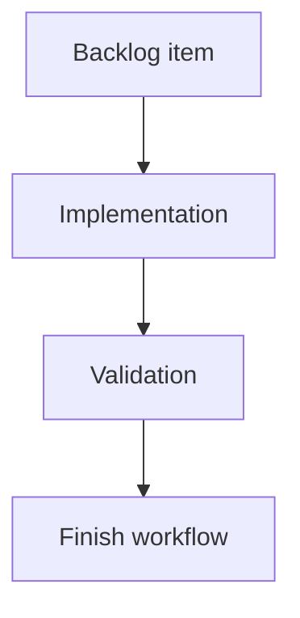

## task_122_multi_network_functional_analysis_view_and_assembly_scope - Multi-network functional analysis view + assembly scope + L1

> From version: 1.15.1
> Schema version: 1.0
> Status: In progress
> Understanding: 99%
> Confidence: 94%
> Progress: 78%
> Complexity: Large
> Theme: Electrical analysis / Diagnostics

# Definition of Done (DoD)
- [x] `computePinElectricalLoad` `assembly` arm implemented per `adr_010`.
- [x] Bridges (`InterHarnessConnectorLink` + shared master connector refs) treated as Kirchhoff pass-through with 1:1 cavity pairing.
- [x] Cycle-safe traversal keyed by `(networkId, connectorId, cavityIndex)`.
- [x] L1 link declaration mismatch emitted as `warning` with `max(currentA)` continuation per ADR.
- [x] Out-of-assembly networks excluded; bridges with far end outside the selected `networkIds` reported in `skippedBridges`.
- [x] Read-only "Multi-network functional analysis" Analysis panel with current-network / active-assembly scope picker.
- [x] Current-network D1–D4 findings plus active-assembly L1 and skipped-bridge diagnostics listed in the view.
- [ ] Custom subset scope, union functional schematic, and assembly-grade D1–D4 findings listed inside the view.
- [x] `Go to` switches active network before focusing the entity.
- [x] Tests cover assembly aggregation, L1 bridge mismatch, current-scope findings, and component scope picker / finding list rendering.
- [ ] Tests cover custom subset, union schematic rendering, and loop display.
- [x] Tests cover active-network-switching `Go to` target construction and component dispatch.

# Backlog
- `item_614_multi_network_functional_analysis_view_and_assembly_scope`

# Acceptance criteria
Mirror `item_614` AC1–AC14.

# Implementation Plan

## Step 1 — Engine assembly arm
- Replace the `NotImplemented` throw in `computePinElectricalLoad` with a real implementation.
- Build the cross-network adjacency by walking each selected network's wires + splices + fuse-box pairs, then adding bridge edges from the active `HarnessAssembly.connectorLinks` and from shared master connector references.
- Reuse the BFS traversal from the `currentNetwork` arm with scoped keys.

## Step 2 — L1 emission
- For each bridge edge, compare the two declared roles + currentA.
- Emit a single L1 warning per (bridge, cavityIndex) on incompatibility (rules from `adr_010` §4).
- Continue aggregation with `max(declaredCurrentA, declaredCurrentA)`.

## Step 3 — Skipped-bridge + loop diagnostics
- Output `diagnostics.skippedBridges` for bridges whose far end is outside `networkIds`.
- Loop warnings list participating scoped pins.

## Step 4 — View
- New top-level view (under "Analysis" tab or sibling).
- Scope picker component with three modes.
- Union functional schematic rendering (re-use the existing renderer with assembly input).
- Findings panel listing D1–D4 + L1 + loop / skipped-bridge entries.
- `Go to` action that dispatches the network switch and focus.

## Step 5 — Tests
- `src/tests/core.pin-electrical-load-assembly.spec.ts` — two-network link, skipped bridge, L1 cases.
- `src/tests/app.lib.multi-network-functional-analysis.spec.ts` — current-scope D1-D4 mapping and active-assembly L1 model.
- `src/tests/app.ui.multi-network-functional-analysis.spec.tsx` — scope picker, themed status chips, finding list.

# Links
- Request: `req_133`
- Architecture decision(s): `adr_010_inter_network_current_bridge_semantics`

# Progress Report
- Delivered in 1.14.0: assembly-scope aggregation core for `InterHarnessConnectorLink`, bridge traversal, skipped-bridge diagnostics, L1 mismatch computation, and core assembly tests.
- Real-status audit on 2026-06-09: no read-only multi-network functional analysis view, scope picker, view-level D1-D4/L1 findings panel, or active-network-switching `Go to` UI was found.
- Implemented after the audit on 2026-06-09: `buildMultiNetworkFunctionalAnalysisModel`, read-only Analysis panel, current-network / active-assembly scope picker, current-network D1-D4 finding projection, active-assembly L1 and skipped-bridge surfacing, active-network-switching `Go to`, plus model/component tests.
- Remaining: custom subset selection, union functional schematic, assembly-grade D1-D4 projection from the union graph, master-connector-ref aggregation parity if not already covered elsewhere, loop display in the panel, and broader integration coverage.
- Pertinence: keep open, but reduce urgency from "invisible engine" to "MVP shipped, depth missing". The next useful increment is assembly-grade D1/D2 projection, not another shell-level panel.

# Validation
- 2026-06-09: `rtk npm run -s test -- src/tests/app.lib.multi-network-functional-analysis.spec.ts src/tests/app.ui.multi-network-functional-analysis.spec.tsx --run` passed (2 files, 3 tests). Covers the delivered model and component MVP: current-scope D1-D4 projection, active-assembly L1/skipped-bridge surfacing, and scope picker/finding-list rendering.
- 2026-06-09: `rtk npm run -s lint` passed.
- 2026-06-09: `rtk npm run -s typecheck` passed.
- 2026-06-09: `rtk npm run -s test -- src/tests/app.lib.multi-network-functional-analysis.spec.ts src/tests/app.ui.multi-network-functional-analysis.spec.tsx --run` passed (2 files, 4 tests). Adds coverage for D1-D4/L1 navigation targets and the component `Go to` callback.
- Not yet covered here: custom subset scope, union schematic rendering, and loop display; those remain open DoD items.
