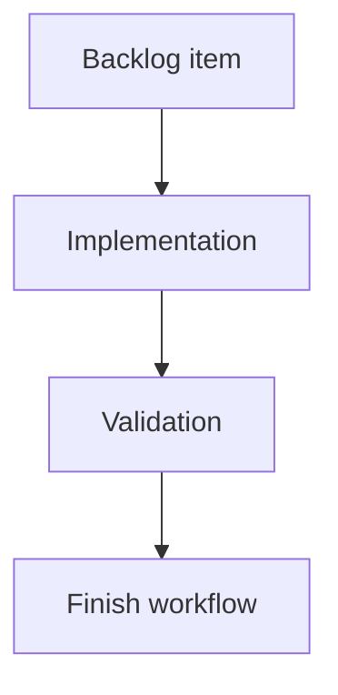

## task_123_pin_role_release_validation_and_permissiveness_gate - Pin role release validation and permissiveness gate

> From version: 1.13.1
> Schema version: 1.0
> Status: In progress
> Understanding: 100%
> Confidence: 90%
> Progress: 75%
> Complexity: Medium
> Theme: Electrical analysis / Diagnostics

# Definition of Done (DoD)
- [ ] Playwright "Pin roles full flow" E2E scenario green.
- [x] Shipped sample networks load with zero **Electrical dimensioning** issues.
- [x] Export/import round-trip preserves `pinElectricalRoles`, catalog defaults, `ampacityOverrides`.
- [x] 2D modeling canvas byte-for-byte snapshot unchanged when only pin roles or ampacity overrides are edited.
- [x] Permissiveness gate: partial declarations emit zero error-level findings.
- [x] AI Agent context snapshot unchanged.
- [ ] Performance budgets captured (in-network engine + multi-network view open) with ratio ≤ 1.3.
- [x] Onboarding step "Declare pin roles" added.
- [ ] One failing assertion blocks the release through existing CI quality gates.

# Backlog
- `item_615_pin_role_release_validation_and_permissiveness_gate`

# Acceptance criteria
Mirror `item_615` AC1–AC9.

# Implementation Plan

## Step 1 — E2E scenario
- New Playwright test `tests/e2e/pin-roles-full-flow.spec.ts`:
  - declare roles via inspector + mass-edit view;
  - assert D1–D4 update live;
  - toggle overlay;
  - open multi-network view on seeded two-network assembly;
  - assert L1 fires on contrived mismatch.

## Step 2 — Regression snapshots
- Vitest snapshot asserting sample networks emit zero electrical-dimensioning issues.
- Export/import round-trip vitest test.
- Modeling-canvas-unchanged snapshot test.
- AI Agent context snapshot test.

## Step 3 — Permissiveness assertions
- Vitest test confirming partial declarations never yield error-level findings.

## Step 4 — Performance budgets
- New script under `scripts/` benchmarking `computePinElectricalLoad` on the largest sample network.
- Multi-network view-open benchmark.
- Assertion captures the baseline once and asserts ratio ≤ 1.3 on subsequent runs.

## Step 5 — Onboarding
- Add the "Declare pin roles" step to the existing onboarding flow data.

# Links
- Request: `req_133`
- Architecture decision(s): `adr_010_inter_network_current_bridge_semantics`

# Progress Report
- Partially covered by 1.14.0 focused validation: data model, ampacity, current-network aggregation, assembly aggregation core, D1-D4 validation, inspector pin roles, and catalog pin roles.
- Delivered after 1.15.0: onboarding step "Declare pin roles" added to the full onboarding flow and covered by `npm run -s test -- src/tests/app.ui.onboarding.spec.tsx --run`.
- Delivered after 1.15.0: AI Agent context snapshot coverage asserts pin electrical roles do not add AI context fields or leak role labels; covered by `npm run -s test -- src/tests/ai-agent-context.spec.ts --run` and `npm run -s typecheck`.
- Delivered after 1.15.0: sample-network silence gate asserts every shipped sample network emits zero `Electrical dimensioning` issues; covered by `npm run -s test -- src/tests/app.validation.electrical-dimensioning.spec.ts --run`.
- Delivered after 1.15.0: network export/import round-trip preserves connector `pinElectricalRoles`, catalog default `pinElectricalRoles`, and network `ampacityOverrides`; covered by `npm run -s test -- src/tests/portability.network-file.spec.ts --run` and `npm run -s typecheck`.
- Real-status audit on 2026-06-09: no Playwright full-flow, performance budget script/gate, or CI release-gate wiring specific to the pin-role release was found.
- Delivered on 2026-06-09: partial pin-role declarations emit zero error-level electrical dimensioning issues; covered by `npm run -s test -- src/tests/app.validation.electrical-dimensioning.spec.ts --run`.
- Delivered on 2026-06-09: 2D network diagram SVG snapshot stays byte-for-byte unchanged when only connector `pinElectricalRoles` and network `ampacityOverrides` change; covered by `npm run -s test -- src/tests/app.ui.navigation-canvas.spec.tsx --run`.
- Remaining: Playwright full-flow, performance budgets, and CI release-gate wiring.
- Pertinence: keep open. Playwright full-flow and multi-network view-open performance should wait until mass-edit/overlay/multi-network view surfaces exist.
