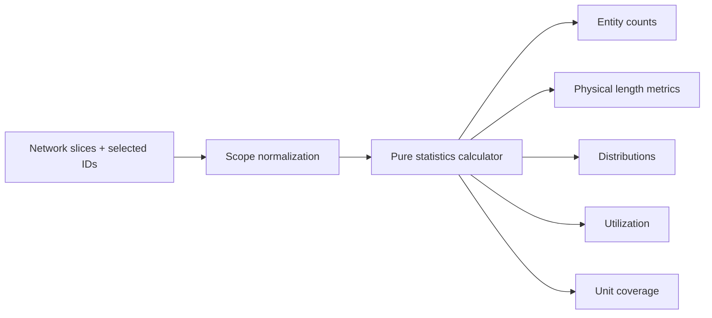

## task_124_network_statistics_calculator_and_scope_contract - Network statistics calculator and scope contract

> From version: 1.14.3
> Schema version: 1.0
> Status: Done
> Understanding: 86%
> Confidence: 82%
> Progress: 100%
> Complexity: Medium
> Theme: Statistics / Reporting
> Reminder: Update status/understanding/confidence/progress and linked request/backlog references when you edit this doc.

# Definition of Done (DoD)
- [x] A pure statistics calculator exists and is exported from a stable module boundary.
- [x] Calculator inputs support active-network data and manual multi-network selections without mutating store state.
- [x] Non-active networks are read from `state.networkStates`, preserving the repo's active-root-slice vs. network-map invariant.
- [x] Core counts cover connectors, splices, routing nodes by kind, segments, wires, and catalog items.
- [x] Wire length metrics prefer finite positive `Wire.lengthMm`, fall back to summed route segment length, and ignore non-routed/non-physical wires.
- [x] Ignored wires never contribute `0 m` to totals, averages, min, max, median, or longest-wire lists.
- [x] Distribution metrics cover wire section, material, color, electrical metadata, fuse protection, pin-role coverage, connector utilization, splice utilization, and catalog linkage.
- [x] No pricing, CSV export, charts, persistence fields, or AI Agent context is introduced.
- [x] Calculator tests cover active-network, manual multi-network, route-length fallback, ignored-unrouted-wire, occupancy, distribution, and catalog-linkage cases.
- [x] Relevant quality gates pass.

# Backlog
- `item_616_network_statistics_dashboard_for_one_or_multiple_networks`

# Acceptance criteria
- AC1: The calculator has a typed input contract that can represent the active network and any manually selected set of workspace networks.
- AC2: The calculator returns deterministic values for the same input and does not mutate inputs.
- AC3: Active-network data can be passed from root-level store slices.
- AC4: Non-active selected network data can be passed from `state.networkStates`.
- AC5: Core counts include connectors, splices, routing nodes by kind, segments, wires, and catalog items.
- AC6: Wire length resolution uses finite positive `Wire.lengthMm` first.
- AC7: When `Wire.lengthMm` is unavailable, route length is computed from `Wire.routeSegmentIds` and the selected network's segment map.
- AC8: Wires with no physical length source are excluded from length metrics and exposed through an explicit ignored/missing-length count for UI explanation.
- AC9: Aggregate length metrics include total, average, min, max, median, routed-count-included, route-lock count/percentage, and top 10 longest wires.
- AC10: Multi-network output includes per-network statistics plus an aggregate total.
- AC11: Wire section distribution includes count and total physical length per section.
- AC12: Wire material and color distributions include explicit unspecified buckets.
- AC13: Electrical metadata coverage includes wires with `currentA`, maximum declared current, and fuse-protected wire count.
- AC14: Pin-role coverage counts declared connector/catalog pin roles by role kind when present.
- AC15: Connector utilization includes total way capacity, occupied ways, occupancy percentage, and top unused-way connectors.
- AC16: Splice utilization separates finite bounded/directional capacity from unbounded splices and reports directional splice count.
- AC17: Catalog indicators include linked vs. unlinked connectors/splices and manufacturer reference distribution.
- AC18: The implementation does not add charting, CSV export, pricing, persistence, or AI Agent changes.
- AC19: Unit tests cover the calculator scenarios listed in the DoD.

# Implementation Plan

## Step 1 - Locate the module boundary
- Prefer a pure module such as `src/app/lib/networkStatistics.ts` if the output shape is UI/reporting-oriented.
- Use `src/core/networkStatistics.ts` only if the implementation stays fully domain-level and has no app formatting concerns.
- Keep the module focused; do not expand existing large controller or component files.

## Step 2 - Define typed contracts
- Define explicit types for:
  - network statistics input;
  - per-network result;
  - aggregate result;
  - length resolution status;
  - distribution rows;
  - utilization rows.
- Avoid ad hoc untyped objects in tests and UI.

## Step 3 - Implement scope aggregation
- Build per-network statistics first.
- Merge per-network results into aggregate totals only after each network is independently computed.
- Preserve stable ordering by network name/technical ID for comparison rows and deterministic tests.

## Step 4 - Implement length semantics
- Use `Wire.lengthMm` only when finite and greater than zero.
- If unavailable, sum route segment lengths from `routeSegmentIds` where every referenced segment exists.
- If neither physical source is valid, exclude the wire from length metrics and increment the ignored/missing-length count.
- Calculate median deterministically from sorted finite lengths.

## Step 5 - Implement distributions and utilization
- Section distribution: count + total physical length.
- Material/color distribution: include explicit unspecified buckets.
- Electrical metadata: `currentA`, fuse protection, pin roles.
- Connector utilization: use connector way count and occupancy maps.
- Splice utilization: finite capacity only for bounded/directional splices; report unbounded separately.
- Catalog indicators: linked/unlinked connector and splice counts plus manufacturer references.

## Step 6 - Unit tests
- Add a focused spec, for example `src/tests/network-statistics.spec.ts`.
- Cover:
  - active-network single scope;
  - manual multi-network aggregate + per-network rows;
  - `Wire.lengthMm` path;
  - route segment fallback path;
  - ignored unrouted/non-physical wire path;
  - connector and splice utilization;
  - distributions with unspecified buckets;
  - catalog linkage.

# Repository and Development Rules
- Respect the store invariant: root slices are the active-network working set; non-active selected networks come from `state.networkStates`.
- Do not dispatch actions or mutate store state from the calculator.
- Do not add persistence fields, schema migrations, dependencies, charts, CSV export, or pricing behavior in this task.
- Keep files under existing modularization thresholds; if a file grows too large, create a focused helper rather than inflating `AppController` or a workspace component.
- Use existing helpers for IDs, wire metadata, connector/splice contracts, and catalog normalization where available.
- Add tests at the lowest practical level before relying on UI tests.

# Validation
- Implemented in `src/app/lib/networkStatistics.ts`.
- Focused tests: `src/tests/network-statistics.spec.ts`.
- Validation run on 2026-06-03:
  - `npm run -s lint`
  - `npm run -s typecheck`
  - `npx vitest run src/tests/network-statistics.spec.ts src/tests/app.ui.statistics.spec.tsx`
  - `npm run -s test:ci:segmentation:check`
  - `npm run -s quality:ui-modularization`
  - `npm run -s quality:store-modularization`
  - `npm run -s quality:hooks-modularization`
  - `npm run -s quality:ui-timeout-governance`
  - `npm run -s quality:exceljs-boundary`
- `logics-manager lint --require-status` or `python3 -m logics_manager lint --require-status` when the Python module is available.
- `npm run -s lint`
- `npm run -s typecheck`
- Focused calculator tests, for example `npx vitest run src/tests/network-statistics.spec.ts`.
- Relevant quality gates if touched files approach modularization boundaries:
  - `npm run -s quality:ui-modularization`
  - `npm run -s quality:store-modularization`

# AI Context
- Summary: Implement the pure statistics calculator and scope contract for `req_135` / `item_616`, covering active-network and manual multi-network statistics without UI mutation or deferred surfaces.
- Keywords: task, statistics calculator, active network, manual multi-network, wire length, route fallback, occupancy, distribution, catalog linkage
- Use when: Implementing or reviewing the non-UI statistics calculation layer.
- Skip when: The change targets navigation, visual layout, charts, CSV export, pricing, or entity mutations.

# Links
- Request: `req_135_network_statistics_dashboard_for_one_or_multiple_networks`
- Backlog: `item_616_network_statistics_dashboard_for_one_or_multiple_networks`
- Product brief(s): `docs/network-statistics-dashboard-product-brief.md`
- Architecture decision(s): (none)
