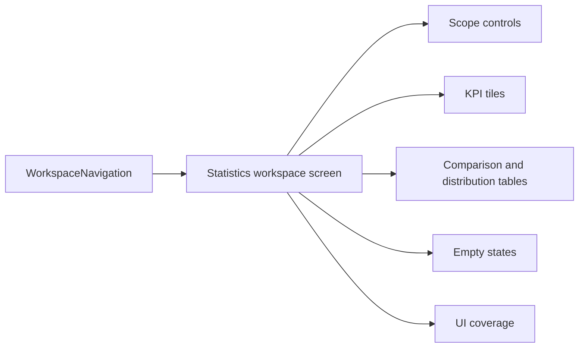

## task_125_statistics_workspace_tab_ui_design_and_validation - Statistics workspace tab UI, design, and validation

> From version: 1.14.3
> Schema version: 1.0
> Status: Done
> Understanding: 86%
> Confidence: 80%
> Progress: 100%
> Complexity: Medium
> Theme: Statistics / Reporting
> Reminder: Update status/understanding/confidence/progress and linked request/backlog references when you edit this doc.

# Definition of Done (DoD)
- [x] A top-level **Statistics** tab appears between **Modeling** and **Validation**.
- [x] The statistics screen is a typed workspace screen distinct from `modeling`, `analysis`, and `validation`.
- [x] The screen defaults to active-network statistics.
- [x] The screen supports manual selection of one or more networks.
- [x] Manual multi-network scope shows aggregate KPI tiles and a per-network comparison table.
- [x] The UI uses KPI tiles and tables only; no charts, charting library, CSV export, pricing, or mutation controls.
- [x] Empty states are explicit and never render `NaN`, `Infinity`, blank misleading totals, or broken tables.
- [x] The design follows existing workspace layout, table, form, and panel conventions.
- [x] UI tests cover tab navigation, scope switching, multi-network comparison, and empty state.
- [x] Repo quality gates pass for lint, typecheck, modularization, and relevant focused tests.

# Backlog
- `item_616_network_statistics_dashboard_for_one_or_multiple_networks`

# Acceptance criteria
- AC1: `ScreenId` or equivalent navigation typing includes a statistics screen.
- AC2: `WorkspaceNavigation` renders **Statistics** between **Modeling** and **Validation**.
- AC3: The Statistics tab is not treated as an Analysis sub-tab and does not mark Modeling active.
- AC4: Opening the tab with an active network selected renders active-network KPI tiles.
- AC5: Opening the tab without an active network renders a clear empty state.
- AC6: Scope controls allow switching between active network and manual network selection.
- AC7: Manual network selection uses existing form/table controls and supports one or more networks.
- AC8: Multi-network mode renders aggregate KPI tiles and a per-network comparison table.
- AC9: The screen renders distribution/utilization tables from the calculator output without recomputing business logic inside JSX.
- AC10: Values use robust formatting and never display `NaN`, `Infinity`, or misleading blanks.
- AC11: Wires ignored by length metrics are explained in UI copy without implying they are zero-length physical wires.
- AC12: The design uses existing workspace panels, restrained KPI tiles, compact tables, and current CSS tokens.
- AC13: The UI does not add nested cards, marketing-style hero sections, decorative charting, or one-off visual systems.
- AC14: The UI remains responsive and readable on supported desktop/mobile layouts.
- AC15: No domain mutation action is dispatched from Statistics controls.
- AC16: The first release does not add charts, CSV export, pricing rollups, persistence fields, or AI Agent integration.
- AC17: UI tests cover navigation, active-network default, no-active-network empty state, manual multi-network selection, and comparison table rendering.

# Implementation Plan

## Step 1 - Navigation typing and placement
- Add the statistics screen to the typed screen union in `src/app/types/app-controller.ts`.
- Update `useWorkspaceNavigation` derived booleans if needed.
- Update `WorkspaceNavigation` so **Statistics** appears between **Modeling** and **Validation**.
- Keep existing `analysis` behavior intact; do not conflate Statistics with Modeling/Analysis.

## Step 2 - Workspace content module
- Add a focused component such as `src/app/components/workspace/StatisticsWorkspaceContent.tsx`.
- Register it through the existing lazy/eager module boundary (`appUiModules` / `appUiModules.eager`) following current patterns.
- Keep the component focused on rendering and local UI state; delegate calculations to the calculator from `task_124`.

## Step 3 - Scope controls
- Default to active-network scope.
- Add a compact control for manual network selection.
- Use existing form controls, labels, and table density patterns.
- Keep selection state local to the Statistics screen for v1.

## Step 4 - KPI tiles and tables
- Render top-level KPI tiles for:
  - connectors;
  - splices;
  - wires;
  - total physical wire length;
  - route-locked percentage;
  - connector occupancy.
- Render tables for:
  - per-network comparison;
  - longest wires;
  - wire sections;
  - material/color distributions;
  - connector utilization;
  - splice utilization;
  - catalog linkage.
- Use compact headings and table labels that fit existing workspace density.

## Step 5 - Empty and unavailable states
- No active network: prompt to create/select a network.
- No selected networks in manual mode: prompt to select at least one network.
- No routed physical lengths: show an explanatory message instead of zero-length totals.
- Missing optional distributions: hide the table or show a short empty state.

## Step 6 - UI tests
- Add focused UI tests, for example `src/tests/app.ui.statistics.spec.tsx`.
- Cover:
  - Statistics tab exists and sits between Modeling and Validation;
  - active-network default render;
  - empty state without active network;
  - manual multi-network selection;
  - aggregate + per-network comparison table;
  - no charts/export/pricing controls in v1 if useful as regression assertions.

# Design and UX Requirements
- Match existing workspace structure: restrained panels, compact KPI surfaces, predictable tables, and existing button/form styles.
- Do not introduce a landing page, hero treatment, charting dependency, decorative visuals, gradient/orb backgrounds, or nested card-heavy layout.
- KPI tiles must be dense and utilitarian, not oversized marketing cards.
- Tables should be scannable and consistent with existing table density/font-size preferences where available.
- Controls should use familiar form patterns already present in the app: select, checkbox/multi-select style rows, buttons, and compact labels.
- Text must fit on mobile and desktop without overlapping, clipping, or forcing layout shifts.
- Use existing CSS tokens and class conventions; avoid one-off colors and inline styling.
- The screen must clearly distinguish "ignored because no physical route/length exists" from "0 m".

# Repository and Development Rules
- Keep `AppController.tsx` and navigation components from growing unnecessarily; follow existing module boundaries.
- Respect current lazy/eager UI module loading patterns.
- Do not add a new dependency for charts, tables, formatting, or CSV.
- Do not dispatch domain mutation actions from the Statistics screen.
- Do not change existing export schemas.
- Do not add persistence unless a future request explicitly asks for remembered statistics scope.
- Add focused tests and update segmented test ownership if a new UI spec file requires it.
- Run modularization quality gates when touching `src/app/**`.

# Validation
- Implemented in `src/app/components/workspace/StatisticsWorkspaceContent.tsx`, `src/app/components/screens/StatisticsScreen.tsx`, and the existing workspace navigation/controller module boundaries.
- Focused tests: `src/tests/app.ui.statistics.spec.tsx`.
- Validation run on 2026-06-03:
  - `npm run -s lint`
  - `npm run -s typecheck`
  - `npx vitest run src/tests/network-statistics.spec.ts src/tests/app.ui.statistics.spec.tsx`
  - `npm run -s test:ci:segmentation:check`
  - `npm run -s quality:ui-modularization`
  - `npm run -s quality:store-modularization`
  - `npm run -s quality:hooks-modularization`
  - `npm run -s quality:ui-timeout-governance`
  - `npm run -s quality:exceljs-boundary`
- `logics-manager lint --require-status` or `python3 -m logics_manager lint --require-status` when the Python module is available.
- `npm run -s lint`
- `npm run -s typecheck`
- Focused UI tests, for example `npx vitest run src/tests/app.ui.statistics.spec.tsx`.
- Calculator tests from `task_124`.
- `npm run -s test:ci:segmentation:check` if a new UI spec file is added.
- `npm run -s quality:ui-modularization`
- `npm run -s quality:ui-timeout-governance`
- Full validation before close: `npm run ci:blocking` where the local environment supports Playwright.

# AI Context
- Summary: Implement the Statistics workspace UI and design integration for `req_135` / `item_616`, including navigation placement, scope controls, KPI/tables presentation, empty states, and UI validation.
- Keywords: task, statistics tab, workspace navigation, UI design, KPI tiles, tables, manual network selection, empty state, responsive layout, modularization
- Use when: Implementing or reviewing the Statistics tab UI, navigation integration, design consistency, or UI tests.
- Skip when: The change targets the pure calculator only, charts, CSV export, pricing, persistence, or AI Agent operations.

# Links
- Request: `req_135_network_statistics_dashboard_for_one_or_multiple_networks`
- Backlog: `item_616_network_statistics_dashboard_for_one_or_multiple_networks`
- Product brief(s): `docs/network-statistics-dashboard-product-brief.md`
- Architecture decision(s): (none)
