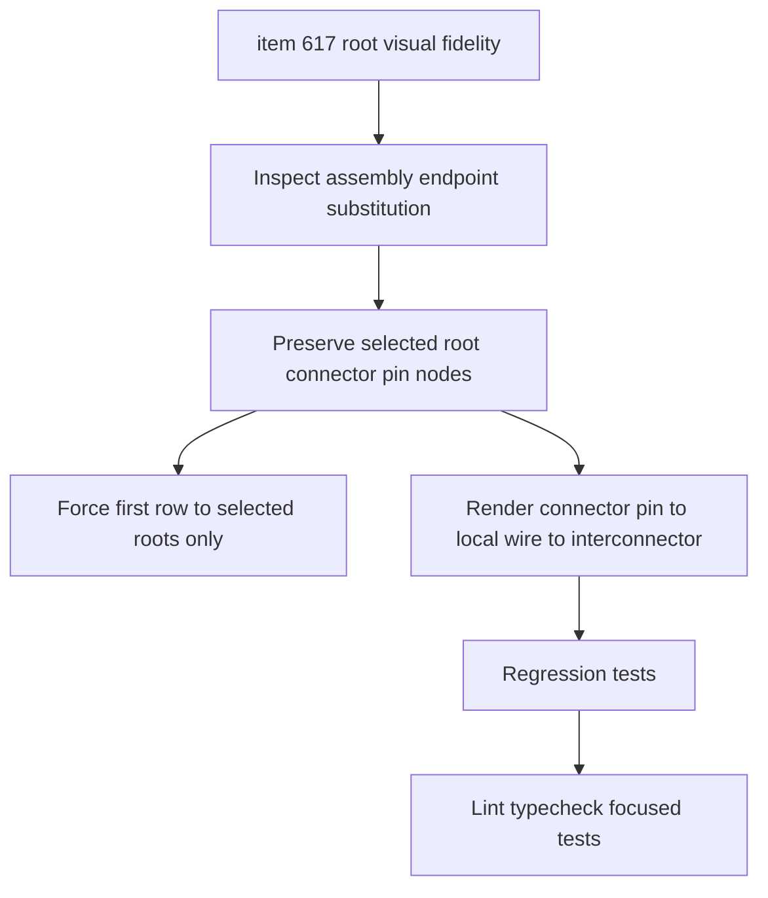

## task_126_harness_assembly_functional_root_connector_visual_fidelity - Harness Assembly Functional Root Connector Visual Fidelity

> From version: 1.14.0
> Schema version: 1.0
> Status: Done
> Understanding: 88%
> Confidence: 84%
> Progress: 100%
> Complexity: Medium
> Theme: Functional schematic / Harness assembly
> Reminder: Update status/understanding/confidence/progress and linked request/backlog references when you edit this doc.

# Context
Implement the root connector visual-fidelity slice defined in `logics/backlog/item_617_harness_assembly_functional_root_connector_visual_fidelity.md`.

The assembly functional graph must keep the saved selected master connector pins as the top visual anchors. Interconnector blocks can remain visible, but they must no longer replace selected root connector nodes or appear on the first graph row.

# Definition of Done (DoD)
- [x] Selected saved master connector roots render as connector pin nodes in the top/root layer.
- [x] The first visual row contains only selected saved root connector pin nodes.
- [x] Root connectors remain represented as one node per connected pin.
- [x] Interconnector nodes no longer replace selected root connector nodes.
- [x] A crossing path renders in the order selected connector pin, local wire, interconnector, distant wire.
- [x] Root connector node source IDs preserve network ID, connector ID, and pin/cavity index.
- [x] Existing non-root interconnector blocks remain visible for valid cross-harness transitions.
- [x] Automated tests cover a selected root connector that also participates in an interconnector link.

# Backlog
- `item_617_harness_assembly_functional_root_connector_visual_fidelity`

# Request
- `req_136_harness_assembly_functional_schematic_root_fidelity_fuse_box_and_strict_scope`

# Implementation Plan

## Step 1 - Inspect current substitution path
- Locate where assembly endpoints are resolved in `src/core/functionalSchematic.ts`.
- Identify all paths where selected root connector endpoints are converted to interconnector nodes.
- Confirm how graph rank/layering is derived for root nodes and interconnector nodes.

## Step 2 - Preserve selected root pin nodes
- Keep selected saved master connector pins as connector nodes even when their connector participates in an inter-harness link.
- Preserve network-qualified IDs and pin/cavity source IDs.
- Ensure per-pin root node creation remains compatible with current node rendering.

## Step 3 - Rewire crossing edges
- Insert interconnector nodes after the selected root connector and after the local wire segment.
- Preserve valid non-root interconnector rendering for downstream cross-harness transitions.
- Avoid changing fuse-box traversal or strict scope filtering in this task.

## Step 4 - Enforce first-row layout contract
- Ensure the graph rank/root layer contains only selected root connector pin nodes.
- Keep interconnector blocks off the first row even if their graph degree would otherwise promote them.
- Preserve existing readable ordering for downstream nodes.

## Step 5 - Add regression tests
- Extend `src/tests/core.functional-schematic.spec.ts`.
- Cover a selected root connector that is part of an interconnector link.
- Assert node kinds, source IDs, edge order, and first-row/root-node membership.

# Acceptance Criteria
- AC1: Selected saved master connector roots render as connector nodes in the top/root layer.
- AC2: The first visual row contains only selected saved root connector pin nodes.
- AC3: Root connectors remain represented as one node per connected pin.
- AC4: Interconnector nodes no longer replace selected root connector nodes.
- AC5: A selected root pin that crosses an interconnector renders in the intended order.
- AC6: Root connector node source IDs preserve network ID, connector ID, and pin/cavity index.
- AC7: Existing non-root interconnector blocks remain visible for valid cross-harness transitions.
- AC8: Automated tests cover the selected-root/interconnector case.

# Validation
- `python3 -m logics_manager lint --require-status`
- `npm run -s typecheck`
- `npm test -- --run src/tests/core.functional-schematic.spec.ts`
- `npm run -s lint`

# Report
- Finished on 2026-06-05.
- Implemented in `src/core/functionalSchematic.ts`.
- Selected root connector pins are no longer substituted by interconnector nodes in assembly endpoint rendering.
- Assembly `rootNodeIds` are now always selected connector pin node IDs, not interconnector IDs.
- Added regression coverage in `src/tests/core.functional-schematic.spec.ts` for a selected root connector that is also part of an interconnector link.
- Validation:
  - `npm run -s typecheck` -> OK.
  - `npm run -s lint` -> OK.
  - `npm test -- --run src/tests/core.functional-schematic.spec.ts src/tests/pdf-export.spec.ts src/tests/app.ui.import-export.spec.tsx` -> OK.

# AI Context
- Summary: Preserve selected harness assembly root connector pin nodes as the top row of the functional schematic while rendering interconnectors after local wire segments.
- Keywords: task, harness assembly, functional schematic, root connector, interconnector, top row, CT8, connector pin
- Use when: Implementing or reviewing root connector visual fidelity in assembly functional schematics.
- Skip when: Work targets strict scope filtering, fuse traversal, PDF export, or wire color selector UX.

# Links
- Request: `req_136_harness_assembly_functional_schematic_root_fidelity_fuse_box_and_strict_scope`
- Backlog: `item_617_harness_assembly_functional_root_connector_visual_fidelity`
- Product brief(s): `prod_006_trustworthy_functional_schematic_review`
- Architecture decision(s): `adr_007_harness_assembly_and_physical_interconnector_contract`

# AC Traceability
- request-AC1 -> This task. Evidence needed: Selected master connector roots render in the top/root layer as connector nodes, even when their pins are linked to interconnectors.
- request-AC2 -> This task. Evidence needed: Interconnector nodes render after selected root connector nodes and no longer replace those selected roots.
- request-AC3 -> This task. Evidence needed: The first visual row of the graph contains only selected saved root connector pin nodes.
- request-AC4 -> This task. Evidence needed: The graph clearly communicates that saved assembly roots are used for rendering, and unsaved root checkbox changes are not reflected until save.
- request-AC5 -> This task. Evidence needed: In the debug workspace, `CT8.B BCM 40V` with `Signal` does not include `Reveil batterie` branches that originate through `CT11.A` / `Interco lateral A`.
- request-AC6 -> This task. Evidence needed: In the debug workspace, `CT8.B BCM 40V` with `Signal` does not include `Capteur vitre D` when that trace originates from `CT8.A`.
- request-AC7 -> This task. Evidence needed: In the debug workspace, `CT8.A BCM 81V` with `12V power` shows fuse-box pair traversal for `CT4 Fuse Box` where configured pair data and matching wires exist.
- request-AC8 -> This task. Evidence needed: Fuse nodes in assembly graphs display fuse ratings from `fusePairRatings` where available.
- request-AC9 -> This task. Evidence needed: Assembly graph node and edge IDs remain network-qualified and collision-safe across harnesses.
- request-AC10 -> This task. Evidence needed: Existing cross-harness interconnector traversal still works for traces legitimately reached from selected roots.
- request-AC11 -> This task. Evidence needed: Existing single-network functional schematic behavior remains unchanged except for shared helper extraction with equivalent behavior.
- request-AC12 -> This task. Evidence needed: Automated tests cover root connector visual retention, interconnector-after-root ordering, strict selected-root scoping, assembly fuse-box traversal, rating display, and the debug workspace regressions where feasible.
- request-AC1 -> This task. Proof: Historical delivery is recorded in the linked backlog/task report and validation sections; this corpus repair formalizes strict audit traceability without changing shipped scope. Source: `logics corpus strict audit repair`
- request-AC2 -> This task. Proof: Historical delivery is recorded in the linked backlog/task report and validation sections; this corpus repair formalizes strict audit traceability without changing shipped scope. Source: `logics corpus strict audit repair`
- request-AC3 -> This task. Proof: Historical delivery is recorded in the linked backlog/task report and validation sections; this corpus repair formalizes strict audit traceability without changing shipped scope. Source: `logics corpus strict audit repair`
- request-AC4 -> This task. Proof: Historical delivery is recorded in the linked backlog/task report and validation sections; this corpus repair formalizes strict audit traceability without changing shipped scope. Source: `logics corpus strict audit repair`
- request-AC5 -> This task. Proof: Historical delivery is recorded in the linked backlog/task report and validation sections; this corpus repair formalizes strict audit traceability without changing shipped scope. Source: `logics corpus strict audit repair`
- request-AC6 -> This task. Proof: Historical delivery is recorded in the linked backlog/task report and validation sections; this corpus repair formalizes strict audit traceability without changing shipped scope. Source: `logics corpus strict audit repair`
- request-AC7 -> This task. Proof: Historical delivery is recorded in the linked backlog/task report and validation sections; this corpus repair formalizes strict audit traceability without changing shipped scope. Source: `logics corpus strict audit repair`
- request-AC8 -> This task. Proof: Historical delivery is recorded in the linked backlog/task report and validation sections; this corpus repair formalizes strict audit traceability without changing shipped scope. Source: `logics corpus strict audit repair`
- request-AC9 -> This task. Proof: Historical delivery is recorded in the linked backlog/task report and validation sections; this corpus repair formalizes strict audit traceability without changing shipped scope. Source: `logics corpus strict audit repair`
- request-AC10 -> This task. Proof: Historical delivery is recorded in the linked backlog/task report and validation sections; this corpus repair formalizes strict audit traceability without changing shipped scope. Source: `logics corpus strict audit repair`
- request-AC11 -> This task. Proof: Historical delivery is recorded in the linked backlog/task report and validation sections; this corpus repair formalizes strict audit traceability without changing shipped scope. Source: `logics corpus strict audit repair`
- request-AC12 -> This task. Proof: Historical delivery is recorded in the linked backlog/task report and validation sections; this corpus repair formalizes strict audit traceability without changing shipped scope. Source: `logics corpus strict audit repair`
