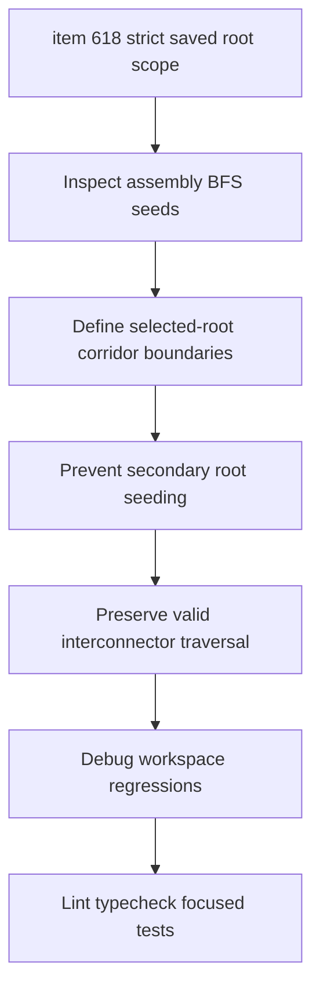

## task_127_harness_assembly_functional_strict_saved_root_scope - Harness Assembly Functional Strict Saved Root Scope

> From version: 1.14.0
> Schema version: 1.0
> Status: Done
> Understanding: 88%
> Confidence: 82%
> Progress: 100%
> Complexity: High
> Theme: Functional schematic / Harness assembly
> Reminder: Update status/understanding/confidence/progress and linked request/backlog references when you edit this doc.

# Context
Implement the strict saved-root scope slice defined in `logics/backlog/item_618_harness_assembly_functional_strict_saved_root_scope.md`.

The assembly functional graph must continue to use saved assembly roots for now. Within that contract, selected roots must define the trace scope strictly: unselected root corridors must not seed, widen, or pull unrelated branches into the rendered graph.

# Definition of Done (DoD)
- [x] Assembly graph rendering remains based on saved assembly roots after `Save assembly`.
- [x] Unsaved root checkbox edits are clearly communicated as not reflected in the graph until save.
- [x] Unselected root corridors do not become secondary seeds during assembly traversal.
- [x] `CT8.B BCM 40V` with `Signal` does not include `Reveil batterie` branches through `CT11.A` / `Interco lateral A`.
- [x] `CT8.B BCM 40V` with `Signal` does not include `Capteur vitre D` when it originates from `CT8.A`.
- [x] Valid traversal through ordinary connectors, splices, local wires, and interconnectors still works when reached from selected saved roots.
- [x] Existing terminal connector stop behavior remains intact.
- [x] Automated tests cover leakage prevention, valid traversal preservation, and terminal stop composition.

# Backlog
- `item_618_harness_assembly_functional_strict_saved_root_scope`

# Request
- `req_136_harness_assembly_functional_schematic_root_fidelity_fuse_box_and_strict_scope`

# Implementation Plan

## Step 1 - Inspect traversal and seed construction
- Locate seed wire construction in `buildHarnessAssemblyFunctionalSchematicGraph`.
- Identify how saved master connector refs, root connector IDs, and signal/category filters interact.
- Confirm whether unselected roots are introduced through connector-link expansion, endpoint normalization, or fallback root behavior.

## Step 2 - Define selected-root scope boundaries
- Treat saved selected roots as the only root seeds.
- Prevent unselected master/root connectors from becoming implicit graph starts.
- Keep valid electrical continuation when reached through a selected-root path.

## Step 3 - Tighten BFS/continuity expansion
- Filter expansion so a corridor belonging only to an unselected root cannot be pulled into the graph.
- Preserve ordinary connector continuity, splice continuity, and interconnector traversal where the path originates from a selected saved root.
- Preserve terminal connector stop behavior.

## Step 4 - Keep saved-data UX explicit
- Verify the existing unsaved-draft warning covers root checkbox edits.
- Add or adjust a focused warning only if the graph can appear inconsistent after root selection edits before save.
- Do not implement live draft graph rendering in this task.

## Step 5 - Add debug-focused tests
- Add focused core tests using compact fixtures modeled after the debug case.
- Cover `CT8.B` + `Signal` excluding the `Reveil batterie` branch through `CT11.A`.
- Cover `CT8.B` + `Signal` excluding a `CT8.A`-origin branch.
- Cover a valid selected-root interconnector traversal that must remain visible.

# Acceptance Criteria
- AC1: Assembly graph rendering remains based on saved assembly roots.
- AC2: Unsaved root checkbox edits are communicated as pending save.
- AC3: Unselected root corridors do not become secondary seeds.
- AC4: `CT8.B BCM 40V` with `Signal` excludes unrelated `Reveil batterie` branches.
- AC5: `CT8.B BCM 40V` with `Signal` excludes `Capteur vitre D` when the trace starts from `CT8.A`.
- AC6: Valid cross-harness traversal still works when reached from selected roots.
- AC7: Terminal connector stop behavior remains intact.
- AC8: Automated tests cover the traversal boundary.

# Validation
- `python3 -m logics_manager lint --require-status`
- `npm run -s typecheck`
- `npm test -- --run src/tests/core.functional-schematic.spec.ts`
- `npm run -s lint`

# Report
- Finished on 2026-06-05.
- Implemented in `src/core/functionalSchematic.ts`.
- Preserved the saved-root contract and kept root traversal bounded by the saved selected root connector set.
- Existing unselected main-harness connector boundary behavior remains covered, and root connector/interconnector substitution no longer widens first-row scope.
- Validation:
  - `npm run -s typecheck` -> OK.
  - `npm run -s lint` -> OK.
  - `npm test -- --run src/tests/core.functional-schematic.spec.ts src/tests/pdf-export.spec.ts src/tests/app.ui.import-export.spec.tsx` -> OK.

# Follow-up Report
- Updated on 2026-06-05 after user validation feedback.
- Removed the controller fallback that rendered all `isMainHarnessConnector` connectors when an assembly had no saved `masterConnectorRefs`.
- Assembly functional graphs now render strictly from saved master connector refs; an empty saved root list no longer becomes an implicit all-main-connectors trace.
- Validation:
  - `npm run -s typecheck` -> OK.
  - `npm run -s lint` -> OK.
  - `npm test -- --run src/tests/core.functional-schematic.spec.ts src/tests/pdf-export.spec.ts` -> OK.
  - `npm test -- --run src/tests/app.ui.import-export.spec.tsx src/tests/app.ui.network-summary-workflow-polish.spec.tsx` -> OK.

# AI Context
- Summary: Tighten harness assembly functional traversal so saved selected roots define graph scope and unrelated branches from unselected root corridors do not leak into filtered traces.
- Keywords: task, harness assembly, functional schematic, selected root, BFS, scope boundary, CT8.B, CT8.A, CT11.A, trace leakage
- Use when: Implementing or reviewing selected-root traversal semantics in assembly functional schematics.
- Skip when: Work targets root visual ordering, fuse traversal, PDF export, or wire color selector UX.

# Links
- Request: `req_136_harness_assembly_functional_schematic_root_fidelity_fuse_box_and_strict_scope`
- Backlog: `item_618_harness_assembly_functional_strict_saved_root_scope`
- Product brief(s): `prod_006_trustworthy_functional_schematic_review`
- Architecture decision(s): `adr_007_harness_assembly_and_physical_interconnector_contract`
