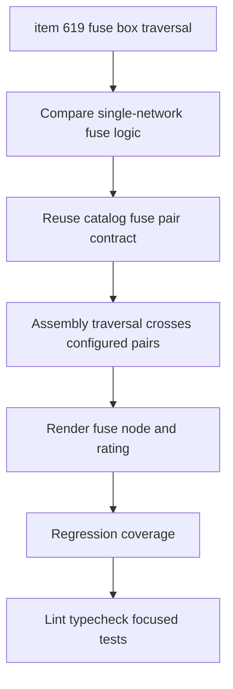

## task_128_harness_assembly_functional_fuse_box_pair_traversal - Harness Assembly Functional Fuse Box Pair Traversal

> From version: 1.14.0
> Schema version: 1.0
> Status: Done
> Understanding: 86%
> Confidence: 82%
> Progress: 100%
> Complexity: High
> Theme: Functional schematic / Harness assembly
> Reminder: Update status/understanding/confidence/progress and linked request/backlog references when you edit this doc.

# Context
Implement the fuse-box pair traversal slice defined in `logics/backlog/item_619_harness_assembly_functional_fuse_box_pair_traversal.md`.

The single-network functional graph already has fuse-box cavity/pair behavior. The assembly functional graph must gain equivalent traversal and rendering so `12V power` traces do not stop at the fuse box when a configured catalog fuse pair provides continuity.

# Definition of Done (DoD)
- [x] Assembly graph derivation traverses configured catalog fuse-box cavity pairs.
- [x] Only pairs declared in the fuse-box catalog/configuration provide continuity.
- [x] Fuse traversal works across network-qualified assembly node IDs.
- [x] The graph renders a fuse/fuse-box element instead of silently stopping at the fuse-box connector.
- [x] Fuse rating/type metadata is displayed when available.
- [x] Unconfigured fuse-box cavities remain stop points.
- [x] Existing single-network fuse behavior does not regress.
- [x] Automated tests cover configured pair traversal, unconfigured stop behavior, and display metadata.

# Backlog
- `item_619_harness_assembly_functional_fuse_box_pair_traversal`

# Request
- `req_136_harness_assembly_functional_schematic_root_fidelity_fuse_box_and_strict_scope`

# Implementation Plan

## Step 1 - Compare existing fuse logic
- Inspect single-network fuse helpers in `src/core/functionalSchematic.ts`.
- Identify reusable pieces such as fuse-box cavity info, pair lookup, fuse node shape, and display metadata.
- Confirm why assembly graph currently treats the fuse box as an ordinary connector.

## Step 2 - Add assembly-safe fuse pair lookup
- Build a network-qualified fuse-pair lookup for assembly graphs.
- Ensure only configured catalog pairs provide continuity.
- Preserve cavity/pin identity and avoid broad connector-to-connector passthrough.

## Step 3 - Traverse configured fuse pairs
- Update assembly traversal so a selected-root path can cross a configured fuse pair.
- Ensure `12V power` traces from `CT8.A` can continue through the fuse box when the catalog pair allows it.
- Keep unconfigured cavities as stop points.

## Step 4 - Render fuse nodes
- Add or reuse the fuse node representation in the assembly graph output.
- Include rating/type metadata when available.
- Keep labels compact and consistent with the current functional schematic UI.

## Step 5 - Add regression tests
- Add a configured fuse pair traversal fixture.
- Add an unconfigured fuse-box cavity stop fixture.
- Add metadata display assertions where the graph model exposes rating/type.
- Keep existing single-network fuse tests green.

# Acceptance Criteria
- AC1: Assembly graph derivation traverses configured fuse-box pairs.
- AC2: Only configured catalog pairs provide continuity.
- AC3: Traversal works with network-qualified assembly IDs.
- AC4: The graph renders a fuse/fuse-box element for the crossing.
- AC5: Fuse rating/type metadata is available when configured.
- AC6: Unconfigured fuse-box cavities remain stop points.
- AC7: Single-network fuse behavior does not regress.
- AC8: Automated tests cover traversal, stop, and metadata cases.

# Validation
- `python3 -m logics_manager lint --require-status`
- `npm run -s typecheck`
- `npm test -- --run src/tests/core.functional-schematic.spec.ts`
- `npm run -s lint`

# Report
- Finished on 2026-06-05.
- Implemented in `src/core/functionalSchematic.ts`.
- Assembly traversal now builds network-qualified fuse-box pair indexes from catalog/configured pairs.
- Assembly BFS crosses only configured fuse-box pairs and renders network-qualified fuse nodes with rating labels.
- Added regression coverage in `src/tests/core.functional-schematic.spec.ts` for configured pair traversal, rating display, and non-bridging of unrelated pairs.
- Validation:
  - `npm run -s typecheck` -> OK.
  - `npm run -s lint` -> OK.
  - `npm test -- --run src/tests/core.functional-schematic.spec.ts src/tests/pdf-export.spec.ts src/tests/app.ui.import-export.spec.tsx` -> OK.

# Follow-up Report
- Updated on 2026-06-05 after user validation feedback that fuse nodes appeared without visible output.
- Assembly fuse rendering now preserves physical fuse-box pin nodes and adds explicit internal pin-to-fuse / fuse-to-pin edges.
- Filtered assembly traces keep wires on the same configured fuse pair when at least one pair-side wire matches the active filter, so `12V power` traces can remain continuous through the fuse box.
- Regression coverage now asserts the chain `input wire -> fuse-box pin -> fuse -> fuse-box pin -> output wire` under a filtered assembly graph.
- Validation:
  - `npm run -s typecheck` -> OK.
  - `npm run -s lint` -> OK.
  - `npm test -- --run src/tests/core.functional-schematic.spec.ts src/tests/pdf-export.spec.ts` -> OK.

# AI Context
- Summary: Add fuse-box configured pair traversal and fuse rendering to harness assembly functional schematics while preserving existing single-network behavior.
- Keywords: task, harness assembly, functional schematic, fuse box, fuse pair, catalog pair, 12V power, CT8.A
- Use when: Implementing or reviewing fuse continuity in assembly functional schematics.
- Skip when: Work targets root visual ordering, strict scope filtering, PDF export, or wire color selector UX.

# Links
- Request: `req_136_harness_assembly_functional_schematic_root_fidelity_fuse_box_and_strict_scope`
- Backlog: `item_619_harness_assembly_functional_fuse_box_pair_traversal`
- Product brief(s): `prod_006_trustworthy_functional_schematic_review`
- Architecture decision(s): `adr_007_harness_assembly_and_physical_interconnector_contract`

# AC Traceability
- request-AC1 -> This task. Evidence needed: Selected master connector roots render in the top/root layer as connector nodes, even when their pins are linked to interconnectors.
- request-AC2 -> This task. Evidence needed: Interconnector nodes render after selected root connector nodes and no longer replace those selected roots.
- request-AC3 -> This task. Evidence needed: The first visual row of the graph contains only selected saved root connector pin nodes.
- request-AC4 -> This task. Evidence needed: The graph clearly communicates that saved assembly roots are used for rendering, and unsaved root checkbox changes are not reflected until save.
- request-AC5 -> This task. Evidence needed: In the debug workspace, `CT8.B BCM 40V` with `Signal` does not include `Reveil batterie` branches that originate through `CT11.A` / `Interco lateral A`.
- request-AC6 -> This task. Evidence needed: In the debug workspace, `CT8.B BCM 40V` with `Signal` does not include `Capteur vitre D` when that trace originates from `CT8.A`.
- request-AC7 -> This task. Evidence needed: In the debug workspace, `CT8.A BCM 81V` with `12V power` shows fuse-box pair traversal for `CT4 Fuse Box` where configured pair data and matching wires exist.
- request-AC8 -> This task. Evidence needed: Fuse nodes in assembly graphs display fuse ratings from `fusePairRatings` where available.
- request-AC9 -> This task. Evidence needed: Assembly graph node and edge IDs remain network-qualified and collision-safe across harnesses.
- request-AC10 -> This task. Evidence needed: Existing cross-harness interconnector traversal still works for traces legitimately reached from selected roots.
- request-AC11 -> This task. Evidence needed: Existing single-network functional schematic behavior remains unchanged except for shared helper extraction with equivalent behavior.
- request-AC12 -> This task. Evidence needed: Automated tests cover root connector visual retention, interconnector-after-root ordering, strict selected-root scoping, assembly fuse-box traversal, rating display, and the debug workspace regressions where feasible.
- request-AC1 -> This task. Proof: Historical delivery is recorded in the linked backlog/task report and validation sections; this corpus repair formalizes strict audit traceability without changing shipped scope. Source: `logics corpus strict audit repair`
- request-AC2 -> This task. Proof: Historical delivery is recorded in the linked backlog/task report and validation sections; this corpus repair formalizes strict audit traceability without changing shipped scope. Source: `logics corpus strict audit repair`
- request-AC3 -> This task. Proof: Historical delivery is recorded in the linked backlog/task report and validation sections; this corpus repair formalizes strict audit traceability without changing shipped scope. Source: `logics corpus strict audit repair`
- request-AC4 -> This task. Proof: Historical delivery is recorded in the linked backlog/task report and validation sections; this corpus repair formalizes strict audit traceability without changing shipped scope. Source: `logics corpus strict audit repair`
- request-AC5 -> This task. Proof: Historical delivery is recorded in the linked backlog/task report and validation sections; this corpus repair formalizes strict audit traceability without changing shipped scope. Source: `logics corpus strict audit repair`
- request-AC6 -> This task. Proof: Historical delivery is recorded in the linked backlog/task report and validation sections; this corpus repair formalizes strict audit traceability without changing shipped scope. Source: `logics corpus strict audit repair`
- request-AC7 -> This task. Proof: Historical delivery is recorded in the linked backlog/task report and validation sections; this corpus repair formalizes strict audit traceability without changing shipped scope. Source: `logics corpus strict audit repair`
- request-AC8 -> This task. Proof: Historical delivery is recorded in the linked backlog/task report and validation sections; this corpus repair formalizes strict audit traceability without changing shipped scope. Source: `logics corpus strict audit repair`
- request-AC9 -> This task. Proof: Historical delivery is recorded in the linked backlog/task report and validation sections; this corpus repair formalizes strict audit traceability without changing shipped scope. Source: `logics corpus strict audit repair`
- request-AC10 -> This task. Proof: Historical delivery is recorded in the linked backlog/task report and validation sections; this corpus repair formalizes strict audit traceability without changing shipped scope. Source: `logics corpus strict audit repair`
- request-AC11 -> This task. Proof: Historical delivery is recorded in the linked backlog/task report and validation sections; this corpus repair formalizes strict audit traceability without changing shipped scope. Source: `logics corpus strict audit repair`
- request-AC12 -> This task. Proof: Historical delivery is recorded in the linked backlog/task report and validation sections; this corpus repair formalizes strict audit traceability without changing shipped scope. Source: `logics corpus strict audit repair`
