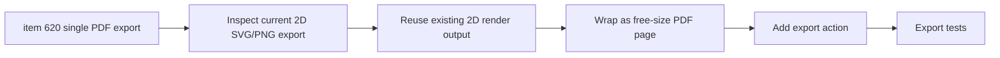

## task_129_network_summary_2d_single_pdf_export - Network Summary 2D Single PDF Export

> From version: 1.14.0
> Schema version: 1.0
> Status: Done
> Understanding: 88%
> Confidence: 84%
> Progress: 100%
> Complexity: Medium
> Theme: Export / Network Summary 2D
> Reminder: Update status/understanding/confidence/progress and linked request/backlog references when you edit this doc.

# Context
Implement the single current Network Summary 2D PDF export slice defined in `logics/backlog/item_620_network_summary_2d_single_pdf_export.md`.

The operator needs a direct PDF export for the same 2D plan output currently available as SVG/PNG. The PDF should preserve the plan, frame/cartouche/background, and existing export options, with free-size dimensions rather than a forced A4/A3 page.

# Definition of Done (DoD)
- [x] Network Summary 2D exposes a PDF export action for the current plan.
- [x] The PDF uses the same rendered content as the current 2D SVG export.
- [x] The export preserves frame/cartouche/background according to existing export options.
- [x] The PDF page size follows the rendered plan bounds and is not constrained to A4/A3.
- [x] Existing SVG/PNG exports keep their current behavior.
- [x] File naming follows current export naming conventions.
- [x] Export failures surface through the existing toast/error feedback pattern.
- [x] Automated coverage verifies PDF action availability and export payload generation.

# Backlog
- `item_620_network_summary_2d_single_pdf_export`

# Request
- `req_137_pdf_export_for_2d_plans_and_grouped_image_pdf_export`

# Implementation Plan

## Step 1 - Inspect current 2D export pipeline
- Locate the Network Summary 2D SVG/PNG export code.
- Identify how rendered bounds, frame/cartouche/background, and filename metadata are built.
- Confirm whether PDF support already exists elsewhere in the export stack.

## Step 2 - Add free-size PDF generation
- Reuse the existing 2D render output as the source of truth.
- Create a single PDF page sized to the rendered plan bounds.
- Preserve image quality and vector content where feasible; avoid reimplementing the 2D renderer.

## Step 3 - Wire UI action
- Add a PDF export action next to existing 2D export actions.
- Use existing icon/button/export menu conventions.
- Route success and failure through existing export feedback.

## Step 4 - Preserve existing exports
- Verify SVG/PNG output remains unchanged.
- Keep existing option semantics for frame/cartouche/background.
- Do not add multi-network/grouped behavior in this task.

## Step 5 - Add tests
- Add focused tests around export action availability and PDF export invocation.
- Add unit coverage for page-size/bounds calculation if a new helper is introduced.
- Mock browser/download APIs consistently with existing export tests.

# Acceptance Criteria
- AC1: A PDF export action is available for the current Network Summary 2D plan.
- AC2: The PDF content matches the existing 2D SVG export content.
- AC3: Frame/cartouche/background options are preserved.
- AC4: The PDF page size follows the plan bounds.
- AC5: Existing SVG/PNG exports do not regress.
- AC6: File naming follows existing conventions.
- AC7: Export errors surface through existing feedback.
- AC8: Automated tests cover the new PDF path.

# Validation
- `python3 -m logics_manager lint --require-status`
- `npm run -s typecheck`
- Focused export/UI tests once located or added.
- `npm run -s lint`
- `npm run -s build`

# Report
- Finished on 2026-06-05.
- Implemented in `src/app/components/network-summary/export/useNetworkSummaryExportActions.ts`, `src/app/components/network-summary/NetworkSummaryExportMenu.tsx`, `src/app/components/network-summary/NetworkSummaryHeader.tsx`, and `src/app/components/NetworkSummaryPanel.tsx`.
- Added `src/app/lib/pdfExport.ts`, a local free-size image PDF writer.
- The Network Summary export menu now exposes `PDF`; the PDF uses the same decorated/fitted SVG render path, rasterized as a page-sized image.
- Added `src/tests/pdf-export.spec.ts` and UI coverage asserting the PDF action is present.
- Validation:
  - `npm run -s typecheck` -> OK.
  - `npm run -s lint` -> OK.
  - `npm test -- --run src/tests/core.functional-schematic.spec.ts src/tests/pdf-export.spec.ts src/tests/app.ui.import-export.spec.tsx` -> OK.
  - `npm test -- --run src/tests/app.ui.network-summary-bom-export.spec.tsx` -> OK.

# Follow-up Report
- Updated on 2026-06-05 after user validation feedback that PDF text was too pixelated.
- The PDF page keeps the same free-size plan bounds, but the embedded raster image is now generated up to 4x resolution with browser canvas safety caps.
- JPEG export quality was raised for PDF rendering, and the PDF writer now supports image pixel dimensions that differ from page dimensions.
- Validation:
  - `npm run -s typecheck` -> OK.
  - `npm run -s lint` -> OK.
  - `npm test -- --run src/tests/core.functional-schematic.spec.ts src/tests/pdf-export.spec.ts` -> OK.
  - `npm test -- --run src/tests/app.ui.import-export.spec.tsx src/tests/app.ui.network-summary-workflow-polish.spec.tsx` -> OK.

# AI Context
- Summary: Add a current Network Summary 2D PDF export using the same rendered output and options as existing SVG/PNG exports, with free-size PDF bounds.
- Keywords: task, PDF export, Network Summary 2D, SVG export, free-size PDF, cartouche, frame, background
- Use when: Implementing or reviewing the single-plan 2D PDF export.
- Skip when: Work targets grouped PDF export, functional schematic export, or external image upload.

# Links
- Request: `req_137_pdf_export_for_2d_plans_and_grouped_image_pdf_export`
- Backlog: `item_620_network_summary_2d_single_pdf_export`
- Product brief(s): (none)
- Architecture decision(s): (none)
