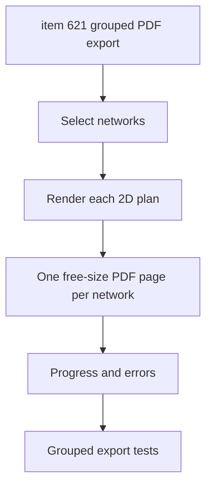

## task_130_network_summary_2d_grouped_selected_networks_pdf_export - Network Summary 2D Grouped Selected Networks PDF Export

> From version: 1.14.0
> Schema version: 1.0
> Status: Done
> Understanding: 86%
> Confidence: 82%
> Progress: 100%
> Complexity: Medium
> Theme: Export / Network Summary 2D
> Reminder: Update status/understanding/confidence/progress and linked request/backlog references when you edit this doc.

# Context
Implement the grouped selected-networks PDF export slice defined in `logics/backlog/item_621_network_summary_2d_grouped_selected_networks_pdf_export.md`.

The grouped export must create one PDF containing one free-size page per selected network. Each page should use the same Network Summary 2D render output and options as the current SVG export.

# Definition of Done (DoD)
- [x] A grouped PDF export action is available for selected networks.
- [x] The export creates one PDF page per selected network.
- [x] Each page uses the same Network Summary 2D output as the existing SVG export.
- [x] Each page uses free-size dimensions based on that network's rendered bounds.
- [x] Frame/cartouche/background options are preserved per page.
- [x] Empty selection and missing/unrenderable network cases show explicit feedback.
- [x] The grouped export does not alter active network or per-network saved state.
- [x] Automated tests cover selection, page generation, and error/empty states.

# Backlog
- `item_621_network_summary_2d_grouped_selected_networks_pdf_export`

# Request
- `req_137_pdf_export_for_2d_plans_and_grouped_image_pdf_export`

# Implementation Plan

## Step 1 - Inspect selection and export entry points
- Locate existing selected-network or batch export UI patterns.
- Decide where the grouped PDF action belongs in the Network Summary 2D export UI.
- Confirm how inactive network data can be rendered without changing the active network.

## Step 2 - Reuse the single-plan PDF generator
- Depend on the single PDF export helper from `task_129`.
- Render each selected network through the same 2D plan renderer.
- Add one PDF page per selected network using that page's own bounds.

## Step 3 - Add grouped export UI and feedback
- Add a grouped PDF action for selected networks.
- Handle empty selection with a clear non-destructive message.
- Surface per-network render failures without producing misleading pages.
- Keep filename naming consistent with existing export conventions.

## Step 4 - Preserve app state
- Ensure the grouped export does not switch the active network as a side effect.
- Avoid mutating project/domain state during rendering.
- Keep existing SVG/PNG exports unchanged.

## Step 5 - Add tests
- Cover grouped action visibility and disabled/empty selection behavior.
- Cover one page per selected network.
- Cover free-size page bounds per network.
- Cover partial or failed render feedback if supported by the chosen export API.

# Acceptance Criteria
- AC1: A grouped PDF export action is available for selected networks.
- AC2: The export creates one page per selected network.
- AC3: Each page uses current Network Summary 2D output.
- AC4: Each page uses free-size dimensions from rendered bounds.
- AC5: Frame/cartouche/background options are preserved.
- AC6: Empty selection and render failures show explicit feedback.
- AC7: The export does not alter active network or saved state.
- AC8: Automated tests cover grouped export behavior.

# Validation
- `python3 -m logics_manager lint --require-status`
- `npm run -s typecheck`
- Focused grouped export/UI tests once located or added.
- `npm run -s lint`
- `npm run -s build`

# Report
- Finished on 2026-06-05.
- Implemented in `src/app/hooks/useNetworkImportExport.ts`, `src/app/hooks/networkImportExportTypes.ts`, `src/app/components/workspace/SettingsWorkspaceContent.tsx`, and controller settings wiring.
- Added grouped PDF export in Settings beside grouped SVG/PNG/BOM.
- The grouped PDF flow iterates selected networks, renders one free-size PDF page per network through the Network Summary panel handle, restores the original active network, and downloads one PDF file.
- Validation:
  - `npm run -s typecheck` -> OK.
  - `npm run -s lint` -> OK.
  - `npm test -- --run src/tests/core.functional-schematic.spec.ts src/tests/pdf-export.spec.ts src/tests/app.ui.import-export.spec.tsx` -> OK.

# Follow-up Report
- Updated on 2026-06-05 after user validation feedback on PDF readability.
- Grouped PDF pages inherit the same high-resolution page image generation as the single-plan PDF export.
- The grouped PDF writer now embeds high-density images while preserving each page's free-size plan dimensions.
- Validation:
  - `npm run -s typecheck` -> OK.
  - `npm run -s lint` -> OK.
  - `npm test -- --run src/tests/core.functional-schematic.spec.ts src/tests/pdf-export.spec.ts` -> OK.
  - `npm test -- --run src/tests/app.ui.import-export.spec.tsx src/tests/app.ui.network-summary-workflow-polish.spec.tsx` -> OK.

# AI Context
- Summary: Add a grouped Network Summary 2D PDF export that renders selected networks as one free-size page per network using the existing 2D output.
- Keywords: task, grouped PDF export, Network Summary 2D, selected networks, one page per network, free-size PDF
- Use when: Implementing or reviewing batch PDF export for selected 2D plans.
- Skip when: Work targets single current-plan PDF export only, functional schematic export, or external image upload.

# Links
- Request: `req_137_pdf_export_for_2d_plans_and_grouped_image_pdf_export`
- Backlog: `item_621_network_summary_2d_grouped_selected_networks_pdf_export`
- Product brief(s): (none)
- Architecture decision(s): (none)

# AC Traceability
- request-AC1 -> This task. Evidence needed: The Network Summary 2D export menu exposes a PDF export option.
- request-AC2 -> This task. Evidence needed: A single exported PDF contains the same rendered plan content as the corresponding PNG/SVG export, with preserved aspect ratio.
- request-AC3 -> This task. Evidence needed: PDF export supports the existing export background, frame, and cartouche options where enabled.
- request-AC4 -> This task. Evidence needed: PDF generation shows loading feedback and does not leave the UI in a stuck loading state on failure.
- request-AC5 -> This task. Evidence needed: A grouped PDF export action can generate one PDF with one selected app-rendered image/page per PDF page.
- request-AC6 -> This task. Evidence needed: Grouped PDF page order is deterministic and visible before final export.
- request-AC7 -> This task. Evidence needed: Multi-page export creates free-size pages from each rendered Network Summary 2D plan without cropping by default.
- request-AC8 -> This task. Evidence needed: The implementation does not require any remote service.
- request-AC9 -> This task. Evidence needed: Existing SVG and PNG export behavior remains unchanged.
- request-AC10 -> This task. Evidence needed: Automated tests cover export option availability, filename extension, grouped page count behavior at the abstraction level available in tests, and failure handling.
- request-AC1 -> This task. Proof: Historical delivery is recorded in the linked backlog/task report and validation sections; this corpus repair formalizes strict audit traceability without changing shipped scope. Source: `logics corpus strict audit repair`
- request-AC2 -> This task. Proof: Historical delivery is recorded in the linked backlog/task report and validation sections; this corpus repair formalizes strict audit traceability without changing shipped scope. Source: `logics corpus strict audit repair`
- request-AC3 -> This task. Proof: Historical delivery is recorded in the linked backlog/task report and validation sections; this corpus repair formalizes strict audit traceability without changing shipped scope. Source: `logics corpus strict audit repair`
- request-AC4 -> This task. Proof: Historical delivery is recorded in the linked backlog/task report and validation sections; this corpus repair formalizes strict audit traceability without changing shipped scope. Source: `logics corpus strict audit repair`
- request-AC5 -> This task. Proof: Historical delivery is recorded in the linked backlog/task report and validation sections; this corpus repair formalizes strict audit traceability without changing shipped scope. Source: `logics corpus strict audit repair`
- request-AC6 -> This task. Proof: Historical delivery is recorded in the linked backlog/task report and validation sections; this corpus repair formalizes strict audit traceability without changing shipped scope. Source: `logics corpus strict audit repair`
- request-AC7 -> This task. Proof: Historical delivery is recorded in the linked backlog/task report and validation sections; this corpus repair formalizes strict audit traceability without changing shipped scope. Source: `logics corpus strict audit repair`
- request-AC8 -> This task. Proof: Historical delivery is recorded in the linked backlog/task report and validation sections; this corpus repair formalizes strict audit traceability without changing shipped scope. Source: `logics corpus strict audit repair`
- request-AC9 -> This task. Proof: Historical delivery is recorded in the linked backlog/task report and validation sections; this corpus repair formalizes strict audit traceability without changing shipped scope. Source: `logics corpus strict audit repair`
- request-AC10 -> This task. Proof: Historical delivery is recorded in the linked backlog/task report and validation sections; this corpus repair formalizes strict audit traceability without changing shipped scope. Source: `logics corpus strict audit repair`
