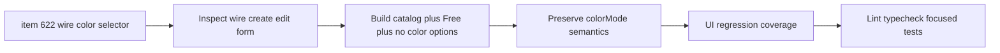

## task_131_wire_color_primary_selector_catalog_with_free_option - Wire Color Primary Selector Catalog With Free Option

> From version: 1.14.0
> Schema version: 1.0
> Status: Done
> Understanding: 86%
> Confidence: 86%
> Progress: 100%
> Complexity: Small
> Theme: Modeling UX / Wire color
> Reminder: Update status/understanding/confidence/progress and linked request/backlog references when you edit this doc.

# Context
Implement the wire color primary-selector correction defined in `logics/backlog/item_622_wire_color_primary_selector_catalog_with_free_option.md`.

The primary wire color selector should directly list catalog colors. The `Free` option must be added to that same menu, while preserving no-color behavior and existing `colorMode` semantics.

# Definition of Done (DoD)
- [x] Wire create/edit primary color selector shows catalog colors directly.
- [x] The same primary selector includes a `Free` option.
- [x] Selecting `Free` switches to free color mode and clears catalog color IDs.
- [x] Selecting a catalog color switches to catalog mode and clears free color semantics as required.
- [x] No-color/unspecified remains possible and preserves existing behavior.
- [x] Secondary color remains available only for catalog primary colors.
- [x] Existing persisted wire color states hydrate into the corrected controls without data loss.
- [x] Automated UI tests cover catalog direct selection, `Free`, no-color, and edit-mode hydration.

# Backlog
- `item_622_wire_color_primary_selector_catalog_with_free_option`

# Request
- `req_138_wire_color_primary_selector_catalog_with_free_option`

# Implementation Plan

## Step 1 - Inspect current form state
- Locate the wire create/edit form component and color selector helpers.
- Confirm how `colorMode`, catalog color IDs, free color labels, and secondary color are stored.
- Identify where the current extra mode selector was introduced.

## Step 2 - Build direct primary options
- Replace the mode-first primary UX with one primary selector containing:
  - no-color/unspecified;
  - `Free`;
  - catalog colors.
- Keep labels compact and consistent with existing catalog color display.
- Preserve existing secondary color UI placement.

## Step 3 - Preserve state semantics
- Selecting a catalog color sets catalog mode and clears incompatible free state.
- Selecting `Free` sets free mode and clears catalog IDs.
- Selecting no-color/unspecified preserves the current no-color behavior.
- Edit mode must hydrate existing none, catalog, bicolor, and free states correctly.

## Step 4 - Add focused tests
- Cover catalog color selection directly from the primary selector.
- Cover `Free` option selection and state normalization.
- Cover no-color selection.
- Cover edit-mode hydration for catalog, bicolor, free, and no-color wires.

# Acceptance Criteria
- AC1: Primary selector shows catalog colors directly.
- AC2: Primary selector includes `Free`.
- AC3: Selecting `Free` sets free mode and clears catalog IDs.
- AC4: Selecting a catalog color sets catalog mode and clears incompatible free state.
- AC5: No-color/unspecified remains possible.
- AC6: Secondary color is available only for catalog primary colors.
- AC7: Persisted color states hydrate without data loss.
- AC8: Automated UI tests cover the corrected behavior.

# Validation
- `python3 -m logics_manager lint --require-status`
- `npm run -s typecheck`
- Focused wire form/UI tests once located or added.
- `npm run -s lint`

# Report
- Finished on 2026-06-05.
- Implemented in `src/app/components/workspace/ModelingWireFormPanel.tsx`.
- Removed the mode-first color selection UX from the wire form.
- `Primary color` now directly lists `Not specified`, `Free`, and catalog colors; selecting each option preserves existing `colorMode`/catalog/free state semantics.
- Updated focused UI coverage in `src/tests/app.ui.wire-free-color-mode.spec.tsx` and `src/tests/app.ui.creation-flow-wire-ergonomics.spec.tsx`.
- Validation:
  - `npm run -s typecheck` -> OK.
  - `npm run -s lint` -> OK.
  - `npm test -- --run src/tests/app.ui.wire-free-color-mode.spec.tsx src/tests/app.ui.creation-flow-wire-ergonomics.spec.tsx` -> OK.

# AI Context
- Summary: Restore direct catalog access in the wire primary color selector while adding `Free` as an option and preserving no-color/catalog/free state semantics.
- Keywords: task, wire color, primary selector, catalog color, Free, colorMode, bicolor, no color, modeling form
- Use when: Implementing or reviewing the wire create/edit color selector.
- Skip when: Work targets read-only color display, PDF export, or functional schematic behavior.

# Links
- Request: `req_138_wire_color_primary_selector_catalog_with_free_option`
- Backlog: `item_622_wire_color_primary_selector_catalog_with_free_option`
- Product brief(s): (none)
- Architecture decision(s): (none)

# AC Traceability
- request-AC1 -> This task. Evidence needed: Wire create/edit form primary color selector shows catalog colors directly without first selecting a separate catalog mode.
- request-AC2 -> This task. Evidence needed: The primary color selector includes a `Free` option.
- request-AC3 -> This task. Evidence needed: Selecting `Free` switches the wire to free color mode and clears catalog color IDs.
- request-AC4 -> This task. Evidence needed: Selecting a catalog color switches the wire to catalog mode and clears free color label semantics as currently required.
- request-AC5 -> This task. Evidence needed: Selecting no-color/unspecified remains possible and preserves existing no-color behavior.
- request-AC6 -> This task. Evidence needed: Secondary color is available only for catalog primary colors.
- request-AC7 -> This task. Evidence needed: Existing persisted wire color states load into the corrected controls without losing data.
- request-AC8 -> This task. Evidence needed: Automated UI coverage verifies catalog direct selection, Free option selection, no-color selection, and edit-mode hydration.
- request-AC1 -> This task. Proof: Historical delivery is recorded in the linked backlog/task report and validation sections; this corpus repair formalizes strict audit traceability without changing shipped scope. Source: `logics corpus strict audit repair`
- request-AC2 -> This task. Proof: Historical delivery is recorded in the linked backlog/task report and validation sections; this corpus repair formalizes strict audit traceability without changing shipped scope. Source: `logics corpus strict audit repair`
- request-AC3 -> This task. Proof: Historical delivery is recorded in the linked backlog/task report and validation sections; this corpus repair formalizes strict audit traceability without changing shipped scope. Source: `logics corpus strict audit repair`
- request-AC4 -> This task. Proof: Historical delivery is recorded in the linked backlog/task report and validation sections; this corpus repair formalizes strict audit traceability without changing shipped scope. Source: `logics corpus strict audit repair`
- request-AC5 -> This task. Proof: Historical delivery is recorded in the linked backlog/task report and validation sections; this corpus repair formalizes strict audit traceability without changing shipped scope. Source: `logics corpus strict audit repair`
- request-AC6 -> This task. Proof: Historical delivery is recorded in the linked backlog/task report and validation sections; this corpus repair formalizes strict audit traceability without changing shipped scope. Source: `logics corpus strict audit repair`
- request-AC7 -> This task. Proof: Historical delivery is recorded in the linked backlog/task report and validation sections; this corpus repair formalizes strict audit traceability without changing shipped scope. Source: `logics corpus strict audit repair`
- request-AC8 -> This task. Proof: Historical delivery is recorded in the linked backlog/task report and validation sections; this corpus repair formalizes strict audit traceability without changing shipped scope. Source: `logics corpus strict audit repair`
