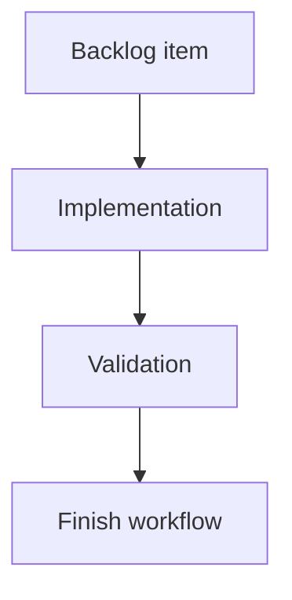

## task_132_harness_assembly_functional_trace_scope_boundaries_for_selected_master_connectors - Harness Assembly Functional Trace Scope Boundaries For Selected Master Connectors
> From version: 1.14.0
> Schema version: 1.0
> Status: Done
> Understanding: 100%
> Confidence: 96%
> Progress: 100%
> Complexity: Medium
> Theme: Implementation delivery
> Reminder: Update status/understanding/confidence/progress and linked request/backlog references when you edit this doc.

# Definition of Done (DoD)
- [x] The backlog scope is implemented.
- [x] Acceptance criteria are covered.
- [x] Validation passes.

# Backlog
- `item_623_harness_assembly_functional_trace_scope_boundaries_for_selected_master_connectors`

# Acceptance criteria
- AC1: In an assembly with multiple saved master connectors, selecting only a subset no longer displays branches that are reachable solely by traversing through another unselected master-connector corridor.
- AC2: A selected master connector still seeds the trace exactly as before.
- AC3: An unselected master connector acts as a traversal boundary for the assembly graph and does not become a secondary seed.
- AC4: Cross-harness traversal through valid interconnector links still works when the resulting path remains inside the selected-root scope.
- AC5: Existing terminal-connector stop behavior remains intact and composes correctly with the new unselected-master boundary rule.
- AC6: Assemblies with only one selected root behave the same as before unless the previous graph relied on leaking through another unselected saved root.
- AC7: The current-network functional tab remains unchanged.
- AC8: Automated tests cover:
- selected-root trace retained;
- leakage through an unselected master connector prevented;
- converging traces from two selected roots preserved;
- interconnector crossing preserved inside scope;
- terminal connector stop still respected.
- AC9: The field scenario using `CT8 A` and `CT8 B` no longer shows the unrelated lateral-interconnector / battery-wake branch when that branch is outside the selected-root scope.

# Validation
- Run `python3 -m logics_manager lint --require-status`.
- Run `python3 -m logics_manager flow finish task task_132_harness_assembly_functional_trace_scope_boundaries_for_selected_master_connectors.md` after implementation.

# Report
- Delivered in 1.14.1.
- Code evidence: `src/core/functionalSchematic.ts` stops harness assembly functional trace expansion when traversal reaches an unselected saved master connector, while selected master connectors continue to seed traces as before.
- Test evidence: `src/tests/core.functional-schematic.spec.ts` includes the regression `stops assembly expansion at unselected master connectors so unrelated downstream branches do not leak`.
- Release evidence: `changelogs/CHANGELOGS_1_14_1.md` records the selected-root boundary behavior and focused validation.

# AI Context
- Summary: Implement harness assembly functional trace scope boundaries for selected master connectors.
- Keywords: task, implementation, backlog, runtime, python
- Use when: You need a bounded implementation task for a backlog item.
- Skip when: The work is still at the request or backlog shaping stage.

# Links
- Request: `req_134_harness_assembly_functional_trace_scope_boundaries_for_selected_master_connectors`
- Product brief(s): (none yet)
- Architecture decision(s): (none yet)

# AC Traceability
- request-AC1 -> This task. Proof: Unselected saved master connectors now stop traversal, preventing branches reachable only through another master-connector corridor from appearing.
- request-AC2 -> This task. Proof: Selected master connectors remain trace seeds; the implementation only blocks unselected saved roots.
- request-AC3 -> This task. Proof: Unselected master connectors act as traversal boundaries and are not promoted to secondary seeds.
- request-AC4 -> This task. Proof: The boundary rule is scoped to unselected master connectors and keeps valid in-scope interconnector traversal available.
- request-AC5 -> This task. Proof: Existing terminal connector stop behavior remains in the same traversal path and composes with the new boundary condition.
- request-AC6 -> This task. Proof: Single-root assemblies preserve prior behavior except where the previous graph leaked through another unselected saved root.
- request-AC7 -> This task. Proof: The change is in harness assembly graph expansion; current-network functional derivation remains outside this task.
- request-AC8 -> This task. Proof: `src/tests/core.functional-schematic.spec.ts` adds automated regression coverage for selected-root retention and unselected-master leakage prevention.
- request-AC9 -> This task. Proof: The CT8 A / CT8 B field scenario maps to the fixed selected-root scope boundary: unrelated downstream branches beyond unselected master connectors are no longer included.
