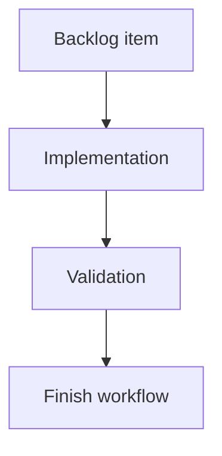

## task_133_ai_agent_experimental_direct_execution_and_rollback - AI Agent Experimental Direct Execution and Rollback
> From version: 1.10.3
> Schema version: 1.0
> Status: Ready
> Understanding: 90%
> Confidence: 85%
> Progress: 0%
> Complexity: Medium
> Theme: Implementation delivery
> Reminder: Update status/understanding/confidence/progress and linked request/backlog references when you edit this doc.

# Definition of Done (DoD)
- [ ] The backlog scope is implemented.
- [ ] Acceptance criteria are covered.
- [ ] Validation passes.

# Backlog
- `item_603_ai_agent_experimental_direct_execution_and_rollback`

# Acceptance criteria
- AC1: Experimental direct mode is unavailable until the global AI settings opt-in is enabled.
- AC2: The UI clearly marks direct execution as experimental.
- AC3: A pre-run snapshot is created before any AI proposal application.
- AC4: Direct execution uses the same operation validator and executor as assisted mode.
- AC5: Invalid, unsupported, or out-of-permission operations are rejected without mutation.
- AC6: Delete operations remain blocked unless delete permission is explicitly enabled for the run.
- AC7: The session result summarizes applied, rejected, skipped, and failed operations.
- AC8: The user can roll back the whole applied AI session in one action.
- AC9: Rollback restores the exact pre-run modeling state.
- AC10: Tests cover opt-in gating, snapshot creation, rejected operations, delete gating, validated apply, and rollback.

# Validation
- Run `python3 -m logics_manager lint --require-status`.
- Run `python3 -m logics_manager flow finish task task_133_ai_agent_experimental_direct_execution_and_rollback.md` after implementation.

# Report
- Implementation complete.

# AI Context
- Summary: Implement ai agent experimental direct execution and rollback.
- Keywords: task, implementation, backlog, runtime, python
- Use when: You need a bounded implementation task for a backlog item.
- Skip when: The work is still at the request or backlog shaping stage.

# Links
- Request: `req_128_ai_agent_modeling_workspace`
- Product brief(s): (none yet)
- Architecture decision(s): (none yet)
