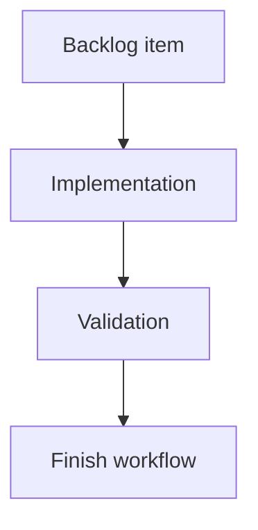

## task_133_ai_agent_experimental_direct_execution_and_rollback - AI Agent Experimental Direct Execution and Rollback
> From version: 1.10.3
> Schema version: 1.0
> Status: Done
> Understanding: 91%
> Confidence: 86%
> Progress: 100%
> Complexity: Medium
> Theme: Implementation delivery
> Reminder: Update status/understanding/confidence/progress and linked request/backlog references when you edit this doc.

# Definition of Done (DoD)
- [x] The backlog scope is implemented.
- [x] Acceptance criteria are covered.
- [x] Validation passes.

# Backlog
- `item_603_ai_agent_experimental_direct_execution_and_rollback`

# Acceptance criteria
- AC1: Experimental direct mode is unavailable until the global AI settings opt-in is enabled.
- AC2: The UI clearly marks direct execution as experimental.
- AC3: A pre-run snapshot is created before any AI proposal application.
- AC4: Direct execution uses the same operation validator and executor as assisted mode.
- AC5: Invalid, unsupported, or out-of-permission operations are rejected without mutation.
- AC6: Delete operations remain blocked unless delete permission is explicitly enabled for the run.
- AC7: The session result summarizes applied, rejected, skipped, and failed operations.
- AC8: The user can roll back the whole applied AI session in one action.
- AC9: Rollback restores the exact pre-run modeling state.
- AC10: Tests cover opt-in gating, snapshot creation, rejected operations, delete gating, validated apply, and rollback.

# Validation
- `npm run -s test -- src/tests/app.ui.settings-ai-agent.spec.tsx --run` passed.
- Final Logics lint and full local CI are run after the full AI Agent follow-up batch.

# Report
- Implementation complete.
- Direct execution remains unavailable until the Settings experimental opt-in is enabled.
- The Modeling AI Agent panel labels direct mode as experimental and applies locally accepted operations immediately after provider validation, without the assisted `Apply` step.
- Direct mode reuses the existing provider proposal parsing, bounded operation validator, and accepted-operation executor.
- Invalid or out-of-permission operations remain in the result summary without mutation; delete stays blocked unless delete permission is explicitly enabled.
- The result summary reports applied, skipped, rejected, unsupported, and failed counts, and the existing rollback action restores the pre-run state for the applied session.

# AI Context
- Summary: Implement ai agent experimental direct execution and rollback.
- Keywords: task, implementation, backlog, runtime, python
- Use when: You need a bounded implementation task for a backlog item.
- Skip when: The work is still at the request or backlog shaping stage.

# Links
- Request: `req_139_ai_agent_true_direct_execution_follow_up`
- Product brief(s): (none yet)
- Architecture decision(s): (none yet)

# AC Traceability
- request-AC1 -> This task. Proof: Covered by task AC1 for global AI settings opt-in gating.
- request-AC2 -> This task. Proof: Covered by task AC2 for visibly experimental direct-execution UI.
- request-AC3 -> This task. Proof: Covered by task AC4 for direct execution through the shared validator/executor path, with implementation still pending.
- request-AC4 -> This task. Proof: Covered by task AC4 for reuse of the assisted-mode validator and executor.
- request-AC5 -> This task. Proof: Covered by task AC5 for rejected invalid, unsupported, or out-of-permission operations.
- request-AC6 -> This task. Proof: Covered by task AC6 for explicit delete permission gating.
- request-AC7 -> This task. Proof: Covered by task AC3, AC8, and AC9 for snapshot creation and rollback restoration.
- request-AC8 -> This task. Proof: Covered by task AC7 for session result summaries.
- request-AC9 -> This task. Proof: Covered by task AC10 for opt-in, snapshot, rejection, delete gate, validated apply, and rollback tests.
