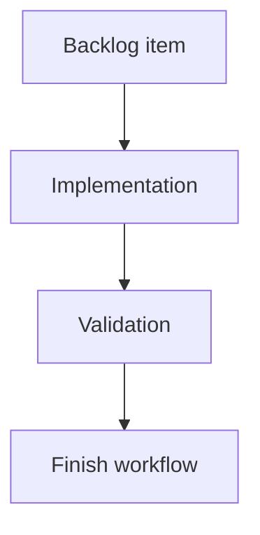

## task_134_ai_agent_follow_up_memory_persistence_and_workflow_polish - AI Agent Follow-up Memory, Persistence, and Workflow Polish
> From version: 1.11.0
> Schema version: 1.0
> Status: Done
> Understanding: 99%
> Confidence: 94%
> Progress: 100%
> Complexity: Medium
> Theme: Implementation delivery
> Reminder: Update status/understanding/confidence/progress and linked request/backlog references when you edit this doc.

# Definition of Done (DoD)
- [x] The backlog scope is implemented.
- [x] Acceptance criteria are covered.
- [x] Validation passes.

# Backlog
- `item_624_ai_agent_follow_up_memory_persistence_and_workflow_polish`

# Acceptance criteria
- AC1: The AI Agent panel persists and restores target scope, agent mode, and permission toggles across navigation and page reloads.
- AC2: Persisted experimental mode is ignored or downgraded when the Settings experimental gate is disabled.
- AC3: Delete permission remains opt-in and does not become enabled by default for fresh users or reset local storage.
- AC4: Submitted non-empty instructions are saved to a bounded local history after a proposal preparation attempt.
- AC5: Duplicate instruction history entries are de-duplicated or moved to the top instead of stored repeatedly.
- AC6: Users can load a previous instruction into the instruction field and edit it before preparing a new proposal.
- AC7: Users can clear AI instruction history without affecting provider configuration or project data.
- AC8: An unsent instruction draft survives switching away from and back to the AI Agent section during the same app session.
- AC9: AI Agent local persistence is excluded from network import/export payloads.
- AC10: Tests cover preference persistence, experimental-gate fallback, instruction history save/load/clear, duplicate handling, and reset behavior.

# Validation
- `npm run -s test -- src/tests/app.ui.settings-ai-agent.spec.tsx src/tests/ai-agent-panel-preferences.spec.ts --run` passed.
- Final Logics lint and full local CI are run after the full AI Agent follow-up batch.

# Report
- Implementation complete.
- The AI Agent panel now exposes local instruction history with load and clear controls.
- Submitted non-empty instructions are normalized, bounded, and de-duplicated in local storage after proposal preparation starts.
- The reset control clears AI Agent local preference/history data, restores default target/mode/permissions, keeps delete disabled, and leaves provider configuration untouched.
- Existing preference persistence and experimental direct-mode fallback remain covered by UI tests.

# AI Context
- Summary: Implement ai agent follow-up memory, persistence, and workflow polish.
- Keywords: task, implementation, backlog, runtime, python
- Use when: You need a bounded implementation task for a backlog item.
- Skip when: The work is still at the request or backlog shaping stage.

# Links
- Request: `req_130_ai_agent_follow_up_memory_persistence_and_workflow_polish`
- Product brief(s): (none yet)
- Architecture decision(s): (none yet)

# AC Traceability
- request-AC1 -> This task. Proof: Existing UI coverage verifies target scope, agent mode, instruction draft, and permission persistence across remount.
- request-AC2 -> This task. Proof: Existing UI coverage verifies persisted direct mode downgrades to assisted when the Settings gate is disabled.
- request-AC3 -> This task. Proof: Reset coverage verifies delete permission returns to disabled.
- request-AC4 -> This task. Proof: UI coverage verifies a submitted non-empty instruction is saved after Prepare.
- request-AC5 -> This task. Proof: `ai-agent-panel-preferences.spec.ts` verifies normalized duplicate instructions move to the top without repeated storage.
- request-AC6 -> This task. Proof: UI coverage loads a previous instruction into the editable instruction field.
- request-AC7 -> This task. Proof: UI coverage clears instruction history and verifies provider configuration remains unchanged.
- request-AC8 -> This task. Proof: Existing persisted instruction state keeps the draft available when the panel is left and reopened in the same app session.
- request-AC9 -> This task. Proof: AI Agent preference/history data is stored in browser-local UI keys outside project/network model state.
- request-AC10 -> This task. Proof: Targeted UI and storage tests cover preference persistence, experimental fallback, instruction save/load/clear, duplicate handling, and reset behavior.
