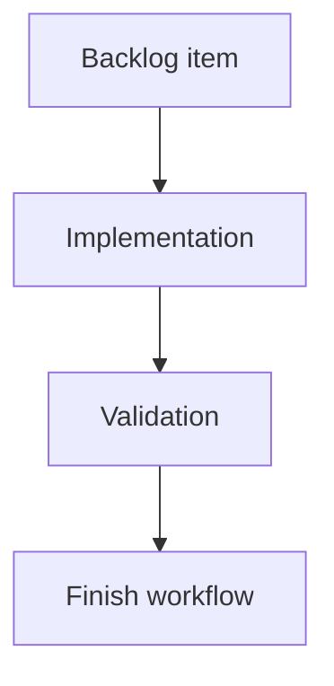

## task_135_connector_rear_backshell_helper_node_segment_sheath_metadata_and_mounting_labels - Connector Rear Backshell Helper Node, Segment Sheath Metadata, and Mounting Labels
> From version: 1.15.0
> Schema version: 1.0
> Status: Done
> Understanding: 90%
> Confidence: 85%
> Progress: 100%
> Complexity: Medium
> Theme: Implementation delivery
> Reminder: Update status/understanding/confidence/progress and linked request/backlog references when you edit this doc.

# Definition of Done (DoD)
- [x] The backlog scope is implemented.
- [x] Acceptance criteria are covered.
- [x] Validation passes.

# Backlog
- `item_625_connector_rear_backshell_helper_node_segment_sheath_metadata_and_mounting_labels`

# Acceptance criteria
- AC1: A connector catalog item can enable rear-backshell helper-node behavior and define the connector-to-helper nominal length.
- AC2: A connector instance can override the effective rear-backshell behavior relative to the catalog default, including both enabled/disabled state and connector-specific backshell length.
- AC3: Creating a connector with effective rear-backshell behavior enabled automatically creates the connector node, the helper node, and the dedicated helper-to-connector segment.
- AC4: Existing connectors linked to a catalog item that gains rear-backshell behavior are migrated so the helper node and dedicated helper segment exist.
- AC5: For backshell-enabled connectors, direct external segment attachment to the connector node is forbidden; the system auto-corrects deterministic cases and surfaces explicit feedback for unresolved cases.
- AC6: Automatic and locked wire routes for backshell-enabled connectors traverse the helper node before the connector node.
- AC7: Each segment can store free-text sheath metadata including sheath type, insulation, line style, and internal part reference.
- AC8: A compact segment callout can display endpoint technical-ID route text, insulation, line style, internal part reference, and quantity derived from segment length.
- AC9: Mounting labels exist as explicit physical plan objects attached to segments, with editable text and configurable position.
- AC10: Segment mini callouts and mounting labels appear in the network summary and are included in exports derived from that rendering.
- AC11: New data survives persistence, import/export, and migration from legacy projects without breaking existing networks.

# Validation
- `npm run typecheck` passed.
- `npx vitest run src/tests/store.reducer.rear-backshell.spec.ts src/tests/portability.network-file.spec.ts src/tests/app.ui.network-summary-svg-export.spec.tsx` passed.
- npm run typecheck passed; vitest passed for rear-backshell, portability.network-file, and app.ui.network-summary-svg-export
- Finish workflow executed on 2026-06-08.
- Linked backlog/request close verification passed.

# Report
- Implemented explicit rear-backshell helper node and dedicated link-segment topology with catalog defaults, connector overrides, migration, auto-correction, and validation enforcement.
- Extended segment modeling and forms with sheath metadata plus sparse mounting-label objects attached to segments.
- Rendered segment mini callouts and mounting labels in the network summary so they also flow into SVG export through the existing DOM-clone export path.
- Finished on 2026-06-08.
- Linked backlog item(s): `item_625_connector_rear_backshell_helper_node_segment_sheath_metadata_and_mounting_labels`
- Related request(s): `req_140_connector_rear_backshell_helper_node_segment_sheath_metadata_and_mounting_labels`

# AI Context
- Summary: Implement connector rear backshell helper node, segment sheath metadata, and mounting labels.
- Keywords: task, implementation, backlog, runtime, python
- Use when: You need a bounded implementation task for a backlog item.
- Skip when: The work is still at the request or backlog shaping stage.

# Links
- Request: `req_140_connector_rear_backshell_helper_node_segment_sheath_metadata_and_mounting_labels`
- Product brief(s): (none yet)
- Architecture decision(s): (none yet)

# AC Traceability
- request-AC1 -> This task. Proof: catalog defaults now persist `connectorDefaults.rearBackshell` and the catalog form exposes enable/length controls.
- request-AC2 -> This task. Proof: connector instances persist `rearBackshellOverride` with enabled/disabled and optional per-connector length override in the connector editor.
- request-AC3 -> This task. Proof: connector-node creation now triggers helper-node and dedicated `rearBackshellLink` segment creation for backshell-enabled connectors.
- request-AC4 -> This task. Proof: catalog and connector reducers reapply backshell topology so existing linked connectors gain helper topology when catalog behavior changes.
- request-AC5 -> This task. Proof: segment upserts are auto-corrected through the helper node and validation flags any remaining direct external attachment to the connector node.
- request-AC6 -> This task. Proof: connector-side segments are normalized onto the helper topology so route computation traverses the helper link before the connector node.
- request-AC7 -> This task. Proof: segments now persist `sheathType`, `insulation`, `lineStyle`, and `internalPartReference`, with create/edit form support.
- request-AC8 -> This task. Proof: network-summary rendering adds compact segment callouts with technical-ID route text, manufacturing metadata, and quantity derived from `lengthMm`.
- request-AC9 -> This task. Proof: segments persist explicit `mountingLabels` objects with text and position fields and render them as distinct physical labels on-plan.
- request-AC10 -> This task. Proof: segment mini callouts and mounting labels render in the network summary DOM and are asserted in SVG export tests.
- request-AC11 -> This task. Proof: dedicated reducer and portability tests verify the new fields survive state persistence and network export/import round-trips.
