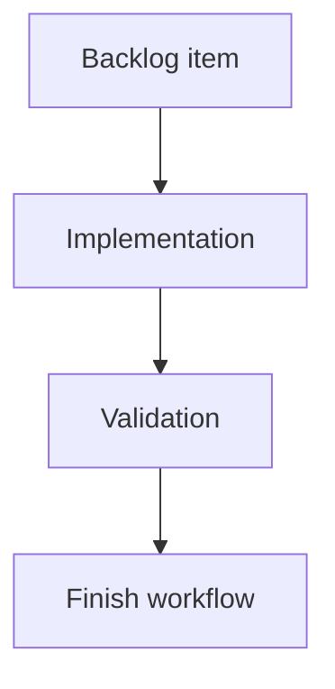

## task_136_appcontroller_hook_impl_decomposition_follow_up - AppController hook-impl decomposition follow-up
> From version: 1.15.0
> Schema version: 1.0
> Status: Archived
> Understanding: 94%
> Confidence: 88%
> Progress: 0% (archived before implementation)
> Complexity: High
> Theme: Implementation delivery
> Reminder: Update status/understanding/confidence/progress and linked request/backlog references when you edit this doc.

# Scope Notes
- Selected target for the next wave: `src/app/hook-impl/controller/useAppControllerModelingAnalysisScreenDomains.tsx`.
- Measured on 2026-06-09 before edits:
  - `useAppControllerModelingAnalysisScreenDomains.tsx`: 1538 lines.
  - `useAppControllerScreenContentSlices.tsx`: 1165 lines.
  - `useAppControllerNetworkSummaryPanelDomain.tsx`: 783 lines.
- Coupling notes:
  - `useAppControllerModelingAnalysisScreenDomains.tsx` owns the largest active implementation body and now concentrates modeling multi-select, batch delete/edit state, analysis navigation, and screen-slice assembly.
  - The first candidate extraction should target a cohesive controller boundary rather than a broad file split. Good candidates are batch-selection dialog state/actions or multi-network functional-analysis navigation because each has clear inputs, state, and UI tests.
  - `useAppControllerScreenContentSlices.tsx` is also large, but it is mostly prop assembly; defer it unless the selected extraction needs companion prop-contract cleanup.
  - `useAppControllerNetworkSummaryPanelDomain.tsx` is smaller than the other two and should be a later wave unless route/callout work makes it the lower-risk target.

# Plan
1. Confirm the selected target and record updated line counts immediately before implementation.
2. Extract one focused controller boundary from `useAppControllerModelingAnalysisScreenDomains.tsx`.
3. Add or extend a controller-boundary spec for the extracted state/action surface.
4. Run focused affected UI specs for modeling/analysis behavior.
5. Run `quality:hooks-modularization`, `quality:ui-modularization`, and the full CI gate before closeout.
6. Update `req_129_app_controller_decomposition_plan` with delivered wave evidence and remaining work.

# Definition of Done (DoD)
- [x] N/A: the backlog scope was archived before implementation and no delivery is claimed.
- [x] N/A: acceptance criteria remain documented for future reuse but were not delivered in this task.
- [x] N/A: product validation was not run because the task was archived before implementation.

# Backlog
- `item_626_appcontroller_hook_impl_decomposition_followup`

# Acceptance criteria
- AC1: The selected `hook-impl/controller` body is re-scoped with measured line count and coupling notes before edits.
- AC2: At least one large implementation body is materially shrunk or split into a focused controller boundary.
- AC3: Controller-boundary coverage is added or extended for the extracted surface.
- AC4: `quality:hooks-modularization`, `quality:ui-modularization`, and affected UI specs pass.
- AC5: `req_129_app_controller_decomposition_plan` is updated with delivered wave evidence and remaining work.

# Validation
- Archived before implementation; product validation was not applicable.
- Corpus validation on 2026-06-16: `logics-manager lint --require-status` and `logics-manager audit --legacy-cutoff-version 1.1.0 --group-by-doc --skip-ac-traceability`.

# Report
- Prepared on 2026-06-09 as the implementation task for the second AppController decomposition wave.
- Implementation not started yet.
- Current target recommendation: extract a focused boundary from `useAppControllerModelingAnalysisScreenDomains.tsx`, preferably the batch-selection state/action surface if still cohesive at implementation time.
- Archived on 2026-06-16 to close the active Logics corpus. This task did not ship code or validation; reopen with a fresh task if the hook-impl decomposition wave becomes active again.

# AI Context
- Summary: Implement appcontroller hook-impl decomposition follow-up.
- Keywords: task, implementation, backlog, runtime, python
- Use when: You need a bounded implementation task for a backlog item.
- Skip when: The work is still at the request or backlog shaping stage.

# Links
- Request: `req_129_app_controller_decomposition_plan`
- Product brief(s): (none yet)
- Architecture decision(s): `adr_009_app_controller_decomposition_plan`
