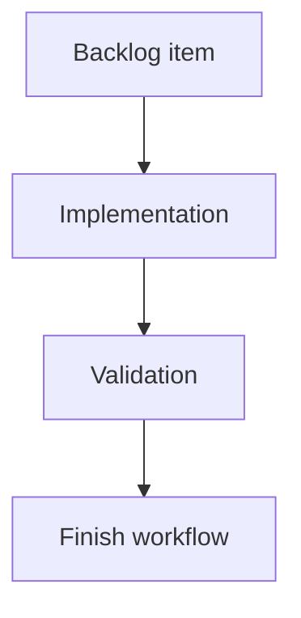

## task_137_segment_callout_layering_product_brief_migration_and_connector_material_default_sync - Segment Callout Layering, Product Brief Migration, and Connector Material Default Sync
> From version: 1.15.2
> Schema version: 1.0
> Status: Done
> Understanding: 100%
> Confidence: 100%
> Progress: 100%
> Complexity: High
> Theme: Network summary callouts, Product Brief migration, and catalog defaults sync
> Reminder: Update status/understanding/confidence/progress and linked request/backlog references when you edit this doc.

# Definition of Done (DoD)
- [x] Segment callout layering, leader-line crossing, and dotted-line styling are aligned with node callout behavior.
- [x] Faded segment callout behavior is investigated and either fixed or documented as intentional.
- [x] Segment callout position reset behavior is investigated and either fixed or documented as intentional.
- [x] Rear backshell helper-only Connector material defaults synchronization is fixed and covered by regression tests.
- [x] Existing `docs/` files are migrated into individual managed Product Briefs under `logics/product`.
- [x] References to migrated `docs/...` paths are updated to the new Product Brief refs or paths.
- [x] The legacy `docs/` folder is removed.
- [x] Linked request/backlog/task docs are updated with implementation evidence and final status.
- [x] Validation passes with the commands listed below, or skipped commands have explicit risk notes.

# Backlog
- `item_627_segment_callout_layering_product_brief_migration_and_connector_material_default_sync`

# Acceptance criteria
- AC1: Segment callouts use the same Z-depth and hierarchy logic as node callouts, and no longer render behind other plan elements in a way that hides them incorrectly.
- AC2: Segment callout dotted leader lines remain visible when they cross other callouts, objects, overlays, segments, nodes, or annotations.
- AC3: Segment callout dotted leader lines match node callout dotted leader line styling across normal and theme-specific rendering.
- AC4: Every relevant file currently under `docs/` is migrated into an individual managed Product Brief under `logics/product`.
- AC5: References from workflow docs, backlog items, tasks, or requests that pointed to `docs/...` are updated to the migrated Product Brief refs or paths.
- AC6: The legacy `docs/` folder is removed after Product Brief migration.
- AC7: Changing only Rear backshell helper in Connector material defaults synchronizes the corresponding Connector material defaults option in Edit catalog item.
- AC8: The Rear backshell helper-only catalog sync path is covered by regression tests.
- AC9: The faded or semi-transparent segment callout behavior is investigated and classified as intentional or a bug.
- AC10: If faded segment callouts are a bug, their opacity behavior is fixed to match node callout expectations; if intentional, the expected trigger and product reason are documented.
- AC11: The segment callout position reset behavior is investigated and classified as intentional or a bug.
- AC12: If segment callout position reset is a bug, moved segment callout positions remain stable across rerenders, relevant state updates, persistence, and export workflows; if intentional, the expected trigger and product reason are documented.

# Implementation plan
- [x] 1. Inspect existing node callout and segment callout rendering order, leader-line SVG/CSS styling, clipping/masking, pointer-event behavior, and export rendering paths.
- [x] 2. Align segment callout Z-depth and leader-line styling with the node callout contract using shared constants/helpers where practical.
- [x] 3. Add or adjust tests for segment callout layering and leader-line visibility when crossing another rendered element.
- [x] 4. Investigate faded segment callouts and record whether the behavior is intentional; fix opacity if it is not.
- [x] 5. Investigate segment callout position resets and record whether the behavior is intentional; fix persistence/keying/reconciliation if it is not.
- [x] 6. Reproduce and fix the Connector material defaults Rear backshell helper-only sync defect, including visible Edit catalog item state and stored catalog item state.
- [x] 7. Migrate each relevant `docs/` file into `logics/product` as an individual Product Brief, update references, and remove `docs/`.
- [x] 8. Add Product Brief refs, architecture refs if needed, validation evidence, and closeout notes to the linked Logics docs before closure.

# Validation
- `npm run -s test -- src/tests/app.ui.network-summary-layering.spec.tsx src/tests/app.ui.network-summary-callouts-viewport.spec.tsx src/tests/network-summary-graph-model.spec.ts` passed.
- `npm run -s test -- src/tests/app.ui.catalog-rear-backshell-defaults.spec.tsx` passed.
- `npm run -s test -- src/tests/app.ui.navigation-canvas.spec.tsx -u` passed and updated the expected network canvas layer snapshot.
- `npm run -s test -- src/tests/app.ui.network-summary-svg-export.spec.tsx` passed.
- `npm run -s lint` passed.
- `npm run -s typecheck` passed.
- `logics-manager lint --require-status` passed.
- `logics-manager audit --legacy-cutoff-version 1.1.0 --group-by-doc --skip-ac-traceability` passed.
- `npm run -s ci:blocking` passed after the implementation, segmentation registration, snapshot update, and SVG export assertion update.

# Report
- Done.
- Segment callouts now render in a dedicated `network-graph-layer-segment-callouts` layer after graph nodes, matching the node callout hierarchy instead of being nested inside segment entity groups.
- Segment callout leader clipping against callout obstacles was removed, so dotted leader lines remain visible when crossing other rendered content.
- Segment callout leaders, frames, dividers, and table cells now reuse the node callout class contract, including `network-callout-leader-line` and `network-callout-frame`, with segment-specific classes retained for targeting.
- Faded segment callouts were classified as a bug. The opacity came from inheriting `.network-entity-group.is-deemphasized`; rendering segment callouts outside entity groups fixes the unintended fade and aligns them with node callouts.
- Segment callout position reset was treated as a bug risk. Existing persistence uses `sheathCalloutPosition`; regression coverage now drags a segment callout, forces a view/rerender path, and verifies the callout transform remains stable.
- Rear backshell helper-only Connector material defaults synchronization was fixed by including `rearBackshell` in Connector material defaults detection, and a regression covers persisted store state plus visible Edit catalog item state.
- Legacy product-facing docs were migrated into managed Product Briefs: `prod_008_fuse_box_functional_schematic`, `prod_009_network_import_conflict_resolution`, `prod_010_network_statistics_dashboard`, and `prod_011_pin_level_current_dimensioning`.
- References to migrated `docs/...` paths were updated, and the legacy `docs/` directory was removed.

# AI Context
- Summary: Implement req_141: segment callout parity with node callouts, docs-to-Product-Briefs migration, Rear backshell helper-only catalog sync, and investigation of segment callout opacity/position reset behavior.
- Keywords: segment callout layering, node callout parity, dotted leader lines, leader crossing, opacity investigation, position reset, docs migration, Product Brief, rear backshell helper, connector material defaults sync
- Use when: Implementing or reviewing the prepared development slice for segment callout rendering parity, Product Brief migration, or Rear backshell helper material default synchronization.
- Skip when: The change is unrelated to network-summary callouts, Logics product docs, or connector material defaults.

# Links
- Request: `req_141_segment_callout_layering_docs_product_brief_migration_and_connector_material_default_sync`
- Backlog: `logics/backlog/item_627_segment_callout_layering_product_brief_migration_and_connector_material_default_sync.md`
- Product brief(s): `logics/product/prod_007_segment_callout_parity_and_product_brief_migration.md`, `logics/product/prod_008_fuse_box_functional_schematic.md`, `logics/product/prod_009_network_import_conflict_resolution.md`, `logics/product/prod_010_network_statistics_dashboard.md`, `logics/product/prod_011_pin_level_current_dimensioning.md`
- Architecture decision(s): not added; implementation reused the existing node callout class/layering contract instead of introducing a new cross-cutting architecture contract.

# AC Traceability
- request-AC1 -> This task. Proof: Segment callouts render in `network-graph-layer-segment-callouts` after graph nodes, matching node callout hierarchy.
- request-AC2 -> This task. Proof: Segment callout leader clipping against callout obstacles was removed, so dotted leaders remain visible across rendered content.
- request-AC3 -> This task. Proof: Segment leaders and frames include shared node callout classes such as `network-callout-leader-line` and `network-callout-frame`.
- request-AC4 -> This task. Proof: The legacy docs were migrated into `prod_008_fuse_box_functional_schematic`, `prod_009_network_import_conflict_resolution`, `prod_010_network_statistics_dashboard`, and `prod_011_pin_level_current_dimensioning`.
- request-AC5 -> This task. Proof: References to migrated `docs/...` paths were updated to Product Brief refs or paths.
- request-AC6 -> This task. Proof: The legacy `docs/` folder was removed.
- request-AC7 -> This task. Proof: `rearBackshell` now participates in Connector material defaults detection.
- request-AC8 -> This task. Proof: `app.ui.catalog-rear-backshell-defaults.spec.tsx` covers Rear backshell helper-only synchronization.
- request-AC9 -> This task. Proof: Faded segment callouts were investigated and classified as an unintended opacity inheritance bug.
- request-AC10 -> This task. Proof: Segment callouts now render outside deemphasized entity groups, removing unintended semi-transparent rendering.
- request-AC11 -> This task. Proof: Segment callout position reset was investigated and classified as a persistence/reconciliation bug risk.
- request-AC12 -> This task. Proof: `app.ui.network-summary-callouts-viewport.spec.tsx` verifies dragged segment callouts remain stable across a view switch and rerender path.
