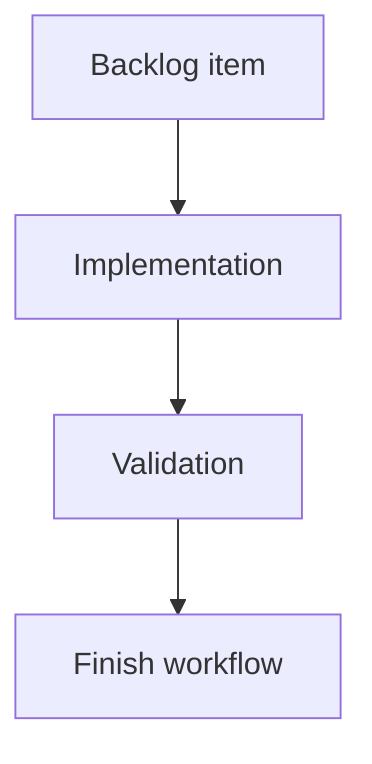

## task_137_segment_callout_layering_product_brief_migration_and_connector_material_default_sync - Segment Callout Layering, Product Brief Migration, and Connector Material Default Sync
> From version: 1.15.2
> Schema version: 1.0
> Status: Ready
> Understanding: 94%
> Confidence: 90%
> Progress: 0%
> Complexity: High
> Theme: Network summary callouts, Product Brief migration, and catalog defaults sync
> Reminder: Update status/understanding/confidence/progress and linked request/backlog references when you edit this doc.

# Definition of Done (DoD)
- [ ] Segment callout layering, leader-line crossing, and dotted-line styling are aligned with node callout behavior.
- [ ] Faded segment callout behavior is investigated and either fixed or documented as intentional.
- [ ] Segment callout position reset behavior is investigated and either fixed or documented as intentional.
- [ ] Rear backshell helper-only Connector material defaults synchronization is fixed and covered by regression tests.
- [ ] Existing `docs/` files are migrated into individual managed Product Briefs under `logics/product`.
- [ ] References to migrated `docs/...` paths are updated to the new Product Brief refs or paths.
- [ ] The legacy `docs/` folder is removed.
- [ ] Linked request/backlog/task docs are updated with implementation evidence and final status.
- [ ] Validation passes with the commands listed below, or skipped commands have explicit risk notes.

# Backlog
- `item_627_segment_callout_layering_product_brief_migration_and_connector_material_default_sync`

# Acceptance criteria
- AC1: Segment callouts use the same Z-depth and hierarchy logic as node callouts, and no longer render behind other plan elements in a way that hides them incorrectly.
- AC2: Segment callout dotted leader lines remain visible when they cross other callouts, objects, overlays, segments, nodes, or annotations.
- AC3: Segment callout dotted leader lines match node callout dotted leader line styling across normal and theme-specific rendering.
- AC4: Every relevant file currently under `docs/` is migrated into an individual managed Product Brief under `logics/product`.
- AC5: References from workflow docs, backlog items, tasks, or requests that pointed to `docs/...` are updated to the migrated Product Brief refs or paths.
- AC6: The legacy `docs/` folder is removed after Product Brief migration.
- AC7: Changing only Rear backshell helper in Connector material defaults synchronizes the corresponding Connector material defaults option in Edit catalog item.
- AC8: The Rear backshell helper-only catalog sync path is covered by regression tests.
- AC9: The faded or semi-transparent segment callout behavior is investigated and classified as intentional or a bug.
- AC10: If faded segment callouts are a bug, their opacity behavior is fixed to match node callout expectations; if intentional, the expected trigger and product reason are documented.
- AC11: The segment callout position reset behavior is investigated and classified as intentional or a bug.
- AC12: If segment callout position reset is a bug, moved segment callout positions remain stable across rerenders, relevant state updates, persistence, and export workflows; if intentional, the expected trigger and product reason are documented.

# Implementation plan
- [ ] 1. Inspect existing node callout and segment callout rendering order, leader-line SVG/CSS styling, clipping/masking, pointer-event behavior, and export rendering paths.
- [ ] 2. Align segment callout Z-depth and leader-line styling with the node callout contract using shared constants/helpers where practical.
- [ ] 3. Add or adjust tests for segment callout layering and leader-line visibility when crossing another rendered element.
- [ ] 4. Investigate faded segment callouts and record whether the behavior is intentional; fix opacity if it is not.
- [ ] 5. Investigate segment callout position resets and record whether the behavior is intentional; fix persistence/keying/reconciliation if it is not.
- [ ] 6. Reproduce and fix the Connector material defaults Rear backshell helper-only sync defect, including visible Edit catalog item state and stored catalog item state.
- [ ] 7. Migrate each relevant `docs/` file into `logics/product` as an individual Product Brief, update references, and remove `docs/`.
- [ ] 8. Add Product Brief refs, architecture refs if needed, validation evidence, and closeout notes to the linked Logics docs before closure.

# Validation
- Run `logics-manager lint --require-status`.
- Run `logics-manager audit --legacy-cutoff-version 1.1.0 --group-by-doc --skip-ac-traceability`.
- Run `npm run -s lint`.
- Run `npm run -s typecheck`.
- Run focused Vitest/UI coverage for network-summary callouts and catalog defaults.
- Run `npm run -s test:ci:ui` when network-summary UI rendering is touched broadly.
- Run `npm run -s ci:blocking` before closure or release.
- Run `logics-manager flow validate-closeout task_137_segment_callout_layering_product_brief_migration_and_connector_material_default_sync` before marking the task done.

# Report
- Not started. This task is prepared for a future development pass.

# AI Context
- Summary: Implement req_141: segment callout parity with node callouts, docs-to-Product-Briefs migration, Rear backshell helper-only catalog sync, and investigation of segment callout opacity/position reset behavior.
- Keywords: segment callout layering, node callout parity, dotted leader lines, leader crossing, opacity investigation, position reset, docs migration, Product Brief, rear backshell helper, connector material defaults sync
- Use when: Implementing or reviewing the prepared development slice for segment callout rendering parity, Product Brief migration, or Rear backshell helper material default synchronization.
- Skip when: The change is unrelated to network-summary callouts, Logics product docs, or connector material defaults.

# Links
- Request: `req_141_segment_callout_layering_docs_product_brief_migration_and_connector_material_default_sync`
- Backlog: `logics/backlog/item_627_segment_callout_layering_product_brief_migration_and_connector_material_default_sync.md`
- Product brief(s): `logics/product/prod_007_segment_callout_parity_and_product_brief_migration.md`
- Architecture decision(s): (none yet)
