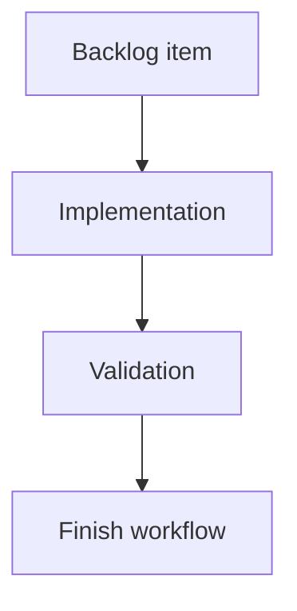

## task_138_debounced_persistence_loses_unsaved_edits_on_tab_close_or_unmount - Debounced persistence loses unsaved edits on tab close or unmount
> From version: 1.15.3
> Schema version: 1.0
> Status: Done
> Understanding: 100%
> Confidence: 95%
> Progress: 100%
> Complexity: Medium
> Theme: Implementation delivery
> Reminder: Update status/understanding/confidence/progress and linked request/backlog references when you edit this doc.

# Definition of Done (DoD)
- [x] `attachPersistenceSync` (`src/app/store.ts`) registers a `visibilitychange` (state `hidden`) and `pagehide` listener that flushes any pending debounced save.
- [x] A synchronous save path (`saveStateSync`) writes `setItem` before any awaited storage-pressure estimation, and lifecycle/detach flushes use it (`src/adapters/persistence/localStorage.ts`).
- [x] The detach handle flushes a pending save before clearing the timer, then unsubscribes and removes the lifecycle listeners (no listener leak).
- [x] Detach with `debounceMs: 0` performs no additional save (synchronous-mode behavior unchanged).
- [x] In-session debounce coalescing and the quota/recovery/write-failure feedback paths remain intact.
- [x] Regression tests cover dispatch-then-unload durability, detach flush, the `debounceMs: 0` no-op, and synchronous-write ordering.
- [x] Persistence durability ADR (`adr_011`) is created and linked here and in `item_628`.
- [x] Validation passes (lint, typecheck, focused Vitest, `test:ci:fast`, `test:ci:ui`, build). Playwright E2E skipped (known host limitation).

# Backlog
- `item_628_debounced_persistence_loses_unsaved_edits_on_tab_close_or_unmount`

# Acceptance criteria
- AC1: A pending debounced save is flushed to localStorage when the page is hidden/unloaded, so edits made within the debounce window before close/reload/navigation are persisted.
- AC2: The flush uses a synchronous write that completes `setItem` before any awaited storage-pressure estimation, so the write survives page teardown.
- AC3: The detach handle flushes any pending save before clearing the timer and unsubscribing.
- AC4: Detach with `debounceMs: 0` performs no additional save (no behavior change for synchronous mode), preserving existing save-count assertions.
- AC5: Normal in-session editing still coalesces bursts of dispatches into a single trailing debounced write.
- AC6: Recovery, quota-exceeded, storage-near-quota, and write-failure feedback paths remain functional.
- AC7: Any lifecycle event listeners added by `attachPersistenceSync` are removed on detach with no listener leak.
- AC8: Regression tests cover dispatch-then-unload persistence, detach flush, and synchronous-write ordering.

# Validation
- `npm run -s lint` passed (full).
- `npx tsc --noEmit` passed.
- `npx vitest run src/tests/store.persistence-durability.spec.ts src/tests/store.create-store.spec.ts src/tests/app.ui.persistence-feedback.spec.tsx src/tests/persistence.localStorage.recovery.spec.ts src/tests/persistence.localStorage.spec.ts` passed (45/45).
- `npx vitest run src/tests/persistence.storage-key.spec.ts src/tests/sample-network.compat.spec.ts` passed (5/5).
- `npm run -s test:ci:fast` exited 0 (full fast segment).
- `npm run -s test:ci:ui` exited 0 (full UI segment).
- `npm run -s build:vite` passed.
- `logics-manager lint --require-status` passed; `logics-manager audit --legacy-cutoff-version 1.1.0 --group-by-doc --skip-ac-traceability` passed.
- `npm run -s test:e2e` (Playwright) not run: Chromium cannot be provisioned on this host, consistent with the 1.15.1 verification note. Run it in CI before release.

# Report
- Added `saveStateSync` and refactored `saveState` to write the snapshot first (shared `writeStateSnapshot` helper) and only then compute the non-blocking near-quota warning, so the durable write no longer depends on the async storage estimate.
- `attachPersistenceSync` now flushes a pending debounced save synchronously on `pagehide` and `visibilitychange` (hidden) and on detach, then removes its lifecycle listeners; the flush is a no-op when no timer is pending so synchronous mode is unchanged.
- A late-resolving async save can no longer clobber a forced flush (shared save-sequence guard), and quota/recovery/write-failure feedback is unchanged.
- Added `src/tests/store.persistence-durability.spec.ts` covering page-hide flush, visibility-hidden flush, no-flush-while-visible, detach flush, `debounceMs: 0` no-op, listener cleanup, and synchronous-write ordering.
- Recorded the durability contract in `adr_011` and linked it across the request/backlog/task chain.
- Code is implemented and validated locally; not yet committed or released. A `1.15.4` changelog entry is the remaining release-time step.

# AI Context
- Summary: Implement debounced persistence loses unsaved edits on tab close or unmount.
- Keywords: task, implementation, backlog, runtime, python
- Use when: You need a bounded implementation task for a backlog item.
- Skip when: The work is still at the request or backlog shaping stage.

# Links
- Request: `req_142_debounced_persistence_durability_flush_on_unload`
- Product brief(s): (none yet)
- Architecture decision(s): `adr_011_local_first_persistence_durability_lifecycle_flush_and_synchronous_write`

# AC Traceability
- request-AC1 -> This task. Proof: `attachPersistenceSync` will flush the pending debounced save from a `visibilitychange` (hidden) / `pagehide` listener so edits within the debounce window before close/reload persist.
- request-AC2 -> This task. Proof: a synchronous save path will run `setItem` before the awaited `estimateStoragePressure` call, so the flushed write completes before page teardown.
- request-AC3 -> This task. Proof: the detach handle will flush a pending save before `clearTimeout` and unsubscribe.
- request-AC4 -> This task. Proof: with `debounceMs: 0` there is no pending timer, so flush-on-detach is a no-op; covered by an existing save-count assertion test.
- request-AC5 -> This task. Proof: the 200 ms trailing debounce path is unchanged for normal in-session dispatch bursts.
- request-AC6 -> This task. Proof: the synchronous write reuses the existing quota/recovery/write-failure result handling; feedback paths verified by `app.ui.persistence-feedback.spec.tsx`.
- request-AC7 -> This task. Proof: detach removes the lifecycle listeners it added; covered by a listener-cleanup assertion.
- request-AC8 -> This task. Proof: a new persistence-durability spec covers dispatch-then-unload, detach flush, the `debounceMs: 0` no-op, and synchronous-write ordering.
