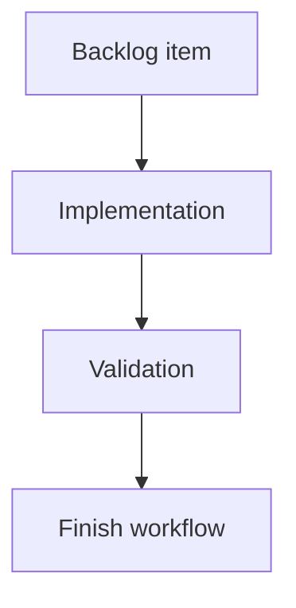

## task_139_floating_splice_placements_decoupled_from_network_topology - Floating splice placements decoupled from network topology
> From version: 1.15.6 (ADR companion linked on 2026-06-10; amended 2026-06-10 after pre-implementation review)
> Schema version: 1.0
> Status: Done
> Understanding: 100% (task delivered and closed against req_144/item_630/adr_012)
> Confidence: 96% (implementation phases 1-8 delivered; current Logics, lint, typecheck, modularization, and targeted regression validation recorded)
> Progress: 100%
> Complexity: High
> Theme: Architecture
> Reminder: Update status/understanding/confidence/progress and linked request/backlog references when you edit this doc.

# Definition of Done (DoD)
- [x] `Splice` has canonical segment-offset placement support with normalization and persistence/import/export compatibility.
- [x] Legacy splice-node workspaces and network imports migrate automatically on load.
- [x] Derived routing supports virtual splice points, partial endpoint segment lengths, deterministic tie-breaks, and locked-route conversion/diagnostics.
- [x] Store reducers prevent invalid wire connections to unplaced splices, block host-segment deletion, and handle segment length edits with offset preservation/clamping feedback.
- [x] Splice forms expose host segment, reference node, offset, and conversion workflows required by the request.
- [x] Network Summary renders floating splices without splice nodes, with current splice styling, selection, activation, highlighting, and callouts.
- [x] Analysis/tables expose host segment, distance from reference node, and relevant partial length details.
- [x] Migration rewrites all affected wire routes (locked and unlocked) during segment fusion, enforces the safe-fusion predicate with intermediate-node fallback, and handles degree-0/1 legacy splice nodes.
- [x] Constructed/converted nodes carry reserved `MIG-SPLICE-*` labels and a modal migration report with explicit dismissal is shown on both load paths.
- [x] Floating splice markers never render hidden under nodes or other splices (deterministic render-only anti-superposition offset).
- [x] Offset clamping and relative-position feedback use the new non-blocking warning channel.
- [x] Acceptance criteria AC1-AC30 are covered by targeted tests or documented validation evidence.
- [x] Logics lint, TypeScript, lint, targeted unit/UI tests, and relevant persistence/import/export tests pass.

# Backlog
- `item_630_floating_splice_placements_decoupled_from_network_topology`

# Acceptance criteria
- AC1: `Splice` supports a canonical segment placement model using `segmentId`, `fromNodeId`, and `offsetMm`; `0 mm` and `lengthMm` offsets are allowed and must be displayed explicitly.
- AC2: A central resolver can resolve splice placement from new placement metadata or migrated legacy splice nodes, and returns enough information for routing, validation, and rendering.
- AC3: Wire routing supports endpoints connected to floating splice ports by using a derived routing graph with virtual splice points and correct partial segment lengths.
- AC4: Route length calculation accounts for partial segment traversal when a wire starts or ends at a floating splice.
- AC5: `Wire.routeSegmentIds` remains the primary public route summary, with additional route detail only where a start or end endpoint lies part-way through a segment.
- AC6: Network Summary renders floating splices without requiring `NetworkNode.kind === "splice"`, including selection, focus/activation behavior, selected-state styling, and the same splice visual treatment as today.
- AC7: Splice callouts remain available for every placed splice and can anchor to resolved splice positions instead of requiring a node position.
- AC8: Legacy workspaces with splice nodes migrate automatically on load and continue to behave correctly after migration.
- AC9: Network import/export persists the new splice placement metadata and continues to accept older files that lack it; newly exported files should not emit legacy splice nodes.
- AC10: Validation and UI feedback prevent invalid connected splices: a splice must be placed before it can be connected to a wire, and unplaced splices are not visible or connectable.
- AC11: Host segment deletion is blocked while a splice is placed on that segment, with user-facing feedback that the splice must be moved or deleted first.
- AC12: Segment length edits preserve the splice `offsetMm` when possible, show user-facing warning feedback when the relative position changes, and clamp/report when the offset would become out of range.
- AC13: Segment placements cannot target `rearBackshellLink` segments.
- AC14: Directional splice L/R inference remains aligned with current behavior, including manual side locking, while adapting the physical side inference to the resolved floating placement.
- AC15: Multiple splices may share the same segment offset; no explicit ordering between same-segment splices is required.
- AC16: Degree-2 legacy splice nodes migrate by fusing adjacent segments and placing the splice on the fused segment while preserving segment IDs where possible.
- AC17: Degree-greater-than-2 legacy splice nodes migrate by replacing the splice node with a structural intermediate node and placing the splice on an adjacent segment at `0 mm` from that intermediate node where possible.
- AC18: Connector-to-floating-splice and connector-to-floating-splice-to-connector routes remain deterministic using the current segment-ID tie-break behavior.
- AC19: Analysis views and splice tables expose host segment, distance from node, and partial length information needed to understand routed wires.
- AC20: Local persisted workspaces and network export files are supported at equal priority.
- AC21: Migration rewrites `routeSegmentIds` for ALL wires affected by segment fusion (locked and unlocked), deduplicating consecutive surviving IDs; no persisted route is left referencing a removed segment ID, and unfixable routes stay loadable with diagnostics.
- AC22: Degree-2 fusion happens only under the safe-fusion predicate (distinct far endpoints, no `rearBackshellLink` involvement, identical `subNetworkTag`/`sheathType`/`insulation`/`lineStyle`/`internalPartReference`); otherwise migration falls back to a structural intermediate node with a `0 mm` placement.
- AC23: Fusion outcomes are deterministic: the surviving segment ID is the lexicographically smaller, `fromNodeId` is the surviving segment's non-junction endpoint, `offsetMm` is the surviving segment's pre-fusion length, and chains of adjacent degree-2 splice nodes are processed in lexicographic node ID order.
- AC24: Degree-1 legacy splice nodes migrate to an intermediate node with a `0 mm` placement on the single adjacent segment; degree-0 legacy splice nodes become unplaced drafts with a validation diagnostic.
- AC25: Every node created or converted by migration carries a clearly distinguishable reserved label (`MIG-SPLICE-<spliceTechnicalId>`, numeric suffix on collision) and is listed in the migration report.
- AC26: A single modal migration report with explicit dismissal is shown after any migrating load or import, on both load paths, listing created/converted nodes, fused segments, rewritten routes, clamped/unresolved placements, unplaced splices, locked-route conversion failures, metadata-divergence fallbacks, and directional L/R side changes.
- AC27: Anti-superposition rendering: a floating splice marker is never hidden under a node or another splice; coinciding resolved positions get a deterministic render-only offset with a visible anchor tick, including `0 mm` placements and same-offset splices, without altering persisted `offsetMm`.
- AC28: Zero-length routes are represented as `routeSegmentIds = [hostSegmentId]` with `0 mm` partial detail — never as an empty route — and validation accepts them as valid.
- AC29: Placement removal is blocked while wires are connected to the splice; placement moves recompute routes and are blocked when they would invalidate a locked route.
- AC30: Offset clamping and relative-position feedback use a non-blocking warning channel (action succeeds, warning surfaced) distinct from blocking errors; migration-time clamps are reported in the migration report.

# Validation
- Passed 2026-06-16: `logics-manager lint --require-status`.
- Passed 2026-06-16: `logics-manager audit --legacy-cutoff-version 1.1.0 --group-by-doc --skip-ac-traceability`.
- Passed 2026-06-16: `rtk npm run -s lint`.
- Passed 2026-06-16: `rtk npm run -s typecheck`.
- Passed 2026-06-16: `rtk npm run -s quality:hooks-modularization`.
- Passed 2026-06-16: `rtk npm run -s quality:ui-modularization`.
- Passed 2026-06-16: `rtk npm test -- --run src/tests/core.pathfinding.spec.ts src/tests/store.reducer.entities.spec.ts src/tests/store.reducer.wires.spec.ts src/tests/persistence.migrations.spec.ts src/tests/network-import-export.spec.ts src/tests/portability.network-file.spec.ts src/tests/app.ui.creation-flow-splice-ergonomics.spec.tsx src/tests/app.ui.navigation-canvas.spec.tsx src/tests/network-summary-callouts-layer.spec.tsx` (9 files, 100 tests).
- Attempted 2026-06-16: `rtk npm run -s ci:blocking` failed before product validation because the npm script invokes `python3 -m logics_manager` and the active Python executable reports `No module named logics_manager`; direct `logics-manager` CLI validation passed.

# Implementation plan
- Phase 1: Add the placement entity contract, normalization helpers, and central `resolveSplicePlacement` API; rename the existing canvas-position "placement" naming (`splicePlacementReducer.ts`, `splice/applyOptimizedPlacement`) to canvas-layout wording.
- Phase 2: Implement load-time migration for degree-0/1/2 and branch legacy splice nodes in deterministic node ID order: safe-fusion predicate with intermediate-node fallback, deterministic surviving-ID/`fromNodeId`/offset rules, global wire route rewriting (locked and unlocked), reserved `MIG-SPLICE-*` labels, orphan `nodePositions` cleanup, and migration report data collection.
- Phase 3: Introduce the derived routing graph with virtual splice points (wire-endpoint scope only) and partial endpoint route detail while preserving `routeSegmentIds`: host-ID-based tie-breaks, consecutive host-ID dedup, zero-length sub-edges, and zero-length route representation.
- Phase 4: Update reducers and validation for unplaced splice rejection, host-segment delete blocking, placement removal/move guards, `rearBackshellLink` exclusion, offset clamping, and the new non-blocking warning channel for user-facing feedback.
- Phase 5: Update splice forms and analysis/table surfaces for host segment, reference node, offset, and partial length information; add the modal migration report UI (explicit dismissal) wired to both load paths.
- Phase 6: Add Network Summary floating-splice overlay rendering and callout anchoring from resolved placement geometry, including the deterministic anti-superposition render-only offset (splice/node and splice/splice) and host-segment sub-network de-emphasis.
- Phase 7: Update local persistence and network file import/export schemas (workspace v3 -> v4, network file v3 -> v4), fixtures, and compatibility/parity tests for both load paths.
- Phase 8: Close AC traceability with targeted tests and complete validation gates.

# Report
- Implementation delivered across phases 1-7 and committed to `main`:
  - Phase 1: segment-offset placement contract, normalization helpers, and the central `resolveSplicePlacement` API; the legacy canvas-position "placement" naming was renamed to canvas-layout wording (`splicePlacementReducer.ts` -> `spliceCanvasLayoutReducer.ts`).
  - Phase 2: load-time legacy splice-node migration (degree-0/1/2 and branch) with the safe-fusion predicate, intermediate-node fallback, deterministic surviving-ID/`fromNodeId`/offset rules, global wire route rewriting, reserved `MIG-SPLICE-*` labels, and migration report data.
  - Phase 3: derived routing graph with virtual splice points, partial endpoint route detail, host-ID tie-breaks, consecutive-host dedup, and zero-length route representation.
  - Phase 4: reducer/validation guards for unplaced-splice rejection, host-segment delete blocking, placement removal/move guards, `rearBackshellLink` exclusion, offset clamping, and the non-blocking warning channel.
  - Phase 5: splice form host-segment/reference-node/offset/conversion surfaces, analysis/table partial-length info, and the modal migration report wired to both load paths.
  - Phase 6: Network Summary floating-splice overlay rendering, callout anchoring from resolved geometry, and the deterministic anti-superposition render-only offset.
  - Phase 7: workspace/network-file schema bumps (v3 -> v4), fixtures, and compatibility/parity tests for both load paths.
- Post-implementation CI recovery (this session): the cumulative feature work pushed several files past their modularization budgets and introduced one type error. Fixes applied to restore a green pipeline without behavior changes:
  - `src/tests/persistence.splice-node-migration.spec.ts`: removed invalid `Connector` color fields (typecheck).
  - `src/app/AppController.tsx` (1103 -> 1081): extracted `useAppControllerSpliceMigrationReport`.
  - `src/app/hooks/useSpliceHandlers.ts` (556 -> 491): extracted `useSpliceOptimizedPlacementSuggestion` and `useSplicePortReservation`.
  - `src/store/reducer/helpers/wireTransitions.ts` (881 -> 119): split into `wireEndpointHelpers`, `derivedWireRouting`, and `directionalSpliceSide`, re-exporting the public API.
  - `src/store/reducer/spliceReducer.ts` (523 -> 461): extracted `spliceDirectionalConversion`.
  - `src/store/reducer/wireReducer.ts` (508 -> 442): extracted `wireEndpointOccupancyGuards`.
- Phase 8 closeout completed on 2026-06-16: AC1-AC30 traceability captured below and formal workflow status moved to `Done`.

# AI Context
- Summary: Implement the full floating-splice placement architecture: segment-offset placement, load-time legacy migration, derived virtual routing points, Network Summary overlay rendering, form editing, validation, and import/export compatibility.
- Keywords: floating splice, segment offset, virtual splice point, derived routing graph, partial segment route, splice migration, Network Summary overlay, splice callout, placement validation
- Use when: Executing or reviewing the implementation task for req_144/item_630/adr_012.
- Skip when: The work only edits unrelated splice metadata, catalog behavior, or non-placement UI.

# Links
- Request: `req_144_floating_splice_placements_decoupled_from_network_topology`
- Product brief(s): (none yet)
- Architecture decision(s): `logics/architecture/adr_012_floating_splice_placement_architecture.md`

# AC Traceability
- request-AC1 -> This task. Proof: segment-offset placement contract, normalization, persistence/import/export schema v4 support, and explicit endpoint offset behavior delivered in phases 1 and 7.
- request-AC2 -> This task. Proof: central `resolveSplicePlacement` API delivered in phase 1 and consumed by routing, validation, analysis, and rendering.
- request-AC3 -> This task. Proof: derived routing graph with virtual splice points delivered in phase 3 and covered by `src/tests/core.pathfinding.spec.ts`.
- request-AC4 -> This task. Proof: partial endpoint route detail and length computation delivered in phase 3 and covered by pathfinding/network statistics/export regression tests.
- request-AC5 -> This task. Proof: `routeSegmentIds` remains the public route summary while partial endpoint detail is added only for floating-splice endpoints.
- request-AC6 -> This task. Proof: Network Summary floating-splice overlay delivered in phase 6 without requiring `NetworkNode.kind === "splice"`.
- request-AC7 -> This task. Proof: callout anchoring from resolved floating-splice geometry delivered in phase 6 and covered by `src/tests/network-summary-callouts-layer.spec.tsx`.
- request-AC8 -> This task. Proof: load-time legacy splice-node migration delivered in phase 2 and covered by persistence migration regressions.
- request-AC9 -> This task. Proof: workspace and network-file schema v4 import/export compatibility delivered in phase 7 and covered by `src/tests/network-import-export.spec.ts` and `src/tests/portability.network-file.spec.ts`.
- request-AC10 -> This task. Proof: reducer and validation guards reject connected unplaced splices and keep unplaced splices out of visible/connectable workflows.
- request-AC11 -> This task. Proof: host-segment deletion guard delivered in phase 4 and covered by store reducer regressions.
- request-AC12 -> This task. Proof: segment length edits preserve, clamp, and warn on splice offsets through the non-blocking warning channel.
- request-AC13 -> This task. Proof: placement validation rejects `rearBackshellLink` host segments.
- request-AC14 -> This task. Proof: directional splice side inference was adapted to resolved floating placement while preserving manual side locks.
- request-AC15 -> This task. Proof: same-offset splices are permitted by the model and rendered with deterministic fan-out rather than persisted ordering.
- request-AC16 -> This task. Proof: degree-2 legacy splice migration fuses eligible adjacent segments under deterministic rules.
- request-AC17 -> This task. Proof: branch legacy splice migration falls back to a structural intermediate node with adjacent `0 mm` placement.
- request-AC18 -> This task. Proof: routing keeps host segment ID tie-breaks deterministic for connector/floating-splice paths.
- request-AC19 -> This task. Proof: splice forms, analysis, and tables expose host segment, reference node, offset, and partial length details.
- request-AC20 -> This task. Proof: both local persisted workspaces and network files use the shared migration/import/export compatibility path.
- request-AC21 -> This task. Proof: migration rewrites locked and unlocked fused-segment wire routes and keeps unfixable locked routes loadable with diagnostics.
- request-AC22 -> This task. Proof: safe-fusion predicate blocks metadata-divergent, self-loop, and `rearBackshellLink` fusion and falls back to intermediate-node conversion.
- request-AC23 -> This task. Proof: fusion uses lexicographic surviving segment IDs, deterministic `fromNodeId`, pre-fusion offset, and splice-node processing order.
- request-AC24 -> This task. Proof: degree-1 legacy splice nodes become intermediate-node `0 mm` placements; degree-0 nodes become unplaced draft diagnostics.
- request-AC25 -> This task. Proof: migration-created/converted nodes use reserved `MIG-SPLICE-*` labels and are listed in the migration report.
- request-AC26 -> This task. Proof: modal migration report with explicit dismissal is wired to both workspace load and network import paths.
- request-AC27 -> This task. Proof: deterministic render-only anti-superposition offset and anchor tick keep overlapping floating splices visible without changing `offsetMm`.
- request-AC28 -> This task. Proof: zero-length routes are represented with the host segment ID and `0 mm` partial detail and accepted by validation.
- request-AC29 -> This task. Proof: placement removal and moves are guarded when connected wires or locked-route invalidation would make the operation unsafe.
- request-AC30 -> This task. Proof: offset clamping and relative-position feedback use `lastWarning` as a non-blocking channel distinct from blocking `lastError`.
