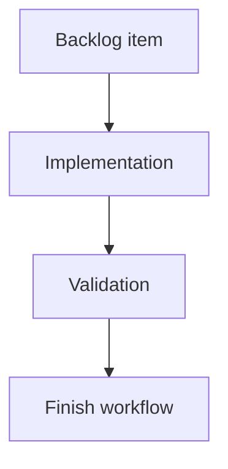

## task_140_wire_list_export_stripping_allowance_and_twisted_pair_length_coefficient - Wire list export stripping allowance and twisted-pair length coefficient
> From version: 1.16.0
> Schema version: 1.0
> Status: Done
> Understanding: 95%
> Confidence: 92%
> Progress: 100%
> Complexity: Medium
> Theme: Export / Settings / Wire length
> Reminder: Update status/understanding/confidence/progress and linked request/backlog references when you edit this doc.

# Definition of Done (DoD)
- [x] UI preference payload, defaults, storage migration, and invalid-value normalization support the stripping allowance and twisted-pair coefficient.
- [x] Settings exposes both values in the export/settings area with finite-value validation and default behavior of `20` and `1.075`.
- [x] A shared export-length helper computes deterministic final wire-by-wire export length without mutating `Wire.lengthMm` or route state.
- [x] Grouped selected-network wire-list export and analysis/single-network wire export both use the shared helper for CSV/XLSX sheets.
- [x] Twist-group coefficient applies only to exported wires sharing a non-empty normalized `twistGroupLabel` with at least one other exported wire.
- [x] Existing in-app length displays remain routed lengths, not export/cut lengths.
- [x] Automated coverage maps to the request/backlog acceptance criteria.
- [x] Validation passes or any skipped validation is recorded with residual risk.

# Plan
- [x] Inspect current UI preference wiring from `uiPreferencesStorage.ts`, controller preference hooks, app-controller types, and Settings form controls.
- [x] Add preference fields, defaults, migration from the current schema, and validation/normalization for non-negative allowance plus positive coefficient.
- [x] Add Settings controls in the export/preferences area without changing unrelated settings layout.
- [x] Implement `resolveWireExportLengthMm` or equivalent shared helper near `wireListExport.ts`.
- [x] Wire the helper into `buildWireListSheet` and the analysis wire export sheet construction.
- [x] Add focused tests for formula behavior, migration/defaults, shared export path usage, and unchanged visible lengths.
- [x] Run targeted tests plus `logics-manager lint --require-status`.

# Backlog
- `item_631_wire_list_export_stripping_allowance_and_twisted_pair_length_coefficient`

# Acceptance criteria
- AC1: Settings exposes a numeric wire stripping/crimping allowance in millimeters, defaulting to `20`, with clear validation for finite non-negative values.
- AC2: Settings exposes or otherwise centrally configures the twisted-pair length coefficient, defaulting to `1.075`, with clear validation for finite positive values.
- AC3: Existing saved UI preferences migrate to the new defaults without rejecting older preference payloads or resetting unrelated preferences.
- AC4: Wire-by-wire exports compute final length from existing `wire.lengthMm` without mutating `wire.lengthMm`, route data, segments, or persisted network files.
- AC5: Every exported wire receives the stripping allowance twice, once for endpoint A and once for endpoint B.
- AC6: Wires in a twisted group receive the `1.075` coefficient by default when at least two exported wires share the same non-empty normalized `twistGroupLabel`.
- AC7: Wires with no twist group, an empty twist group, or a single unmatched twist-group label in the exported sheet do not receive the twisted-pair coefficient.
- AC8: The wire-by-wire export `Length (mm)` value is the final export/cut length, using deterministic rounding.
- AC9: Normal in-app length displays remain unchanged, including modeling wire tables, analysis wire tables, Network Summary labels/callouts, statistics, validation, and route preview surfaces.
- AC10: Grouped selected-network wire-list export and single-network/analysis wire export paths use the same export-length helper so CSV/XLSX behavior is consistent.
- AC11: Automated coverage verifies the default formula with a non-twisted wire, a twisted pair, and custom settings values.
- AC12: Automated coverage verifies that app-visible `wire.lengthMm` remains unchanged after export-length calculation.

# Validation
- `npm run -s typecheck` passed.
- `npx vitest run src/tests/wire-list-export.spec.ts src/tests/app.ui.settings-wire-defaults.spec.tsx` passed (`2` files, `4` tests).
- `npm run -s lint` passed.
- `logics-manager lint --require-status` passed.
- typecheck, focused wire export/settings tests, lint, and logics lint passed
- Finish workflow executed on 2026-06-12.
- Linked backlog/request close verification passed.

# Report
- Implemented export-only wire cut length calculation.
- Added `src/app/lib/wireExportLength.ts` with defaults, normalization, twist-group counting, and deterministic rounded export length resolution.
- Extended UI preferences to schema version `17` with `wireExportStrippingAllowanceMm` defaulting to `20` and `wireExportTwistedPairLengthCoefficient` defaulting to `1.075`.
- Added Settings controls in `Catalog & BOM setup`, including search labels and French translations.
- Wired grouped selected-network wire exports, Analysis wire exports, and Modeling wire table exports through the shared helper.
- Preserved displayed routed lengths in tables and state; only export sheet values use the adjusted final length.
- Finished on 2026-06-12.
- Linked backlog item(s): `item_631_wire_list_export_stripping_allowance_and_twisted_pair_length_coefficient`
- Related request(s): `req_145_wire_list_export_stripping_allowance_and_twisted_pair_length_coefficient`

# AI Context
- Summary: Implement export-only wire cut length adjustments driven by Settings defaults for stripping allowance and twisted-pair coefficient.
- Keywords: task, wire list export, fil a fil, stripping allowance, crimping allowance, twisted pair coefficient, twistGroupLabel, Settings, UI preferences, CSV, XLSX
- Use when: Executing the implementation for `item_631` / `req_145`.
- Skip when: Work is only request grooming or unrelated routing, BOM, statistics, canvas, or validation behavior.

# Links
- Request: `req_145_wire_list_export_stripping_allowance_and_twisted_pair_length_coefficient`
- Product brief(s): (none yet)
- Architecture decision(s): (none yet)

# AC Traceability
- request-AC1 -> This task. Proof: `SettingsWorkspaceContent` exposes `Wire stripping allowance (mm)` with non-negative finite input handling; `app.ui.settings-wire-defaults.spec.tsx` verifies default `20` and persistence.
- request-AC2 -> This task. Proof: `SettingsWorkspaceContent` exposes `Twisted-pair length coefficient` with positive finite input handling; `app.ui.settings-wire-defaults.spec.tsx` verifies default `1.075` and persistence.
- request-AC3 -> This task. Proof: `uiPreferencesStorage.ts` schema `17` migration defaults legacy payloads to `20` and `1.075`; `useUiPreferences.ts` normalizes invalid hydrated values.
- request-AC4 -> This task. Proof: `resolveWireExportLengthMm` computes from `wire.lengthMm` without writes; `wire-list-export.spec.ts` asserts original `wire.lengthMm` values remain unchanged.
- request-AC5 -> This task. Proof: `resolveWireExportLengthMm` adds `strippingAllowanceMm * 2`; `wire-list-export.spec.ts` covers default and custom allowance outputs.
- request-AC6 -> This task. Proof: `buildWireTwistGroupExportCounts` and `resolveWireExportLengthMm` apply `1.075` by default for matching non-empty normalized labels; `wire-list-export.spec.ts` covers matching `CAN 1` labels.
- request-AC7 -> This task. Proof: singleton twist labels and empty labels receive no coefficient; `wire-list-export.spec.ts` covers a singleton `LIN` label.
- request-AC8 -> This task. Proof: `resolveWireExportLengthMm` uses `Math.round`; `wire-list-export.spec.ts` verifies rounded final `Length (mm)` values.
- request-AC9 -> This task. Proof: UI table cells still read `wire.lengthMm`; only export row builders call `resolveWireExportLengthMm`.
- request-AC10 -> This task. Proof: grouped export in `useNetworkImportExport.ts`, Analysis export, and Modeling export all use the shared helper or `buildWireListSheet`.
- request-AC11 -> This task. Proof: `wire-list-export.spec.ts` covers default non-twisted, default twisted-pair, singleton twist label, and custom settings.
- request-AC12 -> This task. Proof: `wire-list-export.spec.ts` asserts source `wire.lengthMm` remains `[1000, 1000, 1000, 1000]` after export sheet generation.
