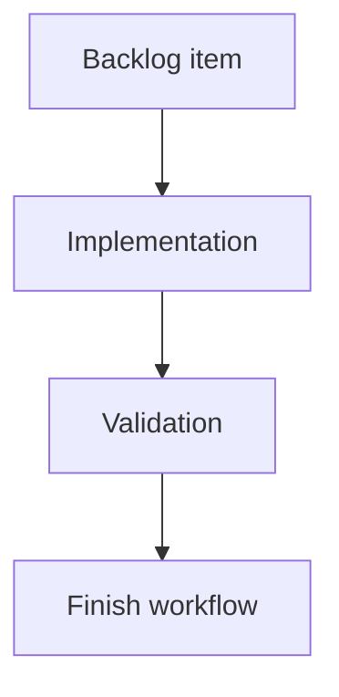

## task_140_wire_list_export_stripping_allowance_and_twisted_pair_length_coefficient - Wire list export stripping allowance and twisted-pair length coefficient
> From version: 1.16.0
> Schema version: 1.0
> Status: Ready
> Understanding: 95%
> Confidence: 92%
> Progress: 0%
> Complexity: Medium
> Theme: Export / Settings / Wire length
> Reminder: Update status/understanding/confidence/progress and linked request/backlog references when you edit this doc.

# Definition of Done (DoD)
- [ ] UI preference payload, defaults, storage migration, and invalid-value normalization support the stripping allowance and twisted-pair coefficient.
- [ ] Settings exposes both values in the export/settings area with finite-value validation and default behavior of `20` and `1.075`.
- [ ] A shared export-length helper computes deterministic final wire-by-wire export length without mutating `Wire.lengthMm` or route state.
- [ ] Grouped selected-network wire-list export and analysis/single-network wire export both use the shared helper for CSV/XLSX sheets.
- [ ] Twist-group coefficient applies only to exported wires sharing a non-empty normalized `twistGroupLabel` with at least one other exported wire.
- [ ] Existing in-app length displays remain routed lengths, not export/cut lengths.
- [ ] Automated coverage maps to the request/backlog acceptance criteria.
- [ ] Validation passes or any skipped validation is recorded with residual risk.

# Plan
- [ ] Inspect current UI preference wiring from `uiPreferencesStorage.ts`, controller preference hooks, app-controller types, and Settings form controls.
- [ ] Add preference fields, defaults, migration from the current schema, and validation/normalization for non-negative allowance plus positive coefficient.
- [ ] Add Settings controls in the export/preferences area without changing unrelated settings layout.
- [ ] Implement `resolveWireExportLengthMm` or equivalent shared helper near `wireListExport.ts`.
- [ ] Wire the helper into `buildWireListSheet` and the analysis wire export sheet construction.
- [ ] Add focused tests for formula behavior, migration/defaults, shared export path usage, and unchanged visible lengths.
- [ ] Run targeted tests plus `logics-manager lint --require-status`.

# Backlog
- `item_631_wire_list_export_stripping_allowance_and_twisted_pair_length_coefficient`

# Acceptance criteria
- AC1: Settings exposes a numeric wire stripping/crimping allowance in millimeters, defaulting to `20`, with clear validation for finite non-negative values.
- AC2: Settings exposes or otherwise centrally configures the twisted-pair length coefficient, defaulting to `1.075`, with clear validation for finite positive values.
- AC3: Existing saved UI preferences migrate to the new defaults without rejecting older preference payloads or resetting unrelated preferences.
- AC4: Wire-by-wire exports compute final length from existing `wire.lengthMm` without mutating `wire.lengthMm`, route data, segments, or persisted network files.
- AC5: Every exported wire receives the stripping allowance twice, once for endpoint A and once for endpoint B.
- AC6: Wires in a twisted group receive the `1.075` coefficient by default when at least two exported wires share the same non-empty normalized `twistGroupLabel`.
- AC7: Wires with no twist group, an empty twist group, or a single unmatched twist-group label in the exported sheet do not receive the twisted-pair coefficient.
- AC8: The wire-by-wire export `Length (mm)` value is the final export/cut length, using deterministic rounding.
- AC9: Normal in-app length displays remain unchanged, including modeling wire tables, analysis wire tables, Network Summary labels/callouts, statistics, validation, and route preview surfaces.
- AC10: Grouped selected-network wire-list export and single-network/analysis wire export paths use the same export-length helper so CSV/XLSX behavior is consistent.
- AC11: Automated coverage verifies the default formula with a non-twisted wire, a twisted pair, and custom settings values.
- AC12: Automated coverage verifies that app-visible `wire.lengthMm` remains unchanged after export-length calculation.

# Validation
- Run `logics-manager lint --require-status`.
- Run focused unit tests covering `wireListExport` / export length helper behavior.
- Run focused UI or hook tests for Settings preference persistence when added.
- Run `npm run -s typecheck` if TypeScript surfaces are touched.
- Run broader export/UI validation if shared tabular export or Settings controller wiring changes beyond the narrow path.
- Run `logics-manager flow validate-closeout task_140_wire_list_export_stripping_allowance_and_twisted_pair_length_coefficient` before closing the task.

# Report
- Not started.

# AI Context
- Summary: Implement export-only wire cut length adjustments driven by Settings defaults for stripping allowance and twisted-pair coefficient.
- Keywords: task, wire list export, fil a fil, stripping allowance, crimping allowance, twisted pair coefficient, twistGroupLabel, Settings, UI preferences, CSV, XLSX
- Use when: Executing the implementation for `item_631` / `req_145`.
- Skip when: Work is only request grooming or unrelated routing, BOM, statistics, canvas, or validation behavior.

# Links
- Request: `req_145_wire_list_export_stripping_allowance_and_twisted_pair_length_coefficient`
- Product brief(s): (none yet)
- Architecture decision(s): (none yet)

# AC Traceability
- request-AC1 -> This task. Evidence needed: Settings exposes a numeric wire stripping/crimping allowance in millimeters, defaulting to `20`, with clear validation for finite non-negative values.
- request-AC2 -> This task. Evidence needed: Settings exposes or otherwise centrally configures the twisted-pair length coefficient, defaulting to `1.075`, with clear validation for finite positive values.
- request-AC3 -> This task. Evidence needed: Existing saved UI preferences migrate to the new defaults without rejecting older preference payloads or resetting unrelated preferences.
- request-AC4 -> This task. Evidence needed: Wire-by-wire exports compute final length from existing `wire.lengthMm` without mutating `wire.lengthMm`, route data, segments, or persisted network files.
- request-AC5 -> This task. Evidence needed: Every exported wire receives the stripping allowance twice, once for endpoint A and once for endpoint B.
- request-AC6 -> This task. Evidence needed: Wires in a twisted group receive the `1.075` coefficient by default when at least two exported wires share the same non-empty normalized `twistGroupLabel`.
- request-AC7 -> This task. Evidence needed: Wires with no twist group, an empty twist group, or a single unmatched twist-group label in the exported sheet do not receive the twisted-pair coefficient.
- request-AC8 -> This task. Evidence needed: The wire-by-wire export `Length (mm)` value is the final export/cut length, using deterministic rounding.
- request-AC9 -> This task. Evidence needed: Normal in-app length displays remain unchanged, including modeling wire tables, analysis wire tables, Network Summary labels/callouts, statistics, validation, and route preview surfaces.
- request-AC10 -> This task. Evidence needed: Grouped selected-network wire-list export and single-network/analysis wire export paths use the same export-length helper so CSV/XLSX behavior is consistent.
- request-AC11 -> This task. Evidence needed: Automated coverage verifies the default formula with a non-twisted wire, a twisted pair, and custom settings values.
- request-AC12 -> This task. Evidence needed: Automated coverage verifies that app-visible `wire.lengthMm` remains unchanged after export-length calculation.
