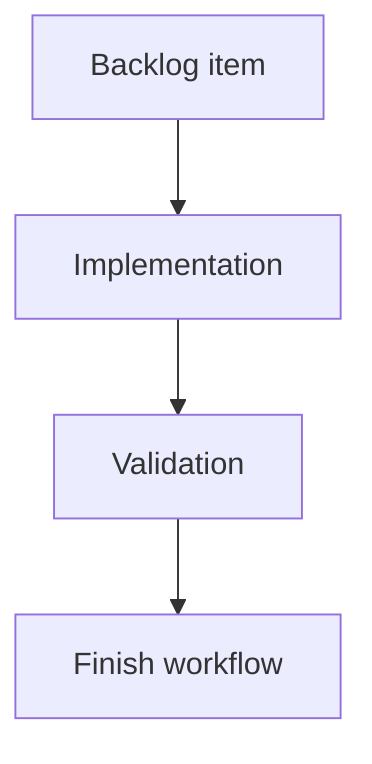

## task_141_export_uniformity_for_floating_splice_connection_references - Export uniformity for floating splice connection references
> From version: 1.16.0
> Schema version: 1.0
> Status: Done
> Understanding: 98%
> Confidence: 95%
> Progress: 100%
> Complexity: Medium
> Theme: Export
> Reminder: Update status/understanding/confidence/progress and linked request/backlog references when you edit this doc.

# Definition of Done (DoD)
- [x] `resolveEndpointConnectionMaterial` resolves splice-port ends from real splice data instead of the hardcoded `"Preden 13mm"`: manual endpoint connection reference/name first, then `splice.catalogItemId` -> `catalogItem.manufacturerReference` (+ name), then `splice.manufacturerReference`, then empty.
- [x] `resolveWireExportEndpointMaterials` and `buildWireListSheet` accept the splice map; both wire export preview callers pass it so the preview matches the downloaded CSV/XLSX.
- [x] Splice seal resolution and connector connection/seal resolution are unchanged.
- [x] `withWarning` clears any pre-existing blocking `lastError` while keeping the new warning.
- [x] Targeted tests cover splice-end connection resolution branches and warning/error channel exclusivity; existing export/persistence/reducer tests stay green.
- [x] Logics lint, lint, typecheck, and the relevant focused tests pass; full remote CI green and release published.

# Implementation plan
- Step 1: In `src/app/lib/wireListExport.ts`, give `resolveEndpointConnectionMaterial` and `resolveWireExportEndpointMaterials` access to a `spliceById` map and a catalog map; resolve splice material via manual ref -> catalog `manufacturerReference` -> `splice.manufacturerReference`. Remove the `"Preden 13mm"` literal. Thread the splice map through `buildWireListSheet`.
- Step 2: Update `ModelingSecondaryTables.tsx` and `AnalysisWireWorkspacePanels.tsx` callers to pass the already-available `spliceById` map.
- Step 3: In `src/store/reducer/shared.ts`, make `withWarning` start from a state with `lastError` cleared (keeping the new `lastWarning`).
- Step 4: Add/extend tests: `src/tests/wire-list-export.spec.ts` for the four splice resolution branches and BOM parity; a reducer test for `withWarning` clearing `lastError`.
- Step 5: Run focused validation and the segmented CI gates touched by these files.

# Backlog
- `item_632_export_uniformity_for_floating_splice_connection_references`

# Acceptance criteria
- AC1: For a wire end connected to a splice port, the wire list connection reference column resolves, in priority order: (1) the operator-set endpoint connection reference/name, then (2) the splice catalog item's `manufacturerReference` (and name) via `splice.catalogItemId`, then (3) `splice.manufacturerReference`, and is empty when none exist. The hardcoded `"Preden 13mm"` literal is removed.
- AC2: The resolved splice connection reference is identical across the wire list CSV, the XLSX export, and the in-app wire export preview tables (single shared resolver), and matches the splice material reported by the BOM for the same splice.
- AC3: Splice seal reference behavior is unchanged (splice ends have no seal material), and connector endpoint connection/seal resolution is unchanged.
- AC4: `withWarning` surfaces a warning while clearing any pre-existing blocking `lastError`, so the warning and error channels are mutually exclusive by construction (task_139 AC30), without clearing a freshly-set warning.
- AC5: Targeted unit/UI tests cover splice-end connection resolution (manual ref, catalog ref, bare `manufacturerReference`, none) and the warning/error channel exclusivity; existing export, persistence, and reducer tests stay green.

# Validation
- Run `python3 -m logics_manager lint --require-status`.
- Run `npm run -s lint`.
- Run `npm run -s typecheck`.
- Run focused tests: `src/tests/wire-list-export.spec.ts`, `src/tests/csv.export.spec.ts`, `src/tests/store.reducer.entities.spec.ts`, and the relevant reducer/shared test.
- Run `npm run -s test:ci:fast -- --coverage` and `npm run -s test:ci:ui` when the export/UI surfaces are touched.
- Run `python3 -m logics_manager flow closeout task_141_export_uniformity_for_floating_splice_connection_references --validation "<evidence>" --lint` after implementation and evidence capture.
- Remote CI (GitHub Actions run 27513235284) concluded success in 9m17s on main at 1.16.1 including e2e; local lint/typecheck/build:vite/quality:pwa and focused vitest (wire-list-export, store.shared-warning-channel, app.ui.list-ergonomics, csv.export, network-summary-bom-csv) all passed; logics lint + audit OK; release v1.16.1 published.
- Finish workflow executed on 2026-06-15.
- Linked backlog/request close verification passed.

# Report
- Implemented in `src/app/lib/wireListExport.ts`: new `resolveSpliceConnectionMaterial` resolves a splice-port wire end via manual endpoint reference -> `splice.catalogItemId` catalog `manufacturerReference` (+ catalog `name`) -> `splice.manufacturerReference` -> empty; the hardcoded `"Preden 13mm"` literal is removed. `resolveEndpointConnectionMaterial`, `resolveWireExportEndpointMaterials`, and `buildWireListSheet` now thread a `spliceById` map.
- Callers updated to pass the existing splice map: `src/app/components/workspace/ModelingSecondaryTables.tsx` and `src/app/components/workspace/AnalysisWireWorkspacePanels.tsx`, so the in-app wire export preview matches the downloaded CSV/XLSX.
- `src/store/reducer/shared.ts`: `withWarning` now clears `lastError` while setting the new `lastWarning`, keeping the two feedback channels mutually exclusive (task_139 AC30).
- Tests: extended `src/tests/wire-list-export.spec.ts` (manual ref, catalog ref + name, bare `manufacturerReference`, none, splice ends carry no seal) and added `src/tests/store.shared-warning-channel.spec.ts` (error cleared on warning; fresh warning preserved).
- Also aligned `src/tests/app.ui.list-ergonomics.spec.tsx`: the wire CSV export assertion that expected the old hardcoded `"Preden 13mm"` now asserts the honored manual splice reference (`TERM-B-CSV`) and the catalog-resolved splice material (`SAMPLE-CAT-J1-10P - Sample main junction 10-port`), and that `"Preden 13mm"` is absent.
- Validation evidence:
  - `logics-manager lint --require-status` OK; `logics-manager audit --legacy-cutoff-version 1.1.0 --group-by-doc --skip-ac-traceability` OK.
  - `npm run -s lint` OK; `npm run -s typecheck` OK; `npm run -s build:vite` OK; `npm run -s quality:pwa` OK.
  - Full local `npm run -s ci:local`: every gate green except the Playwright e2e stage, which cannot run in this WSL/ubuntu26.04 environment (Playwright does not ship a supported browser build there); the e2e suite ran and passed on remote CI.
  - Remote CI (GitHub Actions `CI` workflow, run 27513235284) concluded `success` in 9m17s on `main` at 1.16.1, including the e2e stage.
  - Release published: `v1.16.1` (tag -> 256453d0), set as latest: https://github.com/AlexAgo83/electrical-plan-editor/releases/tag/v1.16.1.
- Commits: `258995d3` (Logics chain), `e507cf1f` (fix + tests), `256453d0` (release 1.16.1).
- Finished on 2026-06-15.
- Linked backlog item(s): `item_632_export_uniformity_for_floating_splice_connection_references`
- Related request(s): `req_146_floating_splice_export_connection_reference_uniformity`

# AI Context
- Summary: Implement export uniformity for floating splice connection references.
- Keywords: task, implementation, backlog, runtime, python
- Use when: You need a bounded implementation task for a backlog item.
- Skip when: The work is still at the request or backlog shaping stage.

# Links
- Request: `req_146_floating_splice_export_connection_reference_uniformity`
- Product brief(s): (none yet)
- Architecture decision(s): (none yet)

# AC Traceability
- request-AC1 -> This task. Proof: `resolveSpliceConnectionMaterial` in `src/app/lib/wireListExport.ts` resolves manual ref -> catalog `manufacturerReference` (+ name) -> `splice.manufacturerReference` -> empty, with the `"Preden 13mm"` literal removed; covered by `src/tests/wire-list-export.spec.ts` "resolves splice-end connection refs from manual ref, catalog material, then splice manufacturerReference".
- request-AC2 -> This task. Proof: all three surfaces call the single `resolveWireExportEndpointMaterials` resolver (wire CSV/XLSX via `buildWireListSheet`; previews via `ModelingSecondaryTables.tsx` / `AnalysisWireWorkspacePanels.tsx`); the resolved catalog `manufacturerReference` matches the BOM grouping key (`src/app/lib/networkSummaryBomCsv.ts`), asserted in `src/tests/wire-list-export.spec.ts` and `src/tests/app.ui.list-ergonomics.spec.tsx` (`SAMPLE-CAT-J1-10P - Sample main junction 10-port`).
- request-AC3 -> This task. Proof: `resolveEndpointSealMaterial` still returns `undefined` for splice ends and the connector branch is unchanged; `src/tests/wire-list-export.spec.ts` asserts splice rows carry no seal ref and connector connection/seal columns keep catalog defaults and manual overrides.
- request-AC4 -> This task. Proof: `withWarning` in `src/store/reducer/shared.ts` sets `lastError: null` alongside the new `lastWarning`; covered by `src/tests/store.shared-warning-channel.spec.ts` (error cleared on warning; fresh warning preserved with no prior error).
- request-AC5 -> This task. Proof: new/extended tests `src/tests/wire-list-export.spec.ts`, `src/tests/store.shared-warning-channel.spec.ts`, and `src/tests/app.ui.list-ergonomics.spec.tsx`; full remote CI run 27513235284 concluded `success`, so existing export/persistence/reducer suites stayed green.
