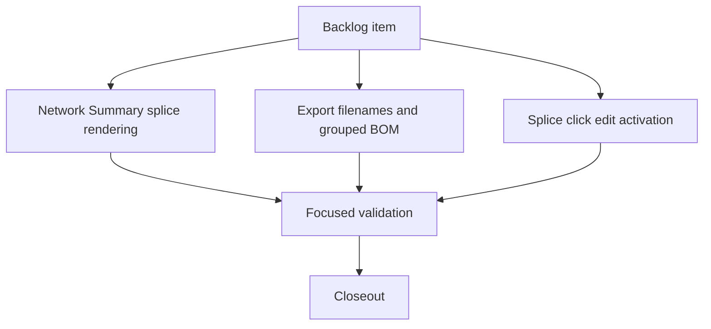

## task_142_tune_floating_splice_visual_placement_and_wire_export_naming - Tune floating splice visual placement and wire export naming
> From version: 1.16.2
> Schema version: 1.0
> Status: Done
> Understanding: 95%
> Confidence: 90%
> Progress: 100%
> Complexity: Medium
> Theme: Network Summary and exports
> Reminder: Update status/understanding/confidence/progress and linked request/backlog references when you edit this doc.

# Definition of Done (DoD)
- [x] Floating splice Network Summary rendering uses a bounded, render-only center-biased visual position with a mild orientation toward the physically closer endpoint.
- [x] Existing anti-superposition and length-label readability behavior is preserved or strengthened for endpoint-adjacent, zero-offset, end-offset, short-segment, and same-offset splice cases.
- [x] Wire-to-wire export filenames include the active network label, and grouped export filenames include every selected harness/network label across PDF/XLSX/CSV/equivalent grouped outputs with deterministic sanitization.
- [x] Grouped BOM export includes wire-list content in the grouped output without changing the underlying single-network BOM semantics.
- [x] Clicking a floating splice in Network Summary opens the splice edit workflow directly, matching connector edit activation behavior.
- [x] Focused tests cover the changed render mapping, filename generation, grouped BOM wire-list inclusion, and splice click-to-edit activation.
- [x] Logics lint, TypeScript/lint, and relevant focused tests pass.

# Implementation plan
- Step 1: Inventory current Network Summary floating-splice render positions and click handlers. Confirm where resolved physical splice positions are converted into canvas coordinates and where connector clicks open edit.
- Step 2: Introduce a small pure helper for render-only splice visual interpolation. It should remap the physical segment percentage into a bounded band around the midpoint (for example, center plus limited signed bias), then feed that visual anchor into the existing anti-superposition/callout/render pipeline without mutating `splice.placement`.
- Step 3: Add focused tests for the helper or render model proving that endpoint-near offsets remain visually away from endpoint node icons, center offsets remain centered, opposite-end offsets bias symmetrically, and same-offset/multiple-splice cases remain deterministic.
- Step 4: Centralize export filename label composition for active-network and grouped-network/harness selections. Reuse that helper in wire-to-wire CSV/XLSX/PDF and grouped export download paths so naming is consistent.
- Step 5: Extend grouped BOM export generation to include the wire list in the grouped output. Prefer reusing the existing wire-list builder rather than duplicating row logic.
- Step 6: Wire floating splice click handling in Network Summary to the existing splice edit action/panel, matching connector behavior for selection, focus, and edit activation.
- Step 7: Add or update UI/export tests for filenames, grouped BOM wire-list inclusion, and splice click-to-edit. Run targeted validation before closeout.

# Backlog
- `item_633_tune_floating_splice_visual_placement_and_wire_export_naming`

# Acceptance criteria
- AC1: Floating splice marker rendering in Network Summary uses a bounded visual interpolation: the marker stays generally near the segment center while showing only a slight directional bias toward the endpoint from which the physical splice offset is closer.
- AC2: The rendering guard prevents splice icons from being placed too close to endpoint node icons under normal segment lengths, and preserves readability of segment length labels. Length labels must not disappear under connector/node/splice icons as a result of the splice visual placement.
- AC3: The visual bias is render-only. Persisted placement (`segmentId`, `fromNodeId`, `offsetMm`), routing, wire lengths, validation, export data, and edit form values continue to use the real physical offset.
- AC4: Edge cases remain deterministic and readable: very short segments, zero-offset splices, end-offset splices, multiple splices on the same segment, and existing anti-superposition offsets must not produce hidden or stacked unreadable markers.
- AC5: Wire-to-wire export filenames include the selected network name using the same user-visible network label shown in the app, with filename-safe sanitization.
- AC6: Grouped exports for multiple selected harnesses/networks include every selected harness/network name in the generated filename for PDF, XLSX, CSV, and any equivalent grouped export artifacts. The order is deterministic and follows the selected/exported order or a documented stable fallback.
- AC7: Grouped BOM export includes the wire list in the grouped export output, without requiring the operator to run a separate wire-list export. Existing single-network BOM export behavior is unchanged except where explicitly extended by filename naming.
- AC8: In Network Summary, clicking a splice opens the splice edit workflow directly, matching the connector edit behavior for focus, selection, and edit panel/modal activation.
- AC9: Targeted tests cover the bounded visual placement behavior, filename generation for single and grouped exports, grouped BOM inclusion of wire list content, and direct splice edit activation from Network Summary.

# Validation
- Run `python3 -m logics_manager lint --require-status`.
- Run `npm run -s lint`.
- Run `npm run -s typecheck`.
- Run focused tests for Network Summary rendering/click behavior and export helpers. Candidate suites to extend or add include:
  - `src/tests/network-summary*.spec.tsx` or the closest existing Network Summary UI test for splice click-to-edit behavior.
  - `src/tests/wire-list-export.spec.ts`, `src/tests/csv.export.spec.ts`, or export-specific suites for filename generation.
  - `src/tests/network-summary-bom-csv.spec.ts` or grouped export suites for BOM plus wire-list content.
- Run `npm run -s test:ci:fast -- --coverage` if helper/export logic changes broad shared paths.
- Run `npm run -s test:ci:ui` if Network Summary UI interaction coverage changes.
- Run `python3 -m logics_manager flow closeout task_142_tune_floating_splice_visual_placement_and_wire_export_naming --validation "<evidence>" --lint` after implementation and evidence capture.
- typecheck PASS; eslint PASS; test:ci:segmentation:check PASS; test:ci:fast PASS (497 tests); test:ci:ui PASS (all chunks green); focused suites PASS: network-summary-graph-model, export-file-name, app.ui.grouped-bom-wire-list, app.ui.floating-splice-click-to-edit, app.ui.wire-export-preview; quality gates PASS: ui/hooks/store modularization, exceljs-boundary, ui-timeout-governance, dependency-audit, pin-role-release-gate
- Finish workflow executed on 2026-06-18.
- Linked backlog/request close verification passed.

# Report
- AC1/AC2/AC3/AC4 (render-only center bias): added pure helper `biasFloatingSpliceVisualRatio` in `src/app/components/network-summary/graph/networkSummaryGraphModel.ts`, remapping the physical segment ratio into a bounded band `[0.3, 0.7]` around the midpoint (bias factor 0.35) before the existing anti-superposition pipeline. `buildRenderedFloatingSplices` now anchors on the biased visual ratio; persisted placement (`segmentId`/`fromNodeId`/`offsetMm`), routing, lengths and exports keep the real offset. Covered by updated/added tests in `src/tests/network-summary-graph-model.spec.ts` (center symmetry, bounded band, zero/end offsets, multi-splice determinism).
- AC5 (wire-to-wire filenames): `AnalysisWireWorkspacePanels.tsx` and `ModelingSecondaryTables.tsx` now prefix the wire-list export filename with the sanitized active network label (new `activeNetworkName` prop threaded through `useAppControllerScreenContentSlices`). Proof: `src/tests/app.ui.wire-export-preview.spec.tsx`.
- AC6 (grouped filenames): new shared helper `buildGroupedFileNameBase` in `src/app/lib/exportFileName.ts` includes every selected network/harness label in selection order with deterministic `-plus-<n>-more` truncation; reused for grouped BOM, grouped wire list and grouped plan PDF in `useNetworkImportExport.ts`. Proof: `src/tests/export-file-name.spec.ts`.
- AC7 (grouped BOM wire list): `handleExportGroupedBom` now appends a `buildWireListSheet` per network alongside the BOM sheets without altering single-network BOM semantics. Proof: `src/tests/app.ui.grouped-bom-wire-list.spec.tsx`.
- AC8 (splice click-to-edit): floating splice single click now activates edit directly (matching connector mouse-down activation) in `NetworkSummaryGraphLayers.tsx`. Proof: `src/tests/app.ui.floating-splice-click-to-edit.spec.tsx`.
- AC9: focused tests added/updated across the four surfaces (see above).
- Finished on 2026-06-18.
- Linked backlog item(s): `item_633_tune_floating_splice_visual_placement_and_wire_export_naming`
- Related request(s): `req_147_floating_splice_placement_and_wire_export_names`

# AI Context
- Summary: Implement center-biased floating splice visual rendering, export filename naming with selected network/harness names, grouped BOM wire-list inclusion, and direct splice edit activation from Network Summary.
- Keywords: floating splice, Network Summary, visual interpolation, export filename, grouped export, grouped BOM, wire list, splice edit
- Use when: You need a bounded implementation task for a backlog item.
- Skip when: The work is still at the request or backlog shaping stage.

# Links
- Request: `req_147_floating_splice_placement_and_wire_export_names`
- Product brief(s): (none yet)
- Architecture decision(s): (none yet)

# AC Traceability
- request-AC1 -> This task. Proof target: render-only helper/model maps physical splice offset into a bounded center-biased visual position in Network Summary.
- request-AC2 -> This task. Proof target: render tests or UI assertions show splice icons stay clear of endpoint node icons and do not cover segment length labels in representative cases.
- request-AC3 -> This task. Proof target: implementation only changes render coordinates/filename/export composition/click handling; persisted placement, routing, lengths, validation, and edit form values are unchanged.
- request-AC4 -> This task. Proof target: tests cover short segments, zero/end offsets, same-offset/multiple splices, and existing anti-superposition interaction.
- request-AC5 -> This task. Proof target: wire-to-wire export filename tests include active network name with filename-safe sanitization.
- request-AC6 -> This task. Proof target: grouped export filename tests include all selected harness/network labels in deterministic order for PDF/XLSX/CSV/equivalent paths.
- request-AC7 -> This task. Proof target: grouped BOM export tests assert wire-list content is included in grouped output while single-network BOM behavior remains stable.
- request-AC8 -> This task. Proof target: Network Summary UI test clicks a floating splice and observes splice edit activation matching connector behavior.
- request-AC9 -> This task. Proof target: focused tests cover all changed surfaces and validation evidence is recorded during closeout.
